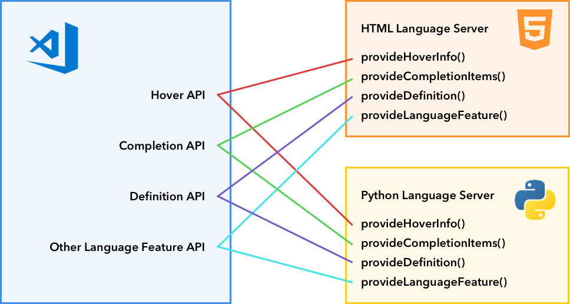
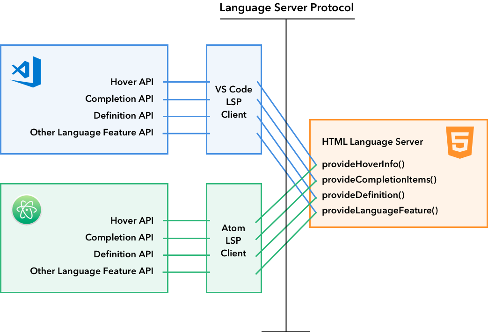

# Language Extension Overview

VS Code provides smart editing features for many different programming languages through Language Extensions. In its core, VS Code offers a set of Contribution Points and API methods but contains no support for any programming languages. It is the bundled [html](https://github.com/Microsoft/vscode/tree/master/extensions/html) extension that allows VS Code to show syntax highlighting for html files. When you type `console.` and `log` shows up, it's the [`typescript-language-features`](https://github.com/Microsoft/vscode/tree/master/extensions/typescript-language-features) extension at work.

Smart editing features can be roughly put into two categories:

## Static Language Features

This cateogry includes very basic language editing support. All features in this area are statically defined in configuration files. Examples include [html](https://github.com/Microsoft/vscode/tree/master/extensions/html), [css](https://github.com/Microsoft/vscode/tree/master/extensions/css) and [typescript-basic](https://github.com/Microsoft/vscode/tree/master/extensions/typescript-basics) extensions bundled with VS Code, which offer a subset of the following Basic Language Features:

- Syntax Highlighting
- Snippet Completion
- Bracket Matching
- Bracket Autuclosing
- Bracket Autosurronding
- Comment
- Folding (legacy)

We have three guides for writing Language Extensions that provide basic language features.

- [Syntax Highlight Guide](/api/language-extensions/syntax-highlight-guide): VS Code uses TextMate grammar for syntax highlighting. This guide will walk you through converting an existing Textmate grammar into a VS Code extension.
- [Snippet Completion Guide](/api/language-extensions/snippet-guide): Extension authors could provide handy snippets for any languages. Come to learn how we can add an idiomatic framework usage as a snippet, or create a snippet for using the latest ECMAScript syntax.
- [Language Configuration Guide](/api/language-extensions/language-configuration-guide): VS Code allows extensions to define a "language configuration" for any programming language. This file controls basic editing features such as comment toggling, bracket matching/surrounding and region folding (legacy).

## Dynamic Language Features

This category includes advanced language features such as auto completion, error checking and jump to definition. These features are often powered by a Language Server, a program that analyzes your project to provide the dynamic features.
 One example is the [`typescript-language-features`](https://github.com/Microsoft/vscode/tree/master/extensions/typescript-language-features) extension bundled in VS Code. It utilizes TSServer from [TypeScript](https://github.com/Microsoft/TypeScript) to offer advanced language features such as:

- Hover information ([`vscode.languages.registerHoverProvider`](https://code.visualstudio.com/docs/extensionAPI/vscode-api#languages.registerHoverProvider))
- Auto completion ([`vscode.languages.registerCompletionItemProvider`](https://code.visualstudio.com/docs/extensionAPI/vscode-api#languages.registerCompletionItemProvider))
- Jump to definition ([`vscode.languages.registerDefinitionProvider`](https://code.visualstudio.com/docs/extensionAPI/vscode-api#languages.registerDefinitionProvider))
- Error checking
- Formatting
- Refactor

For a complete list of advanced language features, see [Language Features](/api/language-extensions/language-features).

## LSP

## Advanced Langauge Features

### Multiroot Support

When the user opens a [multi-root workspace](/docs/editor/multi-root-workspaces), you might need to adapt your Language Server extensions accordingly. This topic discusses multiple approaches to support multi-root workspace usage.

### Embedded Languages

Embedded languages are common in web development. For example, CSS/JS inside HTML, and GraphQL inside JavaScript/TypeScript. This topic discusses how you can make language features available to embedded languages.