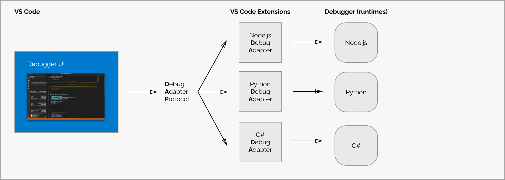
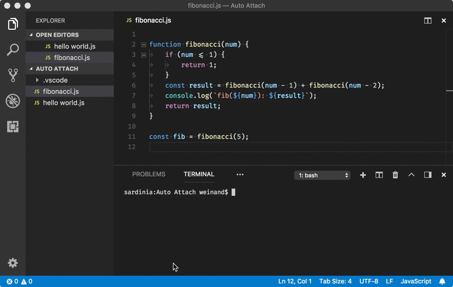

---
Order:
TOCTitle: Logpoints and auto-attach
PageTitle: Introducing Logpoints and auto-attach to make debugging easier and simpler to use
MetaDescription: Introducing Logpoints and auto-attach to make debugging easier and simpler to use in Visual Studio Code
MetaSocialImage: /assets/blogs/2017/12/20/social_paused.png
Date: 2018-07-11
ShortDescription: Introducing Logpoints and auto-attach to make debugging easier and simpler to use
Author: Kenneth Auchenberg
---
# Introducing Logpoints and auto-attach

Over the past months we have been busy improving the debugging experience in Visual Studio Code, and in this post I'm going to talk about the way we think about debugging, the feedback we hear from our users, and how we are making debugging easier and simpler to use in VS Code.

Since the early days of VS Code, we have shipped with an integrated debugging experience as we believe debugging should be an integral part of where you write and edit your source code  ––  your editor.

The VS Code debugging experience is powered by a generic debugger UI that communicates through the Debug Adapter Protocol (DAP) with a specific type of VS Code extension that we call a Debug Adapter (DA). The DA talks to a real debugger and translates between the DAP and the runtime specific debug protocol or API of the debugger.

This means that the core of VS Code is fully decoupled from the specific debugger, and this architecture allows VS Code to debug anything, as long as there's a Debug Adapter available, as illustrated here:

 

 

## Observations and pain points

Today we have a large group of satisfied developers who are debugging in VS Code on a regular basis, but, as a part of our mission, we want to make debugging easier and available to more developers.

To this end, we began conversations to better understand the pain points of debugging in VS Code and learn why some developers aren't using our debugger at all.

These are our observations:

### Debug configuration is hard to get right

VS Code is a general editor with a generic debugger and not a specialized tool for a particular stack or runtime. For this reason, we can't provide an opinionated default debug configuration that will work for everyone.

This means that VS Code requires you to set up debug configurations for the debugger to use, and how to start your runtime with the right parameters, etc.

We recognize that this can be hard to get right, but we don't see a way to completely eliminate debug configuration for everyone. That being said we believe that debug configuration can be simplified and sometimes in the right context be reduced to a minimum.

I'll get back to this later.

### The difference between launch and attach configs isn't always clear

In VS Code, we have two core concept for debugging: **Launch** and **Attach** configurations, which cater to two different workflows and segments of developers. Depending on which segment you belong to, it can be confusing to determine what type of configuration you need for your project.

If you come from a browser DevTools background, you aren't used to the concept of "launching from your tool" since your browser instance is already open. When you open DevTools, you are simply **attaching** DevTools to your open browser tab. On the other hand, if you come from a Java background, it's quite normal to have your editor **launch** your Java process for you, and your editor automatically attaches its debugger to the newly launched process.

The best way to explain the difference between **launch** and **attach** is think about [launch configurations](/docs/editor/debugging#_launch-configurations) as a recipe for how to start your app in debug mode **before** VS Code attaches to it, while an [attach config](/docs/editor/debugging#_launchjson-attributes) is a recipe for how to connect VS Code's debugger's to an app or process that's already running.

The value of [launch configurations](/docs/editor/debugging#_launch-configurations) is to give you a way to offload some of the cognitive overhead of launching your app with the right debugging parameters by creating a configuration that's repeatable and sharable with your project and team.

However, when we talked to developers about how they were launching their applications, we saw a pattern and made one important observation:

**Observation**: Many developers who are using VS Code really love the Integrated Terminal and rely on command line tools to launch their applications. For many, it's a more natural workflow to run a command in the terminal followed by attaching the debugger from the editor. This is similar to opening DevTools after the browser has been launched.

This observation was key, and we realized that many don't want a full "magical" launch experience in their editor. They want to keep their editor as the place to edit and debug source code and use the terminal to launch apps, run build scripts, etc. This is one of the reasons why we have an Integrated Terminal experience inside VS Code, as we believe a good functional UI should co-exist and integrate well with the terminal.

### Many developers don't use breakpoints because they are inspecting state changes

When looking at how developers debug their applications, we also saw another interesting pattern: Using logging instead of breakpoints.

Logging for debugging isn't a new concept but the observation was important:

**Observation**: Traditional debugging workflows are most focused around slowing down execution to allow a specific set of logic to be inspected, while logging workflows are usually focused around inspecting state and how it changes throughout the execution of an application. The fundamental observation here is that the two techniques used for different debugging purposes.

This observation is especially relevant for JavaScript developers, who mostly are dealing with the complexity of managing state, and this might explain why [most JavaScript developers still prefers to add console.log's](https://christianheilmann.com/2017/07/08/debugging-javascript-console-loggerheads/) to their source code instead of using a script debugger.

 

<blockquote class="twitter-tweet">
Debuggers don&#39;t actually remove bugs, they just run your code as slow as you can think.
&mdash; Daniel Rosenwasser (@drosenwasser) <a href="https://twitter.com/drosenwasser/status/1009850470221791232?ref_src=twsrc%5Etfw">June 21, 2018</a></blockquote> 

 

## Auto-attaching to Node processes

When reflecting on how some developers are using the Integrated Terminal to launch, we saw a unique opportunity emerge. By leveraging the contextual information we have inside VS Code from your editor and Integrated Terminal, we had a way to detect your context and reason about your intent to debug, and this could provide a much simpler debugging experience for Node.js developers.

So in [our March iteration](https://code.visualstudio.com/updates/v1_22#_node-debugging) of VS Code, we released a new feature that called **Auto Attach for Node**, that enables the Node debugger to automatically attach to Node.js processes that have been launched in debug mode from VS Code's Integrated Terminal.

You enable auto attach by running **Debug: Toggle Auto Attach** command from the Command Palette, and once activated you can toggle auto attached from the Status Bar too.

 

 

This feature completely eliminates any debug configuration, as we interpret any Node process started with `node -inspect` as an intent to debug, and when combining this with our Integrated Terminal, we can provide a much simpler debugging experience that allows developers to launch their app in their own way, while eliminating debug configuration at the same time! 🎉

## Debugging NPM scripts with ease

Many Node developers relies on `npm scripts` to get their work done, and we have some great news on that front too: Auto-attach also works with `npm scripts`, so if you run `npm run debug"` and the `"debug"` script is  `"node --inspect"` or any other command that includes `--inspect` then auto attach will detect that and attach the debugger 🎉

We also recognize that some developers want a more visual way to explore and debug their `npm scripts`, so in [our April 2018 iteration](https://code.visualstudio.com/updates/v1_23#_npm-script-running), we added a new NPM scripts explorer that allows you to browse and run your NPM scripts directly from the UI. As a part of our journey of simplifying debug configuration, we also made it possible to start Node debugging directly from the explorer, without having to create debug configuration.

If you have a `npm script` that includes an debugging argument like `--inspect`, we'll automatically detect this and provide a debug action that launches the debugger, as seen here:

## Introducing Logpoints

Based on the learning of a different debugging purpose we saw an opportunity to combine our existing debugging experience with the purpose of state inspection, so in [our March iteration](https://code.visualstudio.com/updates/v1_22#_logpoints) of VS Code we released the first iteration of a debugging concept that we call Logpoints.

Logpoints are a breakpoint variant that does not "break" into the debugger but instead logs a message to the console.

The concept for Logpoints isn't new, and over the past many years we have seen multiple flavors of this concept in tools like [Visual Studio](https://codewala.net/2018/01/25/tracepoint-an-awsome-feature-of-visual-studio/), [Edge DevTools](https://docs.microsoft.com/en-us/microsoft-edge/devtools-guide/debugger) and [GDB](https://sourceware.org/gdb/onlinedocs/gdb/Tracepoints.html) under several names such as [Tracepoints](https://blogs.msdn.microsoft.com/devops/2013/10/10/tracepoints/) and [Logpoints](https://blogs.msdn.microsoft.com/visualstudio/2017/09/13/debug-live-apps-in-azure-with-the-snappoints-and-logpoints-preview/).

### Why and when to use Logpoints?

Logpoints are based on the observation that in many cases you don't want to stop execution in a particular part of your application, but instead you want to inspect how state mutates throughout the lifetime of the application.

Logpoints allows you to "inject" on-demand logging statements into your application logic, just like if you had added logging statements into your application before starting it. Because Logpoints are injected at execution time, and not persisted in the source code, this means that you don't have to think ahead of time, but can inject Logpoints as you need them, and a nice benefit is that you don't have to worry about cleaning up after you are finished debugging.

For JavaScript developers this means that you don't have to worry about leaving `console.log's` behind anymore  ––  just use Logpoints! Even better, you can combine `console.log` and Logpoints, so this means that if you insert a Logpoint into a block of code that already have `console.log`s you'll see both logging statements inside the Debug Console.

### Logpoints in cloud contexts

Logpoints are particular useful in cloud contexts (or any remote context really), as they enable you to inject logging into remote environments without having to redeploy your applications, and because you don't halt script execution, your users aren't affected, unlike they would have been if you were using regular breakpoints.

You can read more about how to use [Logpoints for Node.js on Azure here](https://medium.com/@auchenberg/introducing-remote-debugging-of-node-js-apps-on-azure-app-service-from-vs-code-in-public-preview-9b8d83a6e1f0).

### Supported languages

Since our first release of Logpoints in VS Code we have seen a growing adoption of Logpoints in our VS Code Debug Adapters, and today we have support for the following languages:

- [Node.js debugger](https://github.com/Microsoft/vscode-node-debug2/)
- [Chrome debugger](https://github.com/Microsoft/vscode-chrome-debug/)
- [Firefox debugger](https://github.com/hbenl/vscode-firefox-debug/commit/0c90a695e304bb54402ada129f8fafae462718f5)
- [Microsoft Edge debugger](https://github.com/Microsoft/vscode-edge-debug2)
- [React Native Debugger](https://github.com/Microsoft/vscode-react-native)
- [Python Debugger](https://github.com/Microsoft/vscode-python)
- [Dart debugger](https://github.com/Dart-Code/Dart-Code)
- [Lua debugger](https://github.com/actboy168/vscode-lua-debug)
- [Java Debugger](https://github.com/Microsoft/java-debug/pull/184)

### Logpoints in the VS Code

If you are interested in adding Logpoints support in your Debug Adapter for VS Code, please take a look at [these changes](https://github.com/Microsoft/vscode-debugadapter-node/commit/aeda2ba8ae526906585a5ccb7d8346a71b83ed10) in the protocol, and you can look at the above debug adapters for inspiration on how each runtime have chosen to implement Logpoints.

## Next steps

That's it for now, but we aren't finished. In our [July iteration](https://github.com/Microsoft/vscode/issues/53850) we are making the first improvements to auto-attach in order to improve discoverability ([#53640](https://github.com/Microsoft/vscode/issues/53640)), based on the feedback we already have heard from you.

We hope the introduction of auto-attach, NPM scripts explorer, and Logpoints are going to simplfy your debugging experience in VS Code, and as always we are eager to hear your feedback, so reach out to us at [GitHub](https://github.com/Microsoft/vscode) or [@code on Twitter](https://twitter.com/code).

On behalf of the VS Code team: Happy Coding!

/Kenneth Auchenberg - [@auchenberg on Twitter](https://twitter.com/auchenberg)
