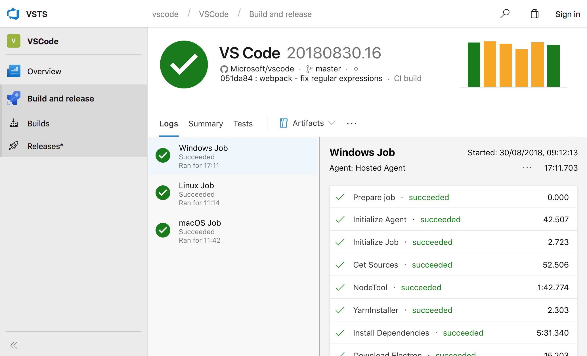
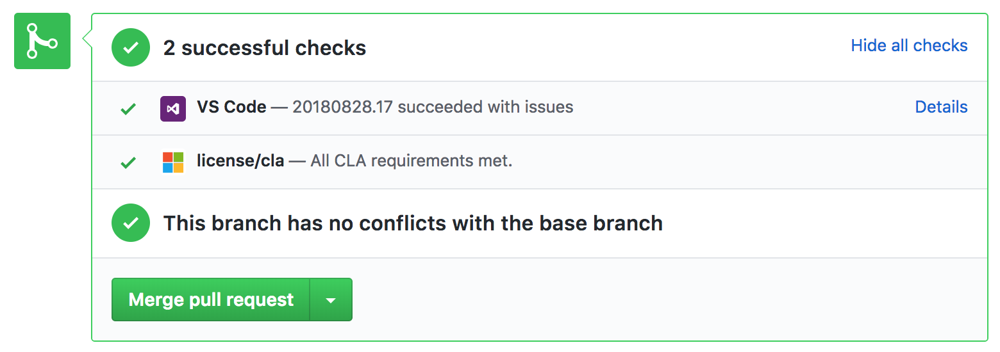

---
Order:
TOCTitle: Using Azure Pipelines
PageTitle: Improved Engineering with Azure Pipelines
MetaDescription: Improved Engineering with Azure Pipelines
MetaSocialImage: /assets/blogs/2018/09/05/github_pr_hero.png
Date: 2018-09-07
ShortDescription: Improved Engineering with Azure Pipelines
Author: João Moreno
---
# Improved Engineering with Azure Pipelines

September 7, 2018 João Moreno, [@joaomoreno](https://twitter.com/joaomoreno)

One of my responsibilities as a developer on the Visual Studio Code team is to maintain and improve our build and CI infrastructure. Given the latest feature announcements from [Azure Pipelines](https://aka.ms/azurecicd), the Visual Studio Code team has dramatically changed how we leverage Microsoft’s technologies to provide a better collaboration platform for both our developers as well as our users. In this blog post I’ll guide you through a bit of Visual Studio Code’s history, focusing on our CI processes and tools and how they have changed over time.

## Visual Studio Code Engineering

Like any other open-source project, we need to have the right tooling and capabilities to receive, triage and address as many code contributions as possible. This rings especially true in the developer tools universe, in which end users are developers themselves: they are a passionate, hard-working and very effective crowd. As of this blog post, we have [148 open PRs as well as 3,482 closed ones](https://github.com/Microsoft/vscode/pulls), which sets an average of ~3 PRs/day given the 3-year project lifespan so far. It is important that we are well equipped for handling this scale of contributions, not only to keep the project development healthy but also to help give other open source projects an example of how to operate at this scale. Part of how we do this is by streamlining our workflow by [bringing the PR experience into the editor](/blogs/2018/09/10/introducing-github-pullrequests), but CI is the other important part of handling contributions at scale.

Up until very recently, we relied on the OSS community's default choices for public continuous integration: [Travis CI](https://travis-ci.org/) took care of our Linux and macOS builds, while the Windows builds were under [AppVeyor](https://www.appveyor.com/)'s responsibility. Additionally, we used [Coveralls](https://coveralls.io/) to provide detailed test coverage reports. These services provide quality reports for PRs and code branches on our public repo, as they automate [compilation](https://github.com/Microsoft/vscode/blob/master/build/lib/compilation.ts), run [code hygiene checks](https://github.com/Microsoft/vscode/blob/master/build/gulpfile.hygiene.js) and [execute several test](https://github.com/Microsoft/vscode/tree/master/test) suites, all of which is essential in order to maintain quality in a distributed team with lots of incoming contributions. This combination of services require the understanding and maintenance of at least 3 different systems, each with its own special file formats, syntax, quirks, limitations, etc.

## Adopting Azure Pipelines

Earlier this year, we were reached out by the Azure Pipelines (then Visual Studio Team Services) team to try out something new. This was the outcome:

 

<blockquote class="twitter-tweet" data-lang="en">
🎉 Hey, did you know <a href="https://twitter.com/code?ref_src=twsrc%5Etfw">@code</a> now uses shiny new <a href="https://twitter.com/VSTS?ref_src=twsrc%5Etfw">@vsts</a> Public Projects and YAML builds to keep its quality up across all 3 platforms simultaneously?! 🤯 Check out the builds at <a href="https://t.co/Q8kYAB1lKG">https://t.co/Q8kYAB1lKG</a>. More about Public Projects at <a href="https://t.co/o0WoNKA4g1">https://t.co/o0WoNKA4g1</a> cc <a href="https://twitter.com/chrisrpatterson?ref_src=twsrc%5Etfw">@chrisrpatterson</a> <a href="https://t.co/Yyhwg19d9z">pic.twitter.com/Yyhwg19d9z</a>
&mdash; João Moreno (@joaomoreno) <a href="https://twitter.com/joaomoreno/status/991958010661670912?ref_src=twsrc%5Etfw">May 3, 2018</a></blockquote>

 

This announcement marks our move to a more streamlined continuous integration solution. Our builds now run simultaneously across all platforms, [check it out](https://aka.ms/vscode-builds):

There's a lot of cool stuff which needed to happen in order for us to make sure a move. Let's break it down:

1. Azure Pipelines [support for public projects](https://docs.microsoft.com/azure/devops/organizations/public) enable us to run a [public-facing Visual Studio Code project](https://dev.azure.com/vscode/VSCode/_build?definitionId=1) in which all our continuous integration builds run;
2. [Build Agents](https://docs.microsoft.com/azure/devops/pipelines/agents/agents) in Azure Pipelines have long supported the Windows, macOS, & Linux platform matrix;
3. [Microsoft-hosted agents](https://docs.microsoft.com/azure/devops/pipelines/agents/hosted) in Azure Pipelines running macOS, Linux, and Windows provide a great stack of software to build projects without worrying about build machine maintenance;
4. [YAML CI](https://docs.microsoft.com/azure/devops/pipelines/get-started-yaml) allows creating YAML definitions which are kept close to the project’s sources (for which Visual Studio Code provides [great extensions](https://marketplace.visualstudio.com/search?term=yaml&target=VSCode&category=All%20categories&sortBy=Relevance)).

Putting all of this together, we're finally able to focus on a single CI solution. The [Visual Studio Code build on Azure Pipelines](https://dev.azure.com/vscode/VSCode/_build/results?buildId=5876&view=logs) runs our compilation, hygiene checks and test suites in a single build, automatically distributing the build across different platforms. Since we're using Microsoft-hosted build agents, we don't have to worry about maintaining those machines.

## Third Party Integrations

Azure Pipelines also provides GitHub integration which gives us build result indicators across our GitHub project page, namely in pull requests.

We've also built a chat bot which hooks up to [Azure Pipeline's REST API](https://docs.microsoft.com/en-us/rest/api/vsts/build/?view=vsts-rest-4.1) and provides notifications for when builds break on our internal chat.

## Going forward

My next task will be to take advantage of [code coverage reports](https://docs.microsoft.com/azure/devops/pipelines/tasks/test/publish-code-coverage-results) in order to get a better end-to-end CI flow than we had with the previous tool mix.

Having made the jump to Azure Pipelines has proved to be a big success for us. Overall code quality is easier to reason about now since builds aren’t scattered all around. We have also consolidated the number and format of our [build definition files](https://github.com/Microsoft/vscode/blob/master/build/tfs/product-build.yml). We’re very happy with the change and excited about what the future holds for Azure Pipelines.

---

If you'd like to learn more about public projects and Azure Pipelines, take a look at their [blog post](https://aka.ms/azurecicd).

Would you like to give Visual Studio Code a try? [Download it now](https://code.visualstudio.com/Download) for your platform of choice. And if you're like us, and always want to run the latest and greatest, then [get our daily-built Insider release](https://code.visualstudio.com/insiders/). Do you simply want to reach out or keep in touch? Follow us [@code on Twitter](https://twitter.com/code).

On behalf of the VS Code team: Happy Coding!

João Moreno, [@joaomoreno](https://twitter.com/joaomoreno)
