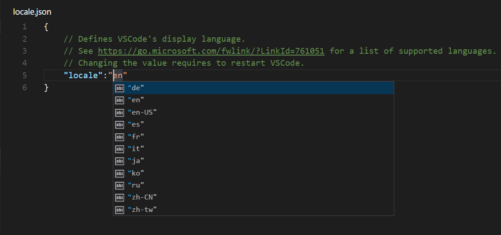

# Display Language

VS Code ships by default with English as the display language and other [languages](#available-locales) rely on Language Pack [extensions](/docs/editor/extension-gallery.md) available from the VS Code [Marketplace](https://marketplace.visualstudio.com/search?target=VSCode&category=Language%20Packs&sortBy=Downloads).

 VS Code detects the operating system's UI language and will prompt you to install the appropriate Language Pack, if available on the Marketplace. Below is an example recommending a Simplified Chinese Language Pack:


After installing the Language Pack extension and following the prompt to restart, VS Code will use the Language Pack matching your operating system's UI language.

## Changing the Display Language

You can also override the default UI language by explicitly setting the VS Code display language. The **Configure Display Language** command creates a `locale.json` file in your user VS Code folder where you can set the `locale` attribute to your preferred locale.

Press `kb(workbench.action.showCommands)` to bring up the **Command Palette** then start typing "display" to filter and display the **Configure Display Language** command.


Press `kbstyle(Enter)` and a `locale.json` file is created with the default value set to your operating system language. You can use IntelliSense (`kb(editor.action.triggerSuggest)`) to select a different supported language locale.



Save `locale.json` and restart VS Code to use the new display language.

The example below sets VS Code to display Simplified Chinese `zh-CN`:

```json
{
    // Defines VS Code's display language.
    "locale":"zh-CN"
}
```

You can rerun the **Configure Display Language** command to review and change your `locale.json` file.

>**Note:** Changing the `locale` value requires a restart of VS Code.

## Available locales

Display Language | Locale
-----------------|-------
English (US) | `en`
Simplified Chinese | `zh-CN`
Traditional Chinese | `zh-TW`
French | `fr`
German | `de`
Italian | `it`
Spanish | `es`
Japanese | `ja`
Korean | `ko`
Russian | `ru`
Bulgarian | `bg`
Hungarian | `hu`
Portuguese (Brazil) | `pt-br`
Turkish | `tr`

## Marketplace Language Packs

As described above, VS Code ships with English as the default display language, but other languages are available through [Marketplace Language Packs](https://marketplace.visualstudio.com/search?target=VSCode&category=Language%20Packs&sortBy=Downloads).

You can search for Language Packs in the Extensions view (`kb(workbench.view.extensions)`) by typing the language you are looking for along with `category:"Language Packs"`.


You can have multiple Language Packs installed and select the current display language with the **Configure Display Language** command.

## Setting the Language

If you want to use a specific language for a VS Code session, you can use the command line switch `--locale` to specify a locale when you launch VS Code.

Below is an example of using the `--locale` command line switch to set the VS Code display language to French:

```bash
code . --locale=fr
```