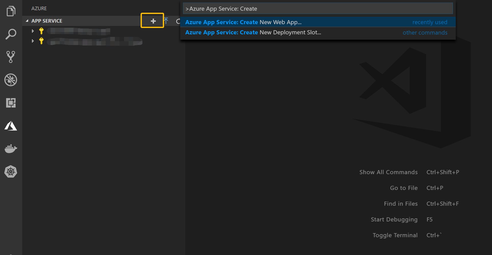

# Deploy Java Web Apps to the cloud

In our [first tutorial](/docs/java/java-tutorial.md), we built a Java web application and ran it locally. In this tutorial, you will learn how to deploy and run it on [Azure](https://azure.microsoft.com) in the cloud.

## Prerequisites

To develop to Azure Web App with Java, you'll need the following tools installed:

- [Java Developer Kit](https://www.azul.com/downloads/zulu/) (JDK), version 1.8.
- [Apache Maven](https://maven.apache.org), version 3.0 or above.

>**Important**: The `JAVA_HOME` environment variable must be set to the install location of the JDK to complete this tutorial.


## Install the Azure App Service extension

The [Azure App Service](https://marketplace.visualstudio.com/items?itemName=ms-azuretools.vscode-azureappservice) extension is used to create, manage, and deploy to Azure App Service with key features including:

- Create new Azure Web App/deployment slot
- Deploy to Azure Web App/deployment slot
- Start, stop, and restart the Azure Web App/deployment slot
- View a Web App's log files
- Swap deployment slots

To install the Azure App Service extension, open the Extensions view (`kb(workbench.view.extensions)`) and search for `azure app service` to filter the results. Select the Microsoft [Azure App Service](https://marketplace.visualstudio.com/items?itemName=ms-azuretools.vscode-azureappservice) extension. For a more command line Maven-centric experience, you can also check out the [Maven plugin for Azure Web App tutorial](https://docs.microsoft.com/en-us/java/api/overview/azure/maven/azure-webapp-maven-plugin/readme?view=azure-java-stable). 

## Create a new Web App 

Once the extension is installed, you can take the following steps to create a new Web App. 

1. Click **Create New Project** button on the **APP SERVICE** Explorer view.
2. Select a subscription. 
3. Enter an unique name for the new Web App. 
4. Select a location for the new Web App. 
5. Select the OS as `Linux`. 
6. Select the runtime of the Web App, for example`Tomcat 8.5`. 

> **Note:** The runtimes are in preview status for `Tomcat 8.5 (JRE8)`, `Tomcat 9.0 (JRE8)` and `Java SE (JRE8)`. 



## Build and deploy to a Web App 

If you don't have an Azure subscription, you can sign up for a [free Azure account](https://azure.microsoft.com/pricing/free-trial/
).

<a class="tutorial-next-btn" href="https://azure.microsoft.com/pricing/free-trial/" target="_blank" style="background-color:#68217A">Create your free Azure account</a>

The deploy process leverages the [Azure Account](https://marketplace.visualstudio.com/items?itemName=ms-vscode.azure-account) extension (installed along with the Azure Functions extension as an dependency) and you need to sign in with your Azure subscription. If you do not have an Azure subscription, [sign up today](https://azure.microsoft.com//free/?b=16.48) for a free 30 day account and get $200 in Azure Credits to try out any combination of Azure services.

To log into Azure, run **Azure: Sign In** from the **Command Palette** (`kb(workbench.action.showCommands)`). You can then sign into your account using the **Device Login** flow. Click on **Copy & Open** to open your default browser.


Paste in the access code and continue the sign in process.


Once you have signed in, you can open the command prompt or terminal window and build the project using Maven commands. This will generate a new `name.war` or `name.jar` file in the `target` directory. 

```bash
mvn clean package
```
After building the project, open the `target` directory in VS Code Explorer. Right-click on the `name.war` or `name.jar` file and choose **Deploy to Web App** button, and follow the prompts to choose the Web App for your deployment.


Open the **Output** window in VS Code to view the deployment logs. Once the deployment is completed, it will print out the URL for your Web App. By pasting the URL into a web browser, you can see the web app running on Azure! 


> **Note:** For more advanced features of App Service, you can check out the [Azure App Service](https://marketplace.visualstudio.com/items?itemName=ms-azuretools.vscode-azureappservice) extension.

## Next steps

* To containerize and deploy a web application, check out the [Java Container Tutorial](/docs/java/java-container.md)
* To learn more about Java Debugging features, see the [Java Debugging Tutorial](/docs/java/java-debugging.md)
