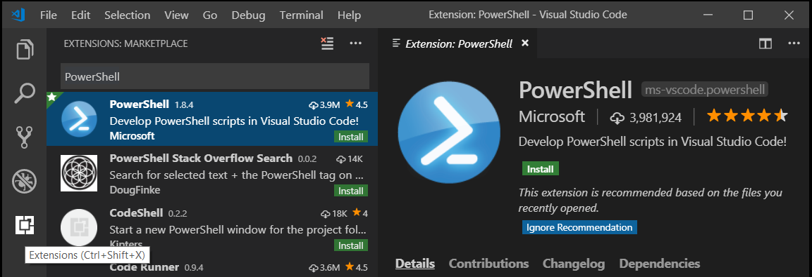
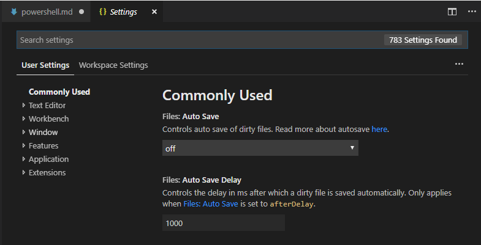
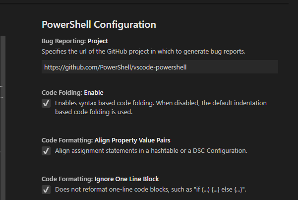

# Editing PowerShell in Visual Studio Code

PowerShell is a task-based command line shell and scripting language built on the .NET framework.
Powershell provides a powerfull toolset for administrators on any platform.

The PowerShell extension provides rich [PowerShell Language Support](https://github.com/PowerShell/vscode-powershell)

## Install the PowerShell extension on Visual Studio Code

    Install-Script Install-VSCode -Scope CurrentUser: Install-VSCode.ps1
You will need to accept the prompts that appear if this is your first time running the ```Install-Script``` command

### Installing the Extension

The official extension can be installed by following the steps in the
[Visual Studio Code Docs](https://code.visualstudio.com/docs/editor/extension-gallery)
or by going directly to the Marketplace and clicking the [Install Button](vscode:extension/ms-vscode.PowerShell)

You can also install the Extension from within Visual Studio code by
browsing


 for extensions `(ctl+Shift+x)`  and searching for PowerShell. Select the PowerShell extension for details

 

## Example Scripts

Example scripts are included with the extension and can be found at the following Path.

    C:\Users\<yourusername>\.vscode\extensions\ms-vscode.PowerShell-<version>\examples

To open or view the examples in Visual Studio Code run the following from your PowerShell command prompt

    code (Get-ChildItem $Home\.vscode\extensions\ms-vscode.PowerShell-*\examples)[-1]

## Major Features

    * Syntax Highlighting
    * Code Snippets
    * Intellisense for cmdlets and more
    * Rule-Based analysis provided by PowerShell Script Analyzer
    * Go to definition of cmdlets and variables
    * Find references of cmdlets and variables
    * Document and Workspace symbol discovery
    * Run slected selection of PowerShell code using F8
    * Launch online help for the symbol under the cursor using ctl+F1
    * Local script debugging and basic interactive console support

## Plaster

 Plaster is a template-based file and project generator written in PowerShell. It's Purpose is to streamline the creation of PowerShell module projects, Pester tests, DSC configurations and more.
 See the [Github Plaster repo](https://github.com/PowerShell/Plaster) for more information.

 [Cmdlet Documentation](https://github.com/PowerShell/Plaster/blob/master/docs/en-US/Plaster.md)

## Debugging

Check out the  Hey, Scripting Guy blog Posts two part series on debugging

Written by [@keithHill](https://twitter.com/r_keith_hill)

[Debugging PowerShell script in Visual Studio Code – Part 1](https://blogs.technet.microsoft.com/heyscriptingguy/2017/02/06/debugging-powershell-script-in-visual-studio-code-part-1/)

[Debugging PowerShell script in Visual Studio Code – Part 2
](https://blogs.technet.microsoft.com/heyscriptingguy/2017/02/13/debugging-powershell-script-in-visual-studio-code-part-2/)

## Settings Reference

You can customize VSCode settings from the file menu by selecting preferences then clicking settings. You can also click the gear Icon
 located in the lower left corner of the activity bar.

This will launch the settings.json file, in VSCode versions prior to 1.27.1. , where the VSCode team has introduced a settings GUI, which will be the new default interface for customizing settings.

You can still launch the JSON settings file by using the command __Open Settings (JSON)__ or by changing the default settings editor with the ```"workbench.settings.editor"```

### VSCode Settings GUI



### PowerShell Extension Settings



[Using a specific version of powershell with VSCode](https://docs.microsoft.com/en-us/powershell/scripting/core-powershell/vscode/using-vscode?view=powershell-6#using-a-specific-installed-version-of-powershell)

### PowerShell Extension Settings Categories

* Project bug reporting settings
* Code Folding
* Code Formatting
* Code Debugging
* Developer
* Integrated Console
* Enable Profile Loading
* Help Completion
* PowerShell .exe specific settings
* Extension auto start
* Script analysis

## Pester

[Pester](https://github.com/pester/Pester/wiki/Pester)
 is a Behavior-Driven Development (BDD) based unit test runner for PowerShell.
Pester provides a framework for running Unit Tests to execute and validate PowerShell commands. Pester follows a file naming convention for naming tests to be discovered by pester at test time and a simple set of functions that expose a Testing DSL for isolating, running, evaluating and reporting the results of PowerShell commands.

Pester 3.40 comes installed with Windows 10 and Server 2016, to update to the latest version follow these instructions from the Pester Github Readme [Pester updated installation instructions](https://github.com/pester/Pester#installation)

## PSScriptAnalyzer

[PSScriptAnalyzer](https://github.com/PowerShell/PSScriptAnalyzer#introduction) is a static code checker for Windows PowerShell modules and scripts. PSScriptAnalyzer checks the quality of Windows PowerShell code by running a set of rules. The rules are based on PowerShell best practices identified by PowerShell Team and the community. It generates DiagnosticResults (errors and warnings) to inform users about potential code defects and suggests possible solutions for improvements.

PSScriptAnalyzer is shipped with a collection of built-in rules that checks various aspects of PowerShell code such as presence of uninitialized variables, usage of PSCredential Type, usage of Invoke-Expression etc. Additional functionalities such as exclude/include specific rules are also supported.

## [Extension FAQ Page](https://github.com/PowerShell/vscode-powershell/wiki/FAQ)

Here are answers to some of the commonly asked questions about the PowerShell extension for Visual Studio Code: