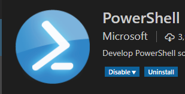
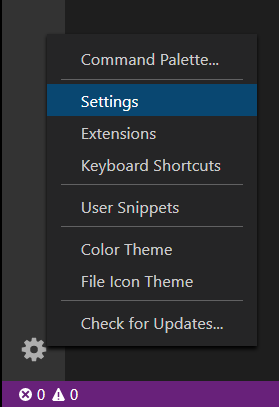
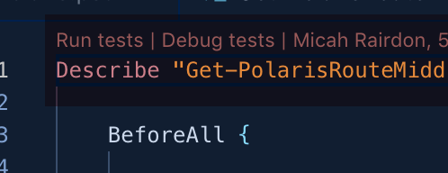
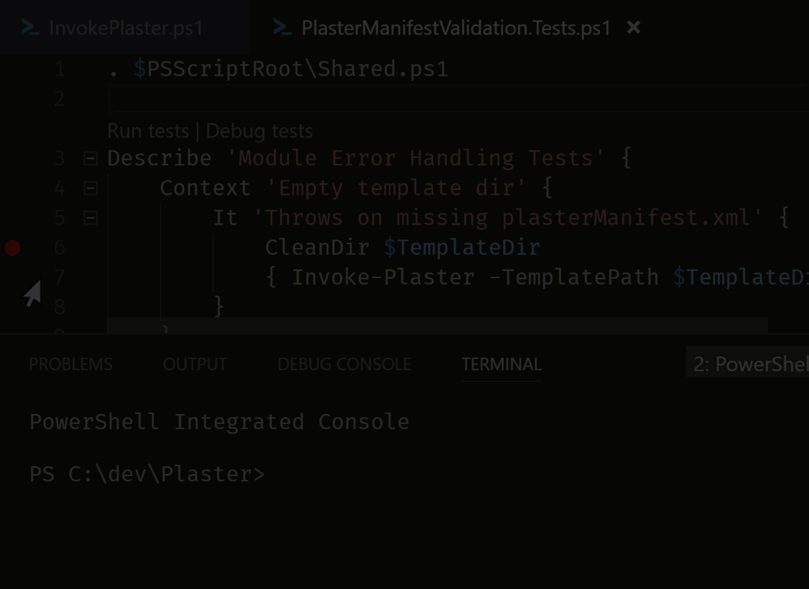

# Editing PowerShell in Visual Studio Code

PowerShell is a task-based command line shell and scripting language built on .NET.

PowerShell provides a powerful toolset for administrators on any platform.

[The PowerShell Extension](https://github.com/PowerShell/vscode-powershell) provides rich language Support and IDE capabilities such as completions, definition tracking and linting analysis for PowerShell versions 3, 4, 5 and 5.1 as well as all versions of PowerShell Core.

## Install the PowerShell Extension on Visual Studio Code

The official PowerShell Extension can be installed by following the steps in the
[Visual Studio Code Docs](https://code.visualstudio.com/docs/editor/extension-gallery)
or by going directly to the Marketplace and clicking the [Install Button](vscode:extension/ms-vscode.PowerShell).

You can also install the PowerShell Extension from within Visual Studio Code by
browsing the Extension Marketplace under the Marketplace view in the Activity Bar for extensions.
You can access this with the shortcut <kbd>ctrl</kbd>-<kbd>Shift</kbd>-<kbd>x</kbd> (or <kbd>cmd</kbd>+<kbd>shift</kbd>+<kbd>x</kbd> on macOS) or by clicking on the

 Marketplace Icon:


Search the Marketplace View for "PowerShell" and select the PowerShell Extension,
Which is denoted by this Icon:



 ## Install from the Command line

 Alternatively, the PowerShell Extension can be installed from any command line (including PowerShell, CMD, bash) on all platforms with the following command
 
 ```
 code --install-extension ms-vscode.powershell

 ```

 If you are running VSCode Insiders, you will need this command instead:

 ```
  code-insiders --install-extension ms-vscode.powershell

  ```

## Example Scripts

Example scripts are included with the extension and can be found at the following Path.

    C:\Users\<yourusername>\.vscode\extensions\ms-vscode.PowerShell-<version>\examples

To open or view the examples in Visual Studio Code run the following from your PowerShell command prompt

```

code (Get-ChildItem $Home\.vscode\extensions\ms-vscode.PowerShell-*\examples)[-1]

```

If using the Insiders edition

```
code-insiders (Get-ChildItem $Home\.vscode\extensions\ms-vscode.PowerShell-*\examples)[-1]

```

You can also open the examples from the [command pallette](https://code.visualstudio.com/docs/getstarted/userinterface#_command-palette)
(opened with <kbd>ctrl</kbd>-<kbd>shift</kbd>-<kbd>p</kbd>, <kbd>cmd</kbd>-<kbd>shift</kbd>-<kbd>p</kbd> on macOS) and typing __PowerShell: Open Examples Folder__.


## The PowerShell Extension includes the following major features

* Syntax Highlighting
* Code Snippets
* Intellisense for cmdlets and more
* Rule-Based analysis provided by PowerShell Script Analyzer
* "Go to definition" of cmdlets and variables
* Find references of cmdlets and variables
* Document and Workspace symbol discovery
* Run selected selection of PowerShell code using <kbd>F8</kbd>
* Launch online help for the symbol under the cursor using <kbd>ctrl</kbd>+<kbd>F1</kbd>
* Local script debugging and basic interactive console support

## Debugging

The PowerShell Extension uses the builtin debugging interface of VSCode to allow for debugging of PowerShell scripts and modules.

You can read the  [VSCode debugging Docs](https://code.visualstudio.com/docs/editor/debugging)
  here.


For more information on debugging check out the Hey, Scripting Guy two-part blog post series written by [@keithHill](https://twitter.com/r_keith_hill) on debugging with the PowerShell Extension:

[Debugging PowerShell script in Visual Studio Code – Part 1](https://blogs.technet.microsoft.com/heyscriptingguy/2017/02/06/debugging-powershell-script-in-visual-studio-code-part-1/)

[Debugging PowerShell script in Visual Studio Code – Part 2](https://blogs.technet.microsoft.com/heyscriptingguy/2017/02/13/debugging-powershell-script-in-visual-studio-code-part-2/)

## PowerShell Extension Settings

You can customize VSCode settings from the file menu by selecting preferences then clicking settings.

You can also click the gear icon
located in the lower left corner of the activity bar.



You can also use the shortcut <kbd>ctrl</kbd>-<kbd>, </kbd> (<kbd>cmd</kbd>-<kbd>,</kbd> on macOS) for a quick search. The VSCode team has introduced a settings GUI in the latest version 1.27.1 as the new default interface for customizing settings. In VSCode versions prior to 1.27.1, this will launch the settings.json file.

You can still launch the settings.json file by using the [command pallette](https://code.visualstudio.com/docs/getstarted/userinterface#_command-palette)
and entering the command __Open Settings (JSON)__ or by changing the default settings editor with the `"workbench.settings.editor"`

Go to [User and Workspace settings](https://code.visualstudio.com/docs/getstarted/settings) for more information on configuring VSCode settings.

## PowerShell Extension multi-version support

You can configure the PowerShell Extensions to use any version of PowerShell installed on your machine by following [these instructions](https://docs.microsoft.com/en-us/powershell/scripting/core-powershell/vscode/using-vscode?view=powershell-6#using-a-specific-installed-version-of-powershell)

You can also change the version by clicking on the version number in  the lower right corner


From the [command pallette](https://code.visualstudio.com/docs/getstarted/userinterface#_command-palette)
enter
```
PowerShell: Show Session Menu

```

## Pester

[Pester](https://github.com/pester/Pester/wiki/Pester)
 is a Behavior-Driven Development (BDD) based unit test runner for PowerShell.
Pester provides a framework for running unit tests to execute and validate PowerShell commands. Pester follows a file naming convention for naming tests to be discovered by pester at test time and a simple set of functions that expose a testing DSL for isolating, running, evaluating and reporting the results of PowerShell commands.

Windows 10 and Server 2016 comes with Pester 3.40 pre-installed.
to update Pester or to install the latest version on other platforms follow the [Pester installation instructions](https://github.com/pester/Pester#installation)



## Plaster

 Plaster is a template-based file and project generator written in PowerShell. Its purpose is to streamline the creation of PowerShell module projects, Pester tests, DSC configurations and more.
 See the [Github Plaster repo](https://github.com/PowerShell/Plaster) for more information.

 [Cmdlet Documentation](https://github.com/PowerShell/Plaster/blob/master/docs/en-US/Plaster.md)

 Create a new Plaster Project from the [command pallette](https://code.visualstudio.com/docs/getstarted/userinterface#_command-palette)
( opened with <kbd>ctrl</kbd>-<kbd>shift</kbd>-<kbd>p</kbd>, or <kbd>cmd</kbd>-<kbd>shift</kbd>-<kbd>p</kbd> on macOS) and typing Plaster:


## PSScriptAnalyzer

The PowerShell Extension includes PSSCriptAnalyzer by default, and automatically performs analysis on PowerShell script files being edited in VSCode.

[PSScriptAnalyzer](https://github.com/PowerShell/PSScriptAnalyzer#introduction) is a static code checker for PowerShell modules and scripts. PSScriptAnalyzer checks the quality of PowerShell code by running a set of rules. The rules are based on PowerShell best practices identified by the PowerShell Team and the community. Pester generates diagnostic rescords (errors and warnings) to inform users about potential code defects and suggests possible solutions for improvements.

### PSScriptAnalyzer Settings

PSScriptAnalyzer is shipped with a collection of built-in rules that checks various aspects of PowerShell code such as presence of uninitialized variables, usage of PSCredential Type, usage of Invoke-Expression etc. additional functionalities such as exclude/include specific rules are also supported.

To disable PSSCriptAnalyzer open the settings, browse extensions, select the PowerShell Extension and deselect the checkbox for


Format document command is provided by the PSScriptAnalyzer module.

### Document Formatting

Automatic document formatting can be invoked from the [command pallette](https://code.visualstudio.com/docs/getstarted/userinterface#_command-palette)
by entering Format keyword or using the <kbd>alt</kbd>+<kbd>shift></kbd>+<kbd>F</kbd>  keyboard shortcut.

## CodeLens

Shows actionable, contextual information that is displayed within the source code.

CodeLens support was added in version 1.3.0 of the PowerShell Extension read the [PowerShell Extension Changelog](https://marketplace.visualstudio.com/items/ms-vscode.PowerShell/changelog) for more information.

### Pester CodeLens Support
Pester supports CodeLens integration for 

```
Run tests

```

```
Debug tests

```
### CodeLens Pester Debug Support



### CodeLens Pester Symbol Support


### Function Reference CodeLens  Support

CodeLens function refernce support shows the number of times a function is referenced within your code and allows you to jump to specific references.


## Extension FAQ Page

Check out the FAQ page on the [PowerShell extensions Wiki](https://github.com/PowerShell/vscode-powershell/wiki/FAQ)