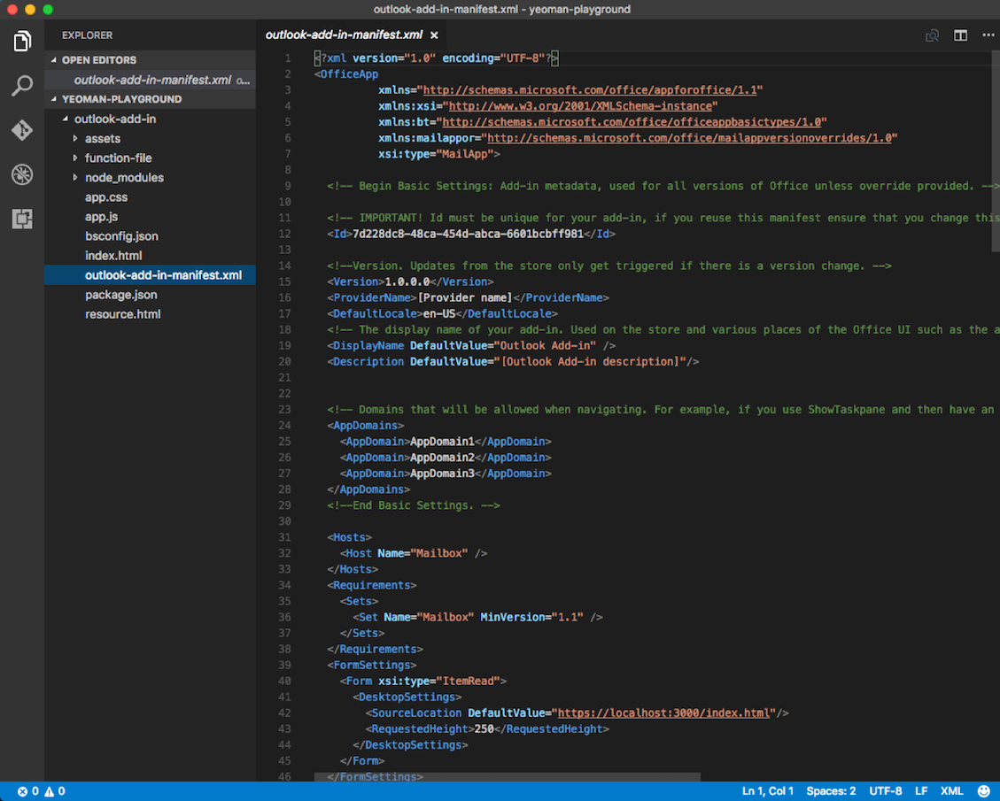
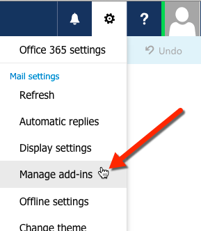
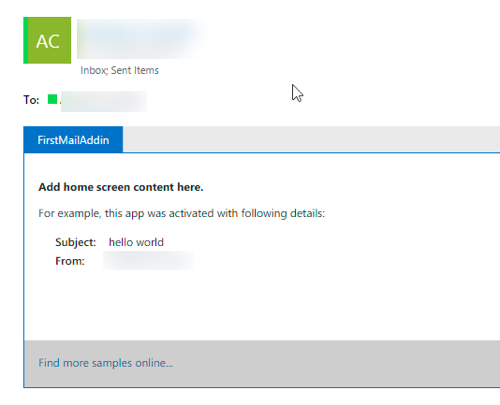
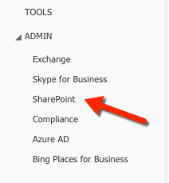

# Office Add-ins with Visual Studio Code

[Office Add-ins](https://dev.office.com/getting-started/addins) run inside an Office application and can interact with the contents of the Office document using the rich JavaScript API.


Under the hood, an Office Add-in is just a web app that you can host anywhere. Using a `manifest.xml` file, you tell the Office application where your web app is located and how you want it to appear. The Office application takes care of hosting it within Office.

## Step 1: Get set up

Follow the instructions to [Create an Office Add-in using any editor](https://dev.office.com/blogs/creating-office-add-ins-with-any-editor-introducing-yo-office) to install the necessary prerequisites, and use Yo Office to create a new add-in project. The following table lists the project attributes to select in the Yeoman generator.

| Option | Value |
|:------|:------|
|New subfolder | (accept the default) |
| Add-in name | Outlook Add-in |
| Supported Office application | (select Outlook) |
| Create new add-in | Yes, I want a new add-in |
| Add [TypeScript](https://www.typescriptlang.org/) | No |
| Choose framework | Jquery |

## Use Visual Studio Code to develop your Office Add-in!

Visual Studio Code is a great tool to help you develop your custom Office Add-ins regardless if they are for Outlook, Word, Excel, PowerPoint and run in the web clients, Windows clients, iOS clients or on macOS!

### Getting started

Open the project in Visual Studio Code by entering the following on the command line from within the same folder where you ran the generator:

```
code .
```



Open the `manifest.xml` file that was created by Yo Office and locate the `SourceLocation` node. Update this URL to the URL where you will host the Add-in.

>**Tip:** If you are using an Azure Web App as the host, the URL will look something like `https://[name-of-your-web-app].azurewebsites.net/[path-to-add-in]`. If you are using the self-hosted option listed above, it will be `http://localhost:3000/[path-to-add-in]`.

### Debugging your Office Add-in

VS Code does not currently support client-side debugging. To debug your client-side Add-in, you can use the Office web clients and open the browser's developer tools and debug the Add-in just like any other client-side JavaScript application.

If you are using Node.js or ASP.NET Core for server-side logic that supports your Office Add-in, refer to the [Debugging](/docs/editor/debugging.md) page to configure VS Code for debugging either of these runtimes.

## Install the Add-in

Office Add-ins must be installed, or registered, with the Office application in order to load. This is done using the `manifest.xml` file you modified earlier.

### Side loading Mail Add-ins

Mail Add-ins can be installed within the Outlook Web App. Browse to your Outlook Web App (https://mail.office365.com) and login. Once logged in, click the gear icon in the top-right section and select **Manage add-ins**:



On the **Manage add-ins** page, select the *+* icon and then select **Add from a file**.


Locate the `manifest.xml` file for your custom Add-in and install it, accepting all prompts when installing it.

Once that's done, select an existing email and you will see a horizontal bar below the email header that includes the Add-in:



Next try creating an email, click the **Add-ins** or **Apps** menu item to get the Task Pane to appear:


Select the Add-in and see it appear in the Task Pane:


### Deploying Add-ins to the Office 365 Tenancy's App Catalog

All Office Add-ins (including Mail Add-ins) can be installed from your Office 365 tenancy's App Catalog site. Log in to your [Office 365 Portal](http://portal.office365.com). In the left-hand navigation, towards the bottom, select the **Admin / SharePoint** option:



From the **SharePoint Admin Center**, select the **Apps** option in the left-hand menu and then select the **App Catalog**. On the **App Catalog** page, select the **Apps for Office** option and upload the `manifest.xml` file.


### Install Content & Task Pane Add-ins in Word / Excel / PowerPoint

Depending on the type of Add-in you created, you can add it to one of the Office applications. Task Pane and Content Add-ins can be installed in Word, Excel & PowerPoint. Mail Add-ins can be installed in Outlook.

To install an Add-in within an Office application, select the **Insert** tab and click the **Office Add-ins** button, as shown here using the Excel Web App:


Using the Office Add-ins dialog you can select Add-ins you've uploaded to your Office 365 tenancy's App Catalog (*listed under My Organization*) or acquire Add-ins from the Office Store.

## Next Steps

Check out the other pages on the VS Code site to find out how you can leverage more capabilities of the editor when creating custom Office Add-ins:

- [Language Overview](/docs/languages/overview.md) - You can write Office Add-ins in many languages. Find out what VS Code has to offer.
- [User Interface](/docs/getstarted/userinterface.md) - Just starting out with VS Code? This is worth reviewing.
- [Basic Editing](/docs/editor/codebasics.md) - Learn about the powerful VS Code editor.

## Common Questions

### Can I create an Office Add-in with the generator and use VS Code regardless of the language or client-side framework?

Yes, you can. You can use pure HTML, Angular, Ember, React, Aurelia... anything you like!

### Can I use TypeScript to create my Office Add-in?

Absolutely, VS Code has great support for [TypeScript](/docs/languages/typescript.md)!
