# Use Django in Visual Studio Code

[Django](https://www.djangoproject.com/) is a high-level Python framework designed for rapid, secure, and scalable web development. Django includes rich support for URL routing, page templates, and working with data.

In this tutorial you create a simple Django app with three pages that use a common base template. You create this app in the context of Visual Studio Code in order to understand how to work with Django in the VS Code terminal, editor, and debugger. Thus tutorial does not explore various details about Django itself, such as working with data models and  creating an administrative interface. For guidance on those aspects, refer to the [Django documentation](https://docs.djangoproject.com/en/2.1/intro/tutorial01/).

The completed code project from this tutorial can be found on GitHub: [python-sample-vscode-django-tutorial](https://github.com/Microsoft/python-sample-vscode-flask-tutorial).

## Prerequisites

To successfully complete this tutorial, you must do the following (which are the same steps as in the [general Python tutorial](/docs/python/python-tutorial.md)):

1. Install the [Python extension](https://marketplace.visualstudio.com/items?itemName=ms-python.python).

1. Install a version of Python 3 (for which this tutorial is written). Options include:
   - (All operating systems) A download from [python.org](https://www.python.org/downloads/); typically use the **Download Python 3.6.5** button that appears first on the page (or whatever is the latest version).
   - (Linux) The built-in Python 3 installation works well, but to install other Python packages you must run `sudo apt install python3-pip` in the terminal.
   - (MacOS) An installation through [Homebrew](https://brew.sh/) on macOS using `brew install python3` (the system install of Python on macOS is not supported).
   - (All operating systems) A download from [Anaconda](https://www.anaconda.com/download/) (for data science purposes).

1. On Windows, make sure the location of your Python interpreter is included in your PATH environment variable. You can check this by running `path` at the command prompt. If the Python interpreter's folder isn't included, open Windows Settings, search for "environment", select **Edit environment variables for your account**, then edit the **Path** variable to include that folder.

## Create a project environment for Django

In this section you create a virtual environment in which Django is installed. Using a virtual environment avoids installing Django into a global Python environment and gives you exact control over the libraries used in an application. A virtual environment also makes it easy to [Create a requirements.txt file for the environment](#create-a-requirements-txt-file-for-the-environment).

1. On your file system, create a project folder for this tutorial, such as `hello_django`.

1. In that folder, use the following command (as appropriate to your computer) to create a virtual environment named `env` based on your current interpreter:

    ```bash
    # macOS/Linux
    # You may need to run sudo apt-get install python3-venv first
    python3 -m venv env

    # Windows
    py -3 -m venv env
    ```

    > **Note**: Use a stock Python installation when running the above commands. If you use `python.exe` from an Anaconda installation, you see an error because the ensurepip module isn't available, and the environment is left in an unfinished state.

1. Open the project folder in VS Code by running `code .`, or by running VS Code and using the **File** > **Open Folder** command.

1. In VS Code, open the Command Palette (**View** > **Command Palette** or (`kb(workbench.action.showCommands)`)). Then select the **Python: Select Interpreter** command:

    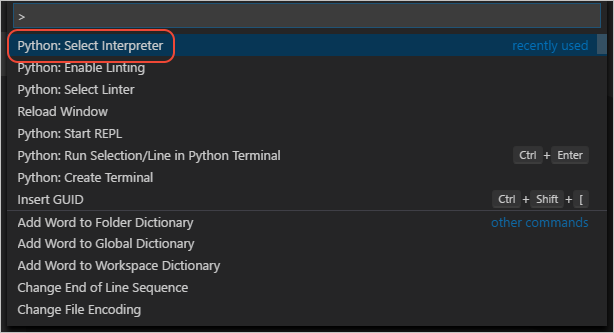

1. The command presents a list of available interpreters that VS Code can locate automatically (your list will vary; if you don't see the desired interpreter, see [Configuring Python environments](/docs/python/environments.md)). From the list, select your virtual environment:

    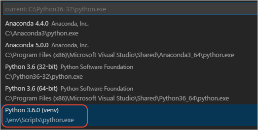

1. Run **Python: Create Terminal** from the command palette, which creates a terminal and automatically activates the virtual environment by running its activate script (`env/scripts/activate`).

    > **Note**: on Windows, if your default terminal type is PowerShell, you may see an error that it cannot run activate.ps1 because running scripts is disabled on the system. The error provides a link for information on how to allow scripts. Otherwise, use **Terminal: Select Default Shell** to set "Command Prompt" or "Git Bash" as your default instead.

1. The selected environment appears on the left side of the VS Code status bar, and notice the "(venv)" indicator that tells you that you're using a virtual environment:

    

1. Install Django in the virtual environment by running one of the following commands in the VS Code Terminal:

    ```bash
    # macOS/Linux
    python -m pip install django

    # Windows
    py -m pip install django
    ```

You now have an self-contained environment ready for writing Django code.

## Create and run a minimal Django app

In Django terminology, a "Django project" is composed of several site-level configuration files along with one or more "apps" that you deploy to a web host to create a full web application. A Django project can contain multiple apps, and the same app can be in multiple Django projects. An app, for its part, is just a Python package that follows certain conventions that Django expects.

To create a minimal Django app, then, it's necessary to first create the Django project to serve as the container for the app, then create the app itself. For both purposes you use the Django administrative utility, `django-admin`, which is installed when you install the Django package.

1. In the VS Code Terminal where your virtual environment is activated, run the following command:

    ```bash
    django-admin startproject django_project
    ```

1. The `startproject` command creates a folder with the specified name, in this case "django_project", with the following contents:

    - `manage.py`: The Django command-line administrative utility for the project. You run administrative commands for the project using `python3 manage.py <command> [options]` (Linux/MacOS) or `python manage.py <command> [options]` (Windows).
    - A folder with the same name as the project, which contains the following files:
        - *__init.py*: an empty file that tells Python that this folder is a Python package.
        - *wsgi.py*: an entry point for WSGI-compatible web servers to serve your project. You typically leave this file as-is as it provides the hooks for production web servers.
        - *settings.py*: contains settings for Django project, which you modify in the course of developing a web app.
        - *urls.py*: contains a table of contents for the Django project, which you also modify in the course of development.

1. To verify the Django project, run it using the command `python manage.py runserver` (`python3` as necessary on Linux/MacOS). The command starts Django's built-in development server on the default port 8000, and you see output like the following in the Output window:

    ```output
    Performing system checks...

    System check identified no issues (0 silenced).

    September 05, 2018 - 14:33:31
    Django version 2.1.1, using settings 'django_project.settings'
    Starting development server at http://127.0.0.1:8000/
    Quit the server with CTRL-BREAK.
    ```

    To be clear, Django's built-in web server is intended only for local development purposes. When you deploy to a web host, however, Django uses the host's web server instead. The *wsgi.py* module in the Django project takes care of hooking into the production servers.

    If you want to use a different port than the default 8000, simply specify the port number on the command line, such as `python manage.py runserver 5050`.

1. `kbstyle(Ctrl+click)` the `http://127.0.0.1:8000/` URL in the Output window to open your default browser to that address. If Django is installed correctly and the project is valid, you see a default page as shown below. You also see server messages in the VS Code Output window.

    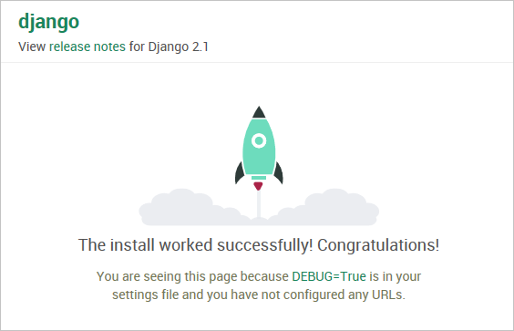

1. When you're done, close the browser window and stop the server in VS Code using `kbstyle(Ctrl+C)` as indicated in the Output window.

1. To add a Django app to the project, first navigate into the `django_project` folder that contains `manage.py`. Then run the administrative utility's `startapp` command in the VS Code Terminal:

    ```bash
    # Linux/MacOS
    python3 manage.py startapp hello

    # Windows
    python manage.py startapp hello
    ```

1. The command creates a default SQLite database file, `db.sqlite3` and folder called `hello` with the following contents:

    TODO: May not talk to all of this.

    | Item | Description |
    | --- | --- |
    | `__init__.py` | The file that identifies the app as a package. |
    | `migrations` | A folder in which Django stores scripts that update the database to align with changes to the models. Django's migration tools then apply the necessary changes to any previous version of the database so that it matches the current models. Using migrations, you keep your focus on your models and let Django handle the underlying database schema. Migrations are discussed in TODO; for now, the folder simply contains an `__init__.py` file (indicating that the folder defines its own Python package). |
    | `admin.py` | The Python file in which you extend the app's administrative interface (see TODO), which is used to seed and edit data in a database. Initially, this file contains only the statement, `from django.contrib import admin`. By default, Django includes a standard administrative interface through entries in the Django project's `settings.py` file, which you can turn on by uncommenting existing entries in `urls.py`. |
    | `apps.py` | A Python file that defines a configuration class for the app. |
    | `models.py` | Models are data objects, identified by functions, through which views interact with the app's underlying database. Django provides the database connection layer so that apps don't need to concern themselves with those details. The `models.py` file is a default place in which to create your models, and initially contains only the statement, `from django.db import models`. |
    | `tests.py` | A Python file that contains the basic structure of unit tests. |
    | `views.py` | Views are what you typically think of as web pages, which take an HTTP request and return an HTTP response. Views typically render as HTML that web browsers know how to display, but a view doesn't necessarily have to be visible (like an intermediate form). A view is defined by a Python function whose responsibility is to render the HTML to send to the browser. The `views.py` file is a default place in which to create views, and initially contains only the statement, `from django.shortcuts import render`. |

1. Modify `hello/views.py` to match the following code, which creates a single view for the app's home page:

    ```python
    from django.shortcuts import render
    from django.http import HttpResponse

    def home(request):
        return HttpResponse("Hello, Django!")
    ```

1. Create a file, `hello/urls.py`, in which you specify URL patterns to route to specific pages in the app. Make the contents of the file match the following code, which maps the root of the app to the `view.home` function of `hello/views.py`:

    ```python
    from django.urls import path
    from . import views

    urlpatterns = [
        path('', views.home, name="home")
    ```

1. To tell the Django project about the app's URLs, modify `django_project/urls.py` to match the following code (you can retain the instructive comments if you like). Here you use the `django.urls.include` function to load `hello/urls.py` into the project:

    ```python
    from django.contrib import admin
    from django.urls import path
    from django.urls import include

    urlpatterns = [
        path('', include('hello.urls')),
    ]
    ```

1. Save all modified files with `kb(workbench.action.files.saveAll)`.

1. Run the development server again with `python manage.py runserver` and open a browser to  `http://127.0.0.1:8000/` to see a page that renders "Hello, Django".

    

Although you may think this two-level URL routing scheme is somewhat tedious, the mechanism allows you to have multiple apps within the same Django project. For example, say you have apps named "storefront", "research", and "api" in the same project, which are each self-contained. Each app would have its own `urls.py` for routing within the app. In the project's `urls.py`, then, you'd route different subfolders off the base URL to each app:

    ```python
    # EXAMPLES ONLY - not used in the tutorial project
    urlpatterns = [
        path('', include('storefront.urls')),          # Default path is to the storefront
        path('store/', include('storefront.urls')),    # Also allow <base_url>/store to reach the storefront
        path('research/', include('storefront.urls')), # <base_url>/research goes to the research app
        path('api/', include('storefront.urls')),      # <base_url>/api goes to the api app
        ]
    ```

The benefit of this scheme is, again, that each app can be self-contained but then easily incorporated into the overall project (or site, if you will). Without this scheme, it becomes too easy for the different apps to become intertwined, thereby increasing the complexity of your code and the possibility of errors.

## Create a debugger launch profile

You may already be tiring of running `python manage.py runserver` every time you want to test the app. Fortunately, you can create a customized launch profile in VS Code, which is also used for what will likely become a common exercise: debugging.

1. Switch to **Debug** view in VS Code (using the left-side activity bar). Along the top of the Debug view, you may see "No Configurations" and a warning dot on the gear icon. Both indicators mean that you don't yet have a `launch.json` file containing debug configurations:

    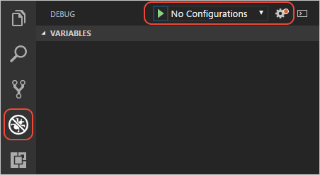

1. Select the gear icon and wait for a few seconds for VS Code to create and open a `launch.json` file. (If you're using an older version of VS Code, you may be prompted with a list of debugger targets, in which case select **Python** from the list.) The `launch.json` file contains a number of debugging configurations, each of which is a separate JSON object within the `configuration` array.

1. Scroll down to and examine the configuration with the name "Python: Django", and modify the `"program"` entry to include the project folder:

    ```json
    {
        "name": "Python: Django",
        "type": "python",
        "request": "launch",
        "program": "${workspaceFolder}/django_project/manage.py",
        "console": "integratedTerminal",
        "args": [
            "runserver",
            "--noreload",
            "--nothreading"
        ],
        "django": true
    },
    ```

    As you can see, the configuration contains `"program": "${workspaceFolder}/django_project/manage.py"` along with an `args` list that includes `runserver` and is where you can add an item for a port number such as `"5000"`, if desired. These arguments together provide the equivalent of the command line you've been using. The `"console": "integratedTerminal"` tells VS Code to show debugging output in the Terminal. Then `"django": true` entry also tells VS Code to enable debugging of Django page templates, which you'll see later in this tutorial.

1. Save `launch.json` (`kb(workbench.action.files.save)`). In the debug configuration drop-down list (which reads **Python: Current File**) select the **Python: Django** configuration .

    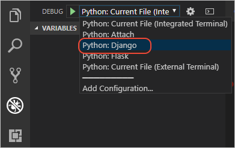

1. Test the configuration by selecting the **Debug** > **Start Debugging** menu command, or selecting the green **Start Debugging** arrow next to the list (`kb(workbench.action.debug.continue)`):

    

1. `kbstyle(Ctrl+click)` the `http://127.0.0.1:8000/` URL in the Output window to open the browser and see that the app is running properly.

1. Close the browser and stop the debugger when you're finished. To stop the debugger, use the Stop toolbar button (the red square) or the **Debug** > **Stop Debugging** command (`kb(workbench.action.debug.stop)`).

## Explore the debugger

Debugging gives you the opportunity to pause a running program on a particular line of code. When a program is paused, you can examine variables, run code in the Debug Console panel, and otherwise take advantage of the features described on [Debugging](/docs/python/debugging.md). Running the debugger also automatically saves any modified files before the debugging session begins.

**Before you begin**: Make sure that you stopped the running app at the end of the last section by using `kbstyle(Ctrl+C)` in the terminal. If you leave the app running in one terminal, it continues to own the port. As a result, when you run the app in the debugger using the same port, the original running app handles all the requests and you won't see any activity in the app being debugged and the program won't stop at breakpoints. In other words, if the debugger doesn't seem to be working, make sure that no other instance of the app is still running.

1. In `hello/urls.py`, add a route to the `urlpatterns` list:

    ```python
    path('hello/<name>', views.hello_there, name="hello_there"),
    ```

    The first argument to `path` defines a route "hello/" that accepts a variable string called *name*. The string is passed as an argument to the `views.hello_there` function.

    URL routes are case-sensitive. For example, the route `/hello/<name>` is distinct from `/Hello/<name>`. If you want the same function to handle both, define paths for each variant.

1. Replace the contents of `views.py` with the following code to define the `hello_there` function that you can step through in the debugger:

    ```python
    from django.http import HttpResponse
    from datetime import datetime
    import re

    def home(request):
        return HttpResponse("Hello, Django!")

    def hello_there(request, name):
        now = datetime.now()
        formatted_now = now.strftime("%A, %d %B, %Y at %X")

        # Filter the name argument to letters only using regular expressions. URL arguments
        # can contain arbitrary text, so we restrict to safe characters only.
        match_object = re.match("[a-zA-Z]+", name)

        if match_object:
            clean_name = match_object.group(0)
        else:
            clean_name = "Friend"

        content = "Hello there, " + clean_name + "! It's " + formatted_now
        return HttpResponse(content)
    ```

    The `name` variable defined in the URL route appears as an argument to the `hello_there` function. As described in the code comments, always filter arbitrary user-provided information to avoid various attacks on your app. In this case, the code filters the name argument to contain only letters, which avoids injection of control characters, HTML, and so forth. (When you use templates in the next section, Django does automatic filtering and you won't need this code.)

1. Set a breakpoint at the first line of code in the `hello_there` function (`now = datetime.now()`) by doing any one of the following:
    - With the cursor on that line, press `kb(editor.debug.action.toggleBreakpoint)`, or,
    - With the cursor on that line, select the **Debug** > **Toggle Breakpoint** menu command, or,
    - Click directly in the margin to the left of the line number (a faded red dot appears when hovering there).

    The breakpoint appears as a red dot in the left margin:

    

1. Start the debugger by selecting the **Debug** > **Start Debugging** menu command, or selecting the green **Start Debugging** arrow next to the list (`kb(workbench.action.debug.continue)`):

    

    Observe that the status bar changes color to indicate debugging:

    

    A debugging toolbar (shown below) also appears in VS Code containing commands in the following order: Pause (or Continue, `kb(workbench.action.debug.continue)`), Step Over (`kb(workbench.action.debug.stepOver)`), Step Into (`kb(workbench.action.debug.stepInto)`), Step Out (`kb(workbench.action.debug.stepOut)`), Restart (`kb(workbench.action.debug.restart)`), and Stop (`kb(workbench.action.debug.stop)`). See [VS Code debugging](/docs/editor/debugging.md) for a description of each command.

    

1. Output appears in a "Python Debug Console" terminal. `kbstyle(Ctrl+click)` the `http://127.0.0.1:8000/` link in that terminal to open a browser to that URL. In the browser's address bar, navigate to `http://127.0.0.1:8000/hello/VSCode`. Before the page renders, VS Code pauses the program at the breakpoint you set. The small yellow arrow on the breakpoint indicates that it's the next line of code to run.

    

1. Use Step Over to run the `now = datetime.now()` statement.

1. On the left side of the VS Code window you see a **Variables** pane that shows local variables, such as `now`, as well as arguments, such as `name`. Below that are panes for **Watch**, **Call Stack**, and **Breakpoints** (see [VS Code debugging](/docs/editor/debugging.md) for details). In the **Locals** section, try expanding different values. You can also double-click values (or use `kb(debug.setVariable)`) to modify them. Changing variables such as `now`, however, can break the program. Developers typically make changes to correct values when the code didn't produce the right value to begin with.

    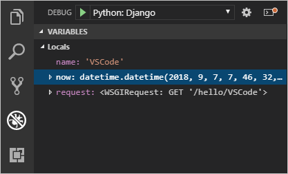

1. When a program is paused, the **Debug Console** panel (which is different from the "Python Debug Console" in the Terminal panel) lets you experiment with expressions and try out bits of code using the current state of the program. For example, once you've stepped over the line `now = datetime.now()`, you might experiment with different date/time formats. In the editor, select the code that reads `now.strftime("%A, %d %B, %Y at %X")`, then right-click and select **Debug: Evaluate** to send that code to the debug console, where it runs:

    ```bash
    now.strftime("%A, %d %B, %Y at %X")
    'Friday, 07 September, 2018 at 07:46:32'
    ```

    > **Tip**: The **Debug Console** also shows exceptions from within the app that may not appear in the terminal. For example, if you see a "Paused on exception" message in the **Call Stack** area of Debug View, switch to the **Debug Console** to see the exception message.

1. Copy that line into the > prompt at the bottom of the debug console, and try changing the formatting:

    ```bash
    now.strftime("%a, %d %B, %Y at %X")
    'Fri, 07 September, 2018 at 07:46:32'
    now.strftime("%a, %d %b, %Y at %X")
    'Fri, 07 Sep, 2018 at 07:46:32'
    now.strftime("%a, %d %b, %y at %X")
    'Fri, 07 Sep, 18 at 07:46:32'
    ```

    > **Note**: if you see a change you like, you can copy and paste it into the editor during a debugging session. However, those changes aren't applied until you restart the debugger.

1. Step through a few more lines of code, if you'd like, then select Continue (`kb(workbench.action.debug.continue)`) to let the program run. The browser window shows the result:

    

1. Close the browser and stop the debugger when you're finished. To stop the debugger, use the Stop toolbar button (the red square) or the **Debug** > **Stop Debugging** command (`kb(workbench.action.debug.stop)`).

> **Tip**: To make it easier to repeatedly navigate to a specific URL like `http://127.0.0.1:8000/hello/VSCode`, output that URL using a `print` statement. The URL appears in the terminal where you can use `kbstyle(Ctrl+click)` to open it in a browser.

## Go to Definition and Peek Definition commands

During your work with Django or any other library, you may want to examine the code in those libraries themselves. VS Code provides two convenient commands that navigate directly to the definitions of classes and other objects in any code:

- **Go to Definition** jumps from your code into the code that defines an object. For example, in `app.py`, right-click on the `Flask` class (in the line `app = Flask(__name__)`) and select **Go to Definition** (or use `kb(editor.action.goToDeclaration)`), which navigates to the class definition in the Flask library.

- **Peek Definition** (`kb(editor.action.previewDeclaration)`, also on the right-click context menu), is similar, but displays the class definition directly in the editor (making space in the editor window to avoid obscuring any code). Press `kbstyle(Escape)` to close the Peek window.

    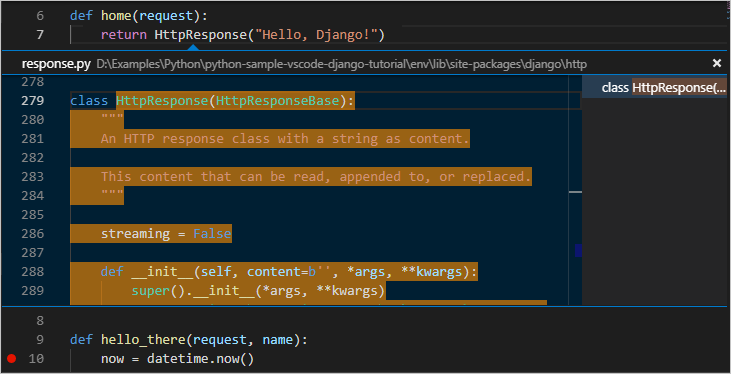

## Use a template to render a page

The app you've created so far in this tutorial generates only plain text web pages directly within Python code. Although it's possible to generate HTML directly in code, developers typically avoid such a practice because it's vulnerable to cross-site scripting (XSS) attacks. Instead, developers separate HTML markup from the code-generated data that gets inserted into that markup. **Templates** are a common approach to achieve this separation.

A template is an HTML file that contains placeholders for values that the code provides at run time. The Django templating engine takes care of making the substitutions when rendering the page. The code, therefore, concerns itself only with data values and the template concerns itself only with markup. Django templates provide flexible options such as template inheritance, which allows you to define a base page with common markup and then build upon that base with page-specific additions.

In this section you create a single page using a template. In the sections that follow, you configure the app to serve static files, and then create multiple pages to the app that each contain a nav bar from a base template.

TODO: Include hello in settings.py.

1. Inside the `hello` folder, create a folder named `templates`, and then another subfolder named `hello` to match the app name. By default, Django looks for an app's template in the `templates/<app_name>` folder.

1. In the `templates/hello` folder, create a file named `hello_there.html` with the contents below. This template contains two placeholders named "title" and "content", which are delineated by pairs of curly braces, `\{{` and `}}`.

    ```html
    <!DOCTYPE html>
    <html>
        <head>
            <meta charset="utf-8" />
            <title>\{{ title }}</title>
        </head>
        <body>
            \{{ content }}
        </body>
    </html>
    ```

1. At the top of `views.py`, add the following import statement:

    ```python
    from django.shortcuts import render
    ```

1. Also in `views.py`, modify the `hello_there` function to use `django.shortcuts.render` method to load a template and apply the named values (the ). `render_template` assumes that the first argument is relative to the `templates` folder. Typically, developers name the templates the same as the functions that use them, but matching names are not required because you always refer to the exact filename in your code.

    ```python
    def hello_there(request, name):
        now = datetime.now()
        formatted_now = now.strftime("%A, %d %B, %Y at %X")

        # BAD CODE! Avoid inline HTML for security reason, plus templates automatically escape HTML content.
        content = "<strong>Hello there, " + name + "!</strong> It's " + formatted_now

        return render(
            request,
            'hello/hello_there.html',
            {
                'title': 'Hello, Django',
                'content': content,
            }
        )
    ```

1. Start the program (inside or outside of the debugger, using `kb(workbench.action.debug.continue)` or `kb(workbench.action.debug.run)`), navigate to a /hello/name URL, and observe the results. Notice that the inline HTML, if you happen to write bad code like this, doesn't get rendered as HTML because the templating engine automatically escapes values used in placeholders. Automatic escaping prevent accidental vulnerabilities to injection attacks: developers often gather input from one page, or the URL, and use it as a value in another page through a template placeholder. Escaping also serves as a reminder that it's again best to keep HTML out of the code entirely.

    For this reason, modify the template and view function as follows to make each piece of content more specifically. While you're at it, also move more of the text (including the title):

    In `templates/hello/hello_there.html`:

    ```html
    <!DOCTYPE html>
    <html>
        <head>
            <meta charset="utf-8" />
            <title>Hello, Django</title>
        </head>
        <body>
            <strong>Hello there, \{{ name }}!</strong> It's \{{ date }}.
        </body>
    </html>
    ```

    In `views.py`:

    ```python
    def hello_there(request, name):
    return render(
        request,
        'hello/hello_there.html',
        {
            'name': name,
            'date': datetime.now().strftime('%A, %d %B, %Y at %X'),
        }
    )
    ```

1. Run the app again and navigate to a /hello/name URL to observe the expected result, then stop the app when you're done.

## Serve static files

Static files are pieces of content that your web app returns as-is for certain requests, such as CSS files. Serving static files requires that the `INSTALLED_APPS` list in `settings.py` contains `django.contrib.staticfiles`, which is included by default.

Static files are of two types. First are those files like stylesheets to which a page template can just refer directly, which is demonstrated in the next section. Such files are placed by default in a `static` folder within the app, the name of which is defined by the `STATIC_URL` variable found in the project's `settings.py` file. You can also define a `STATICFILES_DIRS` list in `settings.py` to define additional static folders. For example, the equivalent entry in `STATICFILES_DIRS` for the default `static` folder is `os.path.join(BASE_DIR, "static")`.

The second type are those files that you want to address in code, such as when you want to implement an API endpoint that returns a static file. The considerations for serving such files in Django production environments is beyond the scope of this tutorial. For more information, see [Managing static files](https://docs.djangoproject.com/en/2.1/howto/static-files/) in the Django documentation.

### Refer to static files in a template

1. In the `hello` folder, create a folder named `static`.

1. Within the `static` folder, create a file named `site.css` with the following contents. After entering this code, also observe the syntax highlighting that VS Code provide for CSS files, including a color preview:

    ```css
    .message {
        font-weight: 600;
        color: blue;
    }
    ```

1. In `templates/hello/hello_there.html`, add the following lines before the `</head>` tag. The `` tag is a custom Django template tag set, which allows you to use `` to refer to a file like the stylesheet.

    ```html
    
    <link rel="stylesheet" type="text/css" href="" />
    ```

1. Also in `templates/hello_there.html`, replace the contents `<body>` element with the following markup that uses the `message` style instead of a `<strong>` tag:

    ```html
    <span class="message">Hello, there \{{ name }}!</span> It's \{{ date }}.
    ```

1. Run the app, navigate to a /hello/name URL, and observe that the message renders in blue. Stop the app when you're done.

## Create multiple templates that extend a base template

Because most web apps have more than one page, and because those pages typically share many common elements, developers separate those common elements into a base page template that other page templates can then extend. (This is also called template inheritance.)

Also, because you'll likely create many pages that extend the same template, it's helpful to create a code snippet in VS Code with which you can quickly initialize new page templates. A snippet helps you avoid tedious and error-prone copy-paste operations.

The following sections walk through different parts of this process.

### Create a base page template and styles

A base page template in Django contains all the shared parts of a set of pages, including references to CSS files, script files, and so forth. Base templates also define one or more **block** tags that other templates that extend the base are expected to override. A block tag is delineated by `` and `` in both the base template and extended templates.

The following steps demonstrate creating a base template.

1. In the `templates/hello` folder, create a file named `layout.html` with the contents below, which contains blocks named "title" and "content". As you can see, the markup defines a simple nav bar structure with links to Home, About, and Contact pages, which you create in a later section. Notice the use of Django's `` tag to refer to other pages through the names of the corresponding URL patterns rather than by relative path.

    ```html
    <!DOCTYPE html>
    <html>
        <head>
            <meta charset="utf-8" />
            <title></title>
            
            <link rel="stylesheet" type="text/css" href="" />
        </head>

        <body>
            <div class="navbar">
                <a href="" class="navbar-brand">Home</a>
                <a href="" class="navbar-item">About</a>
                <a href="" class="navbar-item">Contact</a>
            </div>

            <div class="body-content">
                
                
                <hr/>
                <footer>
                    <p>&copy; 2018</p>
                </footer>
            </div>
        </body>
    </html>
    ```

1. Add the following styles to `static/site.css` below the existing "message" style, and save the file. (This walkthrough doesn't attempt to demonstrate responsive design; these styles simply generate a reasonably interesting result.)

    ```css
    .navbar {
        background-color: lightslategray;
        font-size: 1em;
        font-family: 'Trebuchet MS', 'Lucida Sans Unicode', 'Lucida Grande', 'Lucida Sans', Arial, sans-serif;
        color: white;
        padding: 8px 5px 8px 5px;
    }

    .navbar a {
        text-decoration: none;
        color: inherit;
    }

    .navbar-brand {
        font-size: 1.2em;
        font-weight: 600;
    }

    .navbar-item {
        font-variant: small-caps;
        margin-left: 30px;
    }

    .body-content {
        padding: 5px;
        font-family:'Segoe UI', Tahoma, Geneva, Verdana, sans-serif;
    }
    ```

You can run the app at this point, but because you haven't made use of the base template anywhere and haven't changed any code files, the result is the same as the previous step. Complete the remaining sections to see the final effect.

### Create a code snippet

Because the three pages you create in the next section extend `layout.html`, it saves time to create a **code snippet** to initialize a new template file with the appropriate reference to the base template. A code snippet provides a consistent piece of code from a single source, which avoids errors that can creep in when using copy-paste from existing code.

1. In VS Code, select the **File** (Windows/Linux) or **Code** (macOS), menu, then select **Preferences** > **User snippets**.

1. In the list that appears, select **html**. (The option may appear as "html.json" in the **Existing Snippets** section of the list if you've created snippets previously.)

1. After VS code opens `html.json`, modify it so it looks like the following (the explanatory comments, not shown here, describe details such as how the `$0` line indicates where VS Code places the cursor after inserting a snippet):

    ```json
    {
        "Django App: template extending layout.html": {
            "prefix": "djextlayout",
            "body": [
                "",
                "",
                "$0",
                "",
                "",
                ""
            ],

            "description": "Boilerplate template that extends layout.html"
        }
    }
    ```

1. Save the `html.json` file (`kb(workbench.action.files.save)`).

1. Now, whenever you start typing the snippet's prefix, such as `djext`, VS Code provides the snippet as an autocomplete option, as shown in the next section. You can also use the **Insert Snippet** command to choose a snippet from a menu.

For more information on code snippets in general, refer to [Creating snippets](/docs/editor/userdefinedsnippets.md).

### Use the code snippet to add pages

With the code snippet in place, you can quickly create templates for the Home, About, and Contact pages.

1. In the `templates/app` folder, create a new file named `home.html`, Then start typing `djext` to see the snippet appear as a completion:

    

    When you select the completion, the snippet's code appears with the cursor on the snippet's insertion point:

    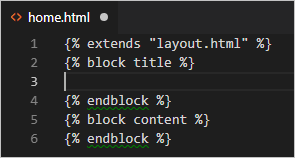

1. At the insertion point in the "title" block, write `Home`, and in the "content" block, write `<p>Home page for the Visual Studio Code Django tutorial.</p>`, then save the file. These lines are the only unique parts of the extended page template:

1. In the `templates` folder, create `about.html`, use the snippet to insert the boilerplate markup, insert `About us` and `<p>About page for the Visual Studio Code Django tutorial.</p>` in the "title" and "content" blocks, respectively, then save the file.

1. Repeat the previous step to create `templates/contact.html` using `Contact us` and `<p>Contact page for the Visual Studio Code Django tutorial.</p>` in the two content blocks.

1. in `urls.py`, add routes for the /about and /contact pages. Be mindful that the `name` argument to the `path` function defines the name with which you refer to the page in the `` tags in the templates.

    ```python
    path('about/', views.about, name="about"),
    path('contact/', views.contact, name="contact"),
    ```

1. In `views.py`, add functions for the /about and /contact routes that refer to their respective page templates. Also modify the `home` function to use the `home.html` template.

    ```python
    # Replace the existing home function with the one below
    def home(request):
        return render(request, 'app/home.html')

    def about(request):
        return render(request, 'app/about.html')

    def contact(request):
        return render(request, 'app/contact.html')
    ```

### Run the app

With all the page templates in place, save `views.py`, run the app, and open a browser to the home page to see the results. Navigate between the pages to verify that the page template are properly extending the base template.

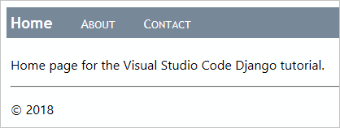

## Work with data, data models, and migrations

Many web apps work with information stored in a database, and Django makes it easy to represent the objects in that database using *models*. In Django, a model is a Python class, derived from `django.db.models.Model`, that represents a specific database object, typically a table.

By default, Django includes a `db.sqlite3` file for an app's database that's suitable for development work. As described on [When to use SQLite](https://www.sqlite.org/whentouse.html) (sqlite.org), SQLite works fine for low to medium traffic sites with fewer than 100K hits/day, but is not recommended for higher production volumes. It's also limited to a single computer, so it cannot be used in any multi-server scenario such as load-balancing and geo-replication. For these reasons, consider using a production-level data store such as PostgreSQL, MySQL, and SQL Server. For information on Django's support for other databases, see [Database setup](https://docs.djangoproject.com/en/2.1/intro/tutorial02/#database-setup). You can also use the [Azure SDK for Python](azure-sdk-for-python.md) to work with Azure storage services like tables and blobs.

With Django, your work with your database almost exclusively through the models you define in code. Django's "migrations" then handle all the details of the underlying database automatically as you evolve the models over time. The only exception is that you might seed or initialize your database using the Django administrative utility [loaddata command](https://docs.djangoproject.com/en/2.1/ref/django-admin/#loaddata). When using the `db.sqlite3` file, you can also confirm exactly what's stored in the database using a tool like the [SQLite browser](http://sqlitebrowser.org/), but avoid making changes to the database using such a tool as those changes won't align with the state of your models.

### Define models

A Django model is again a Python class derived from `django.db.model.Models`, which you place in the app's `models.py` file. Each model is automatically given a unique ID field in the database named `id`. All other fields are defined as properties of the class using types from `django.db.models` such as `CharField` (limited text), `TextField` (unlimited text), `EmailField`, `URLField`, `IntegerField`, `DecimalField`, `BooleanField`. `DateTimeField`, `ForeignKey`, and `ManyToMany`, among others. (See the [Model field reference](https://docs.djangoproject.com/en/2.1/ref/models/fields/) in the Django documentation for details.)

Each field takes some attributes, like `max_length`. The `blank=True` attribute means the field is optional; `null=true` means that a value is optional. There is also a `choices` attribute that limits values to values in an array of data value/display value tuples.

For example, the following class in `models.py`, then, defines a data model to represent dated entries in a simple message log:

```python
from django.db import models

class LogMessage(models.Model):
    message = models.CharField(max_length=300)
    log_date = models.DateTimeField('date logged')

    def __unicode__(self):
        """Returns a string representation of a message."""
        return "'" + self.text + "' logged on " + log_date.strftime('%A, %d %B, %Y at %X')
```

A model class can include methods that return values computed from other class properties. Models typically include a `__unicode__` method that returns a string representation of the instance.

## Initialize and migrate the database

Now that you have your first model, make sure you have an Terminal with your virtual environment activated (use the **Python: Create Terminal** command in VS Code), then navigate into the project folder and run the following commands:

```bash
python manage.py makemigrations
python manage.py migrate
```

These commands first generate "migration" scripts (`makemigrations`) in your `migrations` folder, then run those scripts to apply the changes (`migrate`). The migration scripts record all the changes you make to your data models over time, which makes it easy to keep your any underlying database up to date with your models. The general workflow is as follows:

1. Make changes to the models in your *models.py* file.
1. Run `python manage.py makemigrations` to generates scripts that to migrate the database from its current state to the new state.
1. Run `python manage.py migrate` to apply the scripts to the actual database.

Because Django creates migrations scripts for each change, it can apply those scripts to any previous version of the database, including a new, uninitialized one. You use migrations to update a previously deployed database with your latest changes, as well as any time you or another developer need to initialize a new database from scratch. Simply said, Django takes care of the details: all you need to do is express your data models in `models.py`!

### Use the database through the models

With the database ready to receive and manage data, you can write code that saves and retrieves data using only your models. In this section, you add a simple form to the app to log a message, then display the logged messages on the home page. The process involves adding a new page, modifying the home page template, and updating various code files, so be mindful of the details.

1. In the `hello` folder (where you have `views.py`), create a new file named `forms.py` with the following code, which defines a Django form that contains field drawn from the data model, `LogMessage`:

    ```python
    from django import forms
    from .models import LogMessage

    class LogMessageForm(forms.ModelForm):
        class Meta:
            model = LogMessage
            fields = ('message',)   # NOTE: the trailing comma is required
    ```

1. In the `templates/hello` folder, create a new template named `log_message.html` with the following contents, which assumes that the template is given a variable named `form` to define the body of the form. It then adds a submit button with the label "Log":

    ```html
    
    
    Log a message
    
    
    <form method="POST" class="log-form">
            {{ form.as_p }}
            <button type="submit" class="save btn btn-default">Log</button>
        </form>
    
    ```

1. In the app's `static/site.css` file, add a rule to make the input form wider:

    ```css
    input[name=message] {
        width: 80%;
    }
    ```

1. In the app's `urls.py` file, add a route for the new page:

    ```python
    path('log/', views.log_message, name="log"),
    ```

1. In `views.py`, define the view named `log_message` (as referred to by the URL route). This view handles both HTTP GET and POST cases. In the GET case (the `else:` section), it just displays the form that you defined in the previous steps. In the POST case, it retrieves the data from the form into a data object (`message`), sets the timestamp, then saves that object at which point it's written to the database:

    ```python
    # At the top of the file:
    from .forms import LogMessageForm
    from .models import LogMessage

    # Elsewhere in the file:
    def log_message(request):
        if request.method == "POST":
            form = LogMessageForm(request.POST)

            if form.is_valid():
                message = form.save(commit=False)
                message.log_date = datetime.now()
                message.save()
                return redirect('home')
        else:
            form = LogMessageForm()
            return render(request, 'hello/log_message.html', {'form': form})
    ```

1. One more step, then you can run the code! In `templates/hello/layout.html`, add a link in the "navbar" div for the message logging page:

    ```html
    <!-- Insert below the link to Home -->
    <a href="" class="navbar-item">Log Message</a>
    ```

1. Run the app and open a browser to the home page. Select the **Log Message** link on the nav bar, which should display the message logging page:

    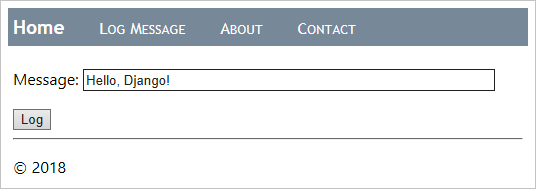

1. Enter a message, select **Log**, and you should be taken back to the home page. The home page doesn't yet show any of the logged messages yet (which you remedy in a moment). Feel free to log a few more messages as well. If you want, you can also take a peek in the database using a tool like SQLite Browser to see that a record has been created in the database. Just be sure to close the database in that tool before using the app, otherwise the app will fail because the database is locked.

1. In the next series of changes, you modify the home page to display the logged messages. First, replace the contents of app's `templates/hello/home.html` file with the following markup. This template expects a context variable names `message_list`. If it receives one (checked with the `` tag), then it iterates over that list (the `` tag) to generate table rows for each message. Otherwise the page indicates that no messages have yet been logged.

    ```html
    
    
    Home
    
    
    <h2>Logged messages</h2>

    
    <table class="message_list">
        <thead>
            <tr>
                <th>Date</th>
                <th>Time</th>
                <th>Message</th>
            </tr>
        </thead>
        <tbody>
            
            <tr>
                <td>{{ message.log_date | date:'d M Y' }}</td>
                <td>{{ message.log_date | date:'H:i:s' }}</td>
                <td>
                    {{ message.message }}
                </td>
            </tr>
            
        </tbody>
    </table>
    
    <p>No messages have been logged. Use the <a href="">Log Message form</a>.</p>
    
    
    ```

1. In `static/site.css`, add a rule to format the table a little:

    ```css
    .message_list th,td {
        text-align: left;
        padding-right: 15px;
    }
    ```

1. In `views.py`, import Django's generic `ListView` class, which we'll use to implement the home page:

    ```python
    from django.views.generic import ListView
    ```

1. Also in `views.py`, replace the `home` function iwith a *class* named `HomeListView`, derived from `ListView`, which ties itself to the `LogMessage` model and implements a function `get_context_data` to generate the context for the template.

    ```python
    class HomeListView(ListView):
        """Renders the home page, with a list of all polls."""
        model = LogMessage

        def get_context_data(self, **kwargs):
            context = super(HomeListView, self).get_context_data(**kwargs)
            return context
    ```

1. In `urls.py`, import the data model:

    ```python
    from .models import LogMessage
    ```

1. Then replace the path for the home page with the following code, which retrieves the five most recent `LogMessage` objects  in descending order (meaning that it queries the database), and then identifies the variable name for the data in the template context along with the template path:

    ```python
        path('',
            views.HomeListView.as_view(
                queryset=LogMessage.objects.order_by('-log_date')[:5],  # :5 limits the results to the five most recent
                context_object_name='message_list',
                template_name='hello/home.html',),
            name="home"),
    ```

1. Start the app and open a browser to the home page, which should now display messages:

    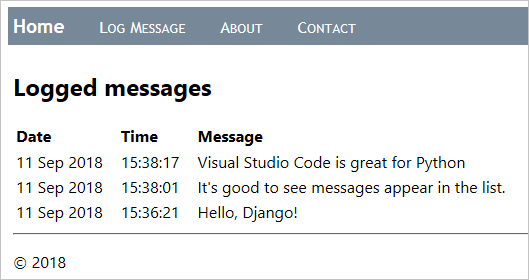

## Optional activities

The following sections describe additional steps that you might find helpful in your work with Python and Visual Studio Code.

### Create a requirements.txt file for the environment

When you share your app code with others through source control or some other means, it doesn't make sense to copy all the files in a virtual environment because recipients can always install packages themselves.

Accordingly, developers typically omit the virtual environment folder from source control, and instead describe the app's dependencies using a `requirements.txt` file.

Although you can create the file by hand, you can also use the `pip freeze` command to generate the file based on the exact libraries installed in the activated environment:

1. With your chosen environment selected using the **Python: Select Interpreter** command, tun the **Python: Create Terminal** command to open a terminal with that environment activated.

1. In the terminal, run `pip freeze > requirements.txt` to create the `requirements.txt` file in your project folder.

Anyone (or any build server) that receives a copy of the project needs only to run the `pip install -r requirements.txt` command to recreate the environment.

### Create an administrative interface

## Next steps

Congratulations on completing this walkthrough of working with Flask in Visual Studio code!

The completed code project from this tutorial can be found on GitHub: [python-sample-vscode-django-tutorial](https://github.com/Microsoft/python-sample-vscode-django-tutorial).

TODO: Django links

You may also want to review the following articles in the VS Code docs that are relevant to Python:

- [Editing Python code](/docs/python/editing.md)
- [Linting](/docs/python/linting.md)
- [Managing Python environments](/docs/python/environments.md)
- [Debugging Python](/docs/python/debugging.md)
- [Unit testing](/docs/python/unit-testing.md)
