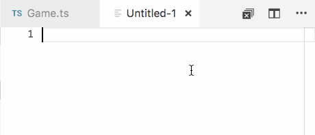
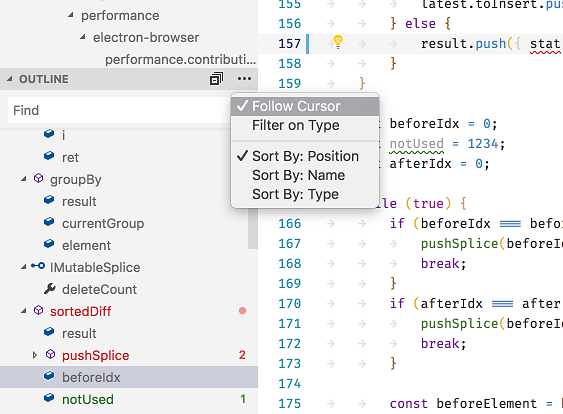
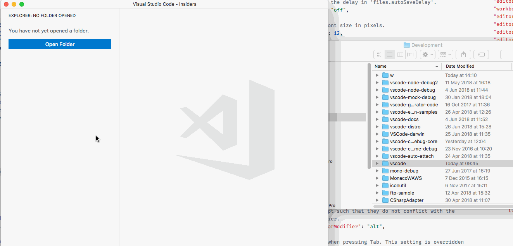
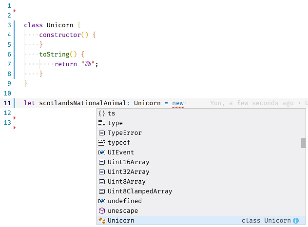
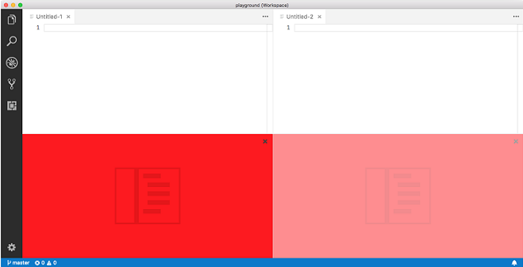
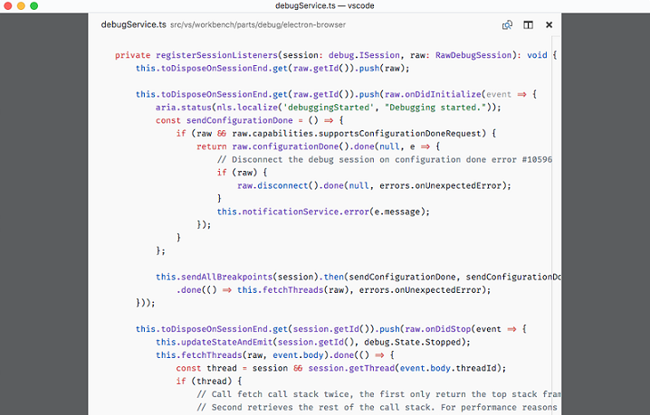

# June 2018 (version 1.25)

<!-- DOWNLOAD_LINKS_PLACEHOLDER -->

## Insiders Release

Welcome to the Insiders build. These are the preliminary notes for the June 1.25 release of Visual Studio Code. As we get closer to the release date, you'll see details below about new features and important fixes.

Until the June release notes are available, you can still track our progress:

* **[June Iteration Plan](https://github.com/Microsoft/vscode/issues/51483)** - See what's planned for the milestone.
* **[Commit Log](https://github.com/Microsoft/vscode/commits/master)** - GitHub commits to the vscode open source repository.
* **[Closed issues](https://github.com/Microsoft/vscode/milestone/69?closed=1)** - Resolved bugs and implemented feature requests in the June milestone.

We really appreciate people taking a look at our new features as soon as they are ready so check back here often and learn what's new to try out.

If you find issues or have suggestions, you can enter them in the VS Code repository on [GitHub](https://github.com/Microsoft/vscode/issues).

## Workbench

### Grid Editor Layout

You can now arrange editors both vertically and horizontally and have more than 3 editors side by side:


To support flexible layouts, you can create empty editor groups. By default, closing the last editor of an editor group will also close the group itself, but you can change this behavior with the new setting `workbench.editor.closeEmptyGroups: false`.


There are a predefined set of editor layouts in the new **View** > **Editor Layout** menu:


Editors that open to the side (for example by clicking the editor toolbar **Split Editor** action) will by default open to the right hand side of the active editor. If you prefer to open editors below the active one, configure the new setting `workbench.editor.openSideBySideDirection: down`.

There are many [new commands](#new-commands) for adjusting the editor layout with the keyboard alone, but if you prefer to use the mouse, drag and drop is a fast way to split the editor into any direction:


Since editor groups are now unlimited and can be arranged in many ways, the **OPEN EDITORS** view no longer labels editor groups as **Left**, **Center**, or **Right**. Instead, editor groups are now labeled with numbers according to their creation time. Thus, the last editor group created will always be at the end of the **OPEN EDITORS** list. We found this to be a good model that minimizes changing the list when moving editor groups around in the layout:


Refer to the [Extension Authoring](#extension-authoring) section for the impact on extensions and themes and see [New Commands](#new-commands) for the list of new editor grid commands.

>**Pro Tip**: If you press and hold the `Alt` key while hovering over the toolbar action to split an editor, it will offer to split to the other orientation. This is a fast way to split either to the right or to the bottom.



### Outline for Everyone

The Outline-feature has left the preview-stage and is now enabled by default. Find it as separate section in the file explorer. Once expanded it will will show the symbol tree of the currently active editor.

The outline tree allows for different 'Sort By' modes, optional cursor tracking, and supports the usual open gestures. It also features an input box which finds or filters symbols as you type. Last, errors and warnings are shown in the outline tree telling at a glance where the trouble is.



The outline comes with a couple of configuration settings which allow you to enable/disable icons and that allow you to control if and how errors and warnings are shown.

Last, there is also [new API](#document-symbols) for **extensions authors**.


### Language Packs

VS Code now ships with only English as the display language and other [languages](https://code.visualstudio.com/docs/getstarted/locales#_available-locales) now rely on Language Packs installable from the VS Code [Marketplace](https://marketplace.visualstudio.com/search?target=VSCode&category=Language%20Packs&sortBy=Downloads). You should not notice this change if you had installed a Language Pack when prompted by the 1.23 or 1.24 versions of VS Code. If you are upgrading from an older version of VS Code or have a fresh installation, you will see a prompt to install the Language Pack of your OS's UI language. Additional Language Packs can be installed from the Marketplace using the Extensions view (`kb(workbench.view.extensions)`).

To summarize:

* If you update from VS Code version 1.22 or older to 1.25, the display language will be English and VS Code will prompt you to install the Language Pack for the OS's UI language, if such a Language Pack is available in the Marketplace.
* If you update from 1.23 or 1.24 to 1.25, you should already have been prompted to install the Language Pack for the UI language. If you did so, 1.25 will start as normal and the display language is presented as the chosen UI language. If you didn't install a Language Pack, then you will be prompted to do so.
* Fresh installs of VS Code, version 1.25 or higher, will prompt you to install a Language Pack if an appropriate one is available in the Marketplace.

### Drop files and folders into empty files explorer

Now it is possible to drop files, folders and code-workspace files into an empty explorer to open them.



## Editor

### Suggestion Selections

Language smarts often know what suggestions are best and with this version of VS Code they can let us know. There is new [API](#Preselected-Completion-Items) for preselected suggestions and when present, the editor will select not the first but the preselected suggestion.



### Snippt Placeholder Transformations

Snippets finally support placeholder transformations. Those are like variable transformations but more dynamic. A transformation is applied when switching from one placeholder to the next and this is the grammar rule for them: __${__*int*__/__*regex*__/__*format_string*__/__*opts*__}__.

A sample, that replaces "Hello World" with its German counterpart can be seen below:

```json
"HelloWorld": {
  "prefix": "say_hello",
  "body": "${1} ${2} -> ${1/Hello/Hallo/} ${2/World/Welt/}"
}
```


Refer to the [snippet grammar](https://code.visualstudio.com/docs/editor/userdefinedsnippets#_grammar) for more details and how to unleash the full potential of transformations. Last but not least, special thanks to [@go2sh](https://github.com/go2sh) for implementing this!

## Debugging

### "Unchained" floating debug toolbar

In the previous milestone, we have introduced a new setting to dock the debug toolbar in the Debug view (`"debug.toolBarLocation": "docked"`). In this milestone, we reviewed user feedback and tried to improve the floating toolbar behavior as well (`"debug.toolBarLocation": "floating"`).

The [consensus](https://github.com/Microsoft/vscode/issues/52490) from the feedback was that the toolbar should always be visible (independent from which view is active) and that it should not hide anything (for instance the editor tabs). Therefore we've "unchained" the floating toolbar by allowing it to be dragged to the editor area. This should help users that heavily use editor tabs but also want to see the debug toolbar at all times.


Since the existing `debug.hideActionBar` setting can be easily subsumed under a value `hidden` with the `debug.toolBarLocation` setting, we are now **removing** `debug.hideActionBar`.

### Breakpoint state tracks debug session

In VS Code, breakpoints are shared between all debuggers and every debugger can decide whether to honor a breakpoint or adjust the breakpoint position, for example, move it to a different line. This results in dynamic state that is associated with a breakpoint for the duration of a debug session. With parallel debug sessions, there can even be multiple states per breakpoint. Previously, VS Code had merged the different states, which sometimes resulted in a confusing experience. With this release, the breakpoint UI now properly reflects only the state of the active debug session. Focusing on a different debug session properly updates the breakpoint state.

## Extension Authoring

### Preselected Completion Items

Extension that provide completion items can now marks them as 'preselected'. That is useful when many completions exist but when some are most likely to be selected. A sample for this is assiging known variable types but this also enables extensions to favor more commonly used completions, like favor `console.log` over `console.dirxml`.

The API additional is just `'CompletionItem#preselect: boolean'` and when many preselected items exists the one with the highest rank is selected.

### Document Symbols

To get the most out of the new outline tree extensions should adopt their `DocumentSymbolProviders` to return `DocumentSymbols`. That is a new type we have added and it is tailored towards the needs of the outline tree. It supports to represent a hierarchy of document symbols and it allows to differentiate between the range that defines a symbol and the range the identifies a symbol.
```

         +--/**
         |   * Some Comment
<range>--|   */
         |  export function fooFunction() {
         |                  +----------+
         +--}                   |
                                |
                          <selection range>
```

### Grid Editor Layout: ViewColumn

There are only a few API adjustments to support the new editor grid layout feature. Most notably, there is a new `ViewColumn.Beside` action that can be used to open an editor to the side of the active one. With the grid editor layout, there is no longer a limit in the number of opened editors, so using that option will always create a new editor to the side of the active one unless there is already some space to the side. Depending on the user setting `workbench.editor.openSideBySideDirection`, this can either be to the right or below the editor.

The `ViewColumn` value for text editors and webviews still goes by the order of appearance in the editor area from left to right as shown below:


Even though the `ViewColumn` enumeration was extended all the way to `ViewColumn.Nine`, a `TextEditor` will always have a number assigned as view column as long as it is contained in the grid.

When an editor group is moved or an editor group is closed, the `onDidChangeTextEditorViewColumn` event is fired as before.

### Grid Editor Layout: New Commands

Even though the change to the API is minimal to support the new grid editor layout, extensions can still make use of the grid editor layout by leveraging new commands that were added (see the [New Commands](#new-commands) section for a complete overview).

The new `vscode.setEditorLayout` deserves a bit of explanation as it allows you to change the overall editor layout with a single command and arguments. The layout is described as object with an initial (optional) orientation (`0` = horizontal, `1` = vertical) and an array of editor `groups` within. Each editor group can have a `size` and another array of editor `groups` that will be laid out orthogonal to the orientation. If editor group sizes are provided, their sum must be `1` to be applied per row or column.

Example for a 2x2 grid:

```json
{ orientation: 0, groups: [{ groups: [{}, {}], size: 0.5 }, { groups: [{}, {}], size: 0.5 }] }
```

### Editors open in active ViewColumn by default

If no `ViewColumn` is provided when opening a text editor or webview , VS Code now defaults to opening in the currently active editor group, instead of opening it in `ViewColumn.One`. If you want to preserve the previous behavior, just pass in `ViewColumn.One` when opening.

### Readonly file system provider

A file system provider can now be registered as `readonly`. VS Code will respect this flag by disabling all the mutating commands on the resources coming from that file system provider. Editors will also be opened in readonly mode for those readonly resources.

### New Theme colors

There are two new theme colors for the background color of empty editor groups, a feature that came out of the work to support editor grid layout:

* `editorGroup.emptyBackground`: Background color of an empty editor group.
* `editorGroup.focusedEmptyBorder`: Border color of an empty editor group that is focused.



* `editorPane.background`: Background color of the editor pane visible on the left and right side of the centered editor layout



### Deprecated Theme colors

The theme color `editorGroup.background` is no longer supported with the introduction of the grid editor layout feature.

### Rename Command

The rename-command (`editor.action.rename`) can now be invoked with an `Uri` and a `Position` and the editor will initiate a rename operation accordingly. Like so:

```ts
vscode.commands.executeCommand(
  'editor.action.rename',
  [vscode.Uri.file('/my/file.abc'), new vscode.Position(14, 7)]
)
```

## New Commands

Key|Command|Command id
---|-------|----------
`kb(workbench.action.splitEditorOrthogonal)`|Split the editor to the orthogonal direction that is configured via `workbench.editor.openSideBySideDirection`|`workbench.action.splitEditorOrthogonal`
`kb(workbench.action.showEditorsInActiveGroup)`|Show the opened editors of the active editor group|`workbench.action.showEditorsInActiveGroup`
`kb(workbench.action.moveEditorToLastGroup)`|Move the active editor to the last editor group|`workbench.action.moveEditorToLastGroup`
`kb(workbench.action.moveActiveEditorGroupUp)`|Move the active editor group up|`workbench.action.moveActiveEditorGroupUp`
`kb(workbench.action.moveActiveEditorGroupDown)`|Move the active editor group down|`workbench.action.moveActiveEditorGroupDown`
`kb(workbench.action.focusLastEditorGroup)`|Focus the last editor group|`workbench.action.focusLastEditorGroup`
`kb(workbench.action.firstEditorInGroup)`|Focus the first editor group|`workbench.action.firstEditorInGroup`
`kb(workbench.action.closeGroup)`|Close the active editor group (will merge opened editors into the neighbor group)|`workbench.action.closeGroup`
`kb(workbench.action.closeAllEditorGroups)`|Close all editor groups|`workbench.action.closeAllEditorGroups`
`kb(workbench.action.closeEditorsAndGroup)`|Close the active editor group and its editors|`workbench.action.closeEditorsAndGroup`
`kb(workbench.action.splitEditorUp)`|Split the active editor up|`workbench.action.splitEditorUp`
`kb(workbench.action.splitEditorDown)`|Split the active editor down|`workbench.action.splitEditorDown`
`kb(workbench.action.splitEditorLeft)`|Split the active editor to the left|`workbench.action.splitEditorLeft`
`kb(workbench.action.splitEditorRight)`|Split the active editor to the right|`workbench.action.splitEditorRight`
`kb(workbench.action.joinAllGroups)`|Merge the editors of all editor groups into the active one|`workbench.action.joinAllGroups`
`kb(workbench.action.focusFourthEditorGroup)`|Focus the fourth editor group (will create a new editor group as needed)|`workbench.action.focusFourthEditorGroup`
`kb(workbench.action.focusFifthEditorGroup)`|Focus the fifth editor group (will create a new editor group as needed)|`workbench.action.focusFifthEditorGroup`
`kb(workbench.action.focusSixthEditorGroup)`|Focus the sixth editor group (will create a new editor group as needed)|`workbench.action.focusSixthEditorGroup`
`kb(workbench.action.focusSeventhEditorGroup)`|Focus the seventh editor group (will create a new editor group as needed)|`workbench.action.focusSeventhEditorGroup`
`kb(workbench.action.focusEighthEditorGroup)`|Focus the eighth editor group (will create a new editor group as needed)|`workbench.action.focusEighthEditorGroup`
`kb(workbench.action.moveEditorToLeftGroup)`|Move active editor into the left editor group|`workbench.action.moveEditorToLeftGroup`
`kb(workbench.action.moveEditorToRightGroup)`|Move active editor into the right editor group|`workbench.action.moveEditorToRightGroup`
`kb(workbench.action.moveEditorToAboveGroup)`|Move active editor into the above editor group|`workbench.action.moveEditorToAboveGroup`
`kb(workbench.action.moveEditorToBelowGroup)`|Move active editor into the below editor group|`workbench.action.moveEditorToBelowGroup`
`kb(workbench.action.focusLeftGroup)`|Focus the editor group to the left|`workbench.action.focusLeftGroup`
`kb(workbench.action.focusRightGroup)`|Focus the editor group to the right|`workbench.action.focusRightGroup`
`kb(workbench.action.focusAboveGroup)`|Focus the editor group to the top|`workbench.action.focusAboveGroup`
`kb(workbench.action.focusBelowGroup)`|Focus the editor group to the bottom|`workbench.action.focusBelowGroup`
`kb(workbench.action.newEditorGroupLeft)`|Create a new editor group to the left|`workbench.action.newEditorGroupLeft`
`kb(workbench.action.newEditorGroupRight)`|Create a new editor group to the right|`workbench.action.newEditorGroupRight`
`kb(workbench.action.newEditorGroupAbove)`|Create a new editor group to the top|`workbench.action.newEditorGroupAbove`
`kb(workbench.action.newEditorGroupBelow)`|Create a new editor group to the bottom|`workbench.action.newEditorGroupBelow`
`kb(workbench.action.editorLayoutSingle)`|Switch to editor layout: Single|`workbench.action.editorLayoutSingle`
`kb(workbench.action.editorLayoutTwoColumns)`|Switch to editor layout: Two Columns|`workbench.action.editorLayoutTwoColumns`
`kb(workbench.action.editorLayoutThreeColumns)`|Switch to editor layout: Three Columns|`workbench.action.editorLayoutThreeColumns`
`kb(workbench.action.editorLayoutTwoRows)`|Switch to editor layout: Two Rows|`workbench.action.editorLayoutTwoRows`
`kb(workbench.action.editorLayoutThreeRows)`|Switch to editor layout: Three Rows|`workbench.action.editorLayoutThreeRows`
`kb(workbench.action.editorLayoutTwoByTwoGrid)`|Switch to editor layout: Two by Two Grid|`workbench.action.editorLayoutTwoByTwoGrid`
`kb(workbench.action.editorLayoutTwoColumnsBottom)`|Switch to editor layout: Two Columns (Bottom)|`workbench.action.editorLayoutTwoColumnsBottom`
`kb(workbench.action.editorLayoutTwoColumnsRight)`|Switch to editor layout: Two Columns (Right)|`workbench.action.editorLayoutTwoColumnsRight`
`kb(workbench.action.editorLayoutCentered)`|Switch to editor layout: Centered|`workbench.action.editorLayoutCentered`

### New `layoutEditorGroups` command

The `layoutEditorGroups` command lets you set an editor group layout the way you like and assign it a keybinding. The layout is described as object with an initial (optional) orientation (`0` = horizontal, `1` = vertical) and an array of editor `groups` within. Each editor group can have a `size` and another array of editor `groups` that will be laid out orthogonal to the orientation. If editor group sizes are provided, their sum must be `1` to be applied per row or column. For example:

```json
{
    "key": "Ctrl+0",
    "command": "layoutEditorGroups",
    "args": {
        "orientation": 1,
        "groups": [{ "size": 0.2 }, { "size": 0.6 }, { "size": 0.2, "groups": [{}, {}] }]
    }
}
```

This will produce the following layout:


## Removed Commands

Command id|Replacement
---|-------
`workbench.action.showEditorsInFirstGroup`|Use `workbench.action.showEditorsInActiveGroup` instead
`workbench.action.showEditorsInSecondGroup`|Use `workbench.action.showEditorsInActiveGroup` instead
`workbench.action.showEditorsInThirdGroup`|Use `workbench.action.showEditorsInActiveGroup` instead
`workbench.action.moveEditorToSecondGroup`|Use one of the `workbench.action.moveEditor.*` commands instead
`workbench.action.moveEditorToThirdGroup`|Use one of the `workbench.action.moveEditor.*` commands instead
`workbench.action.openLastEditorInGroup`|Use `workbench.action.lastEditorInGroup` instead
`workbench.action.openFolderAsWorkspaceInNewWindow`| Use `workbench.action.duplicateWorkspaceInNewWindow` instead
`editor.debug.action.toggleColumnBreakpoint`| Use `editor.debug.action.toggleInlineBreakpoint` instead

## Notable Changes

* [49591](https://github.com/Microsoft/vscode/issues/49591): Have a "Close All" button as editor action in the toolbar
* [35361](https://github.com/Microsoft/vscode/issues/35361): Limited native window tabs functionality in macOS high sierra
* [42726](https://github.com/Microsoft/vscode/issues/42726): Open File: unable to open a file with spaces in name if absolute path is provided
* [51440](https://github.com/Microsoft/vscode/issues/51440): Allow closing notifications with middle mouse button

## Thank You

Last but certainly not least, a big *__Thank You!__* to the following folks that helped to make VS Code even better:

Contributions to `vscode`:

* [bitshiftza (@bitshiftza)](https://github.com/bitshiftza): Fix for issue #39458 [PR #52506](https://github.com/Microsoft/vscode/pull/52506)
* [@brentwang23](https://github.com/brentwang23): Implement word part move and delete for issue #46203 [PR #48023](https://github.com/Microsoft/vscode/pull/48023)
* [Howard Chen (@chenhowa)](https://github.com/chenhowa): Await git.pullFrom and gitt.pushTo to ensure any failures display an … [PR #49167](https://github.com/Microsoft/vscode/pull/49167)
* [Cherry Wang (@chryw)](https://github.com/chryw): Markdown and common toolbar icons consistency pass [PR #50484](https://github.com/Microsoft/vscode/pull/50484)
* [@CoenraadS](https://github.com/CoenraadS): Add setting for highlightActiveIndentGuide #49148 [PR #49298](https://github.com/Microsoft/vscode/pull/49298)
* [Daniel Frankcom (@danielfrankcom)](https://github.com/danielfrankcom): Added background ANSI colour codes [PR #49764](https://github.com/Microsoft/vscode/pull/49764)
* [Darius Keeley (@Dari-K)](https://github.com/Dari-K): Fix #51533 [PR #52075](https://github.com/Microsoft/vscode/pull/52075)
* [David  (@ddruker)](https://github.com/ddruker): [GIT EXTENSION] Add Custom Foreground Color for Files Added to Index [PR #46066](https://github.com/Microsoft/vscode/pull/46066)
* [EbXpJ6bp (@EbXpJ6bp)](https://github.com/EbXpJ6bp): Improve Dependencies and Contributions UI in the Extension editor [PR #52126](https://github.com/Microsoft/vscode/pull/52126)
* [Schuyler Cebulskie (@Gawdl3y)](https://github.com/Gawdl3y): Add V8 version to about dialog and prettify it [PR #51511](https://github.com/Microsoft/vscode/pull/51511)
* [Deleted user (@ghost)](https://github.com/ghost): [Fix] Add a missing return type for _hue2rgb  [PR #51285](https://github.com/Microsoft/vscode/pull/51285)
* [Jing Zhou (@gnijuohz)](https://github.com/gnijuohz): Show warning when git commit input box only contains whitespaces [PR #45254](https://github.com/Microsoft/vscode/pull/45254)
* [Christoph Seitz (@go2sh)](https://github.com/go2sh): Add transformations for placeholders [PR #51621](https://github.com/Microsoft/vscode/pull/51621)
* [Jan Pilzer (@Hirse)](https://github.com/Hirse): Add gitignore language [PR #51026](https://github.com/Microsoft/vscode/pull/51026)
* [Ian Sanders (@iansan5653)](https://github.com/iansan5653): Limit highlighting on drag over open editors by checking if dragged item can be dropped [PR #52623](https://github.com/Microsoft/vscode/pull/52623)
* [James (@jwhitmarsh)](https://github.com/jwhitmarsh): Allow emmet actions inside script tags with text/ng-template as type [PR #51849](https://github.com/Microsoft/vscode/pull/51849)
* [Catalin Pirvu (@katakonst)](https://github.com/katakonst): Restore focus on message field when git include multiple projects. [PR #46068](https://github.com/Microsoft/vscode/pull/46068)
* [Krzysztof Cieślak (@Krzysztof-Cieslak)](https://github.com/Krzysztof-Cieslak): Add support for `1.txt` format in incrementFileName [PR #50869](https://github.com/Microsoft/vscode/pull/50869)
* [Leonardo Braga (@LeonardoBraga)](https://github.com/LeonardoBraga)
  * Improves support to Windows UNC files in a "yet-to-be-saved" state [PR #52518](https://github.com/Microsoft/vscode/pull/52518)
  * Statusbar polishing [PR #52149](https://github.com/Microsoft/vscode/pull/52149)
  * Fixes stuck hover widget when triggered manually, with "editor.hover": false [PR #52147](https://github.com/Microsoft/vscode/pull/52147)
* [Jon Malmaud (@malmaud)](https://github.com/malmaud): Fix typo in extensions doc. [PR #51509](https://github.com/Microsoft/vscode/pull/51509)
* [Momoto, Seiji (@momoto)](https://github.com/momoto): Fix typo in main.contribution.ts [PR #52104](https://github.com/Microsoft/vscode/pull/52104)
* [Nahom Abi (@NahomAgidew)](https://github.com/NahomAgidew): Fix to #43625: spin sync icon on push [PR #52146](https://github.com/Microsoft/vscode/pull/52146)
* [Ori Ashual (@oriash93)](https://github.com/oriash93): Added option whether to show terminal reuse alert [PR #44461](https://github.com/Microsoft/vscode/pull/44461)
* [Eugen Cazacu (@oygen87)](https://github.com/oygen87): delete a comment [PR #50971](https://github.com/Microsoft/vscode/pull/50971)
* [Dániel Tar (@qcz)](https://github.com/qcz)
  * Fix typo in taskConfiguration.ts [PR #52067](https://github.com/Microsoft/vscode/pull/52067)
  * Improve i18n of new task identifier related strings [PR #52019](https://github.com/Microsoft/vscode/pull/52019)
  * Fix a replace gone wrong in typescript-language-features/package.nls [PR #52704](https://github.com/Microsoft/vscode/pull/52704)
* [Ronald Rey (@reyronald)](https://github.com/reyronald): Add "Recommend" action to extension viewlet [PR #50419](https://github.com/Microsoft/vscode/pull/50419)
* [@rianadon](https://github.com/rianadon): [WIP] Colored titlebar for Windows [PR #39972](https://github.com/Microsoft/vscode/pull/39972)
* [ryenus (@ryenus)](https://github.com/ryenus): Allow customization of the viewlets in the default Extensions view [PR #47766](https://github.com/Microsoft/vscode/pull/47766)
* [Shizeng Zhou (@shizengzhou)](https://github.com/shizengzhou): Remove the border. Fix #48765 [PR #48825](https://github.com/Microsoft/vscode/pull/48825)
* [Benjamin Smith (@SirHoneyBiscuit)](https://github.com/SirHoneyBiscuit): Add option to hide/show release notes on update #44020 [PR #44271](https://github.com/Microsoft/vscode/pull/44271)
* [Alfonso Perez (@alfonsoperez)](https://github.com/alfonsoperez): Keep deleting lines when triggering deleteAllLeft on column 1 [PR #28392](https://github.com/Microsoft/vscode/pull/28392)
* [Spencer (@spalger)](https://github.com/spalger): Fix DeleteAllLeft when executed from column 1 [PR #40876](https://github.com/Microsoft/vscode/pull/40876)
* [Benjamin Crawford (@subylan)](https://github.com/subylan): max_old_space_size flag out of range for 32-bit builds. [PR #52792](https://github.com/Microsoft/vscode/pull/52792)
* [Tomáš Hübelbauer (@TomasHubelbauer)](https://github.com/TomasHubelbauer)
  * Hide ahead push arrow if remote push URL is no_push  [PR #45341](https://github.com/Microsoft/vscode/pull/45341)
  * Mention the mouse middle button drag to rectangle select feature in the Interactive Playground [PR #49205](https://github.com/Microsoft/vscode/pull/49205)
* [@vemoo](https://github.com/vemoo): fix for "Cannot Create keybinding to restart a specific Task"  [PR #36474](https://github.com/Microsoft/vscode/pull/36474)
* [Winner Crespo (@wistcc)](https://github.com/wistcc): Adding warning when tokenization is skipped [PR #51265](https://github.com/Microsoft/vscode/pull/51265)
* [@zhuowei](https://github.com/zhuowei): Fix #35361: fix native tabs on macOS 10.13 [PR #52775](https://github.com/Microsoft/vscode/pull/52775)

Contributions to `language-server-protocol`:

* [Colin Rofls (@cmyr)](https://github.com/cmyr): Fixup typos in specification.md [PR #499](https://github.com/Microsoft/language-server-protocol/pull/499)
* [Samarth Wahal (@LordZamy)](https://github.com/LordZamy): Fix typo in spec [PR #508](https://github.com/Microsoft/language-server-protocol/pull/508)

Contributions to `vscode-node-debug`:

* [jramsay (@jramsay)](https://github.com/jramsay): Enable Loaded Scripts for VS Live Share [PR #180](https://github.com/Microsoft/vscode-node-debug/pull/180)

<!-- In-product release notes styles.  Do not modify without also modifying regex in gulpfile.common.js -->
<a id="scroll-to-top" role="button" aria-label="scroll to top" href="#"><span class="icon"></span></a>
<link rel="stylesheet" type="text/css" href="css/inproduct_releasenotes.css"/>
