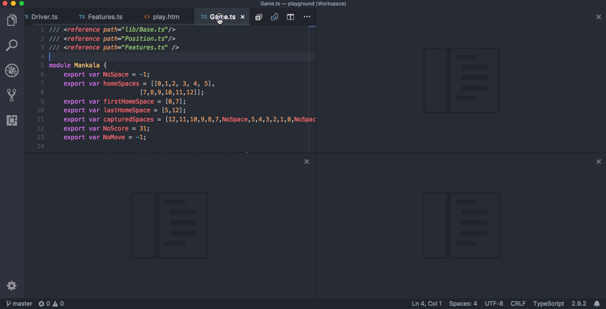
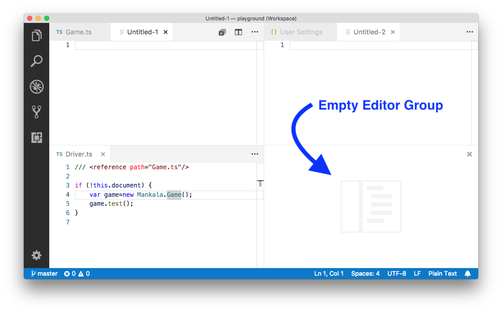
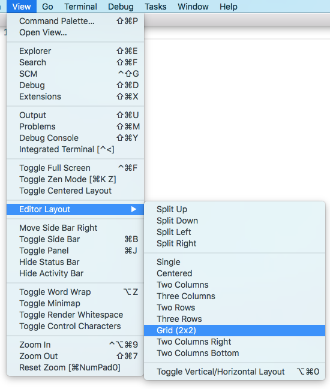
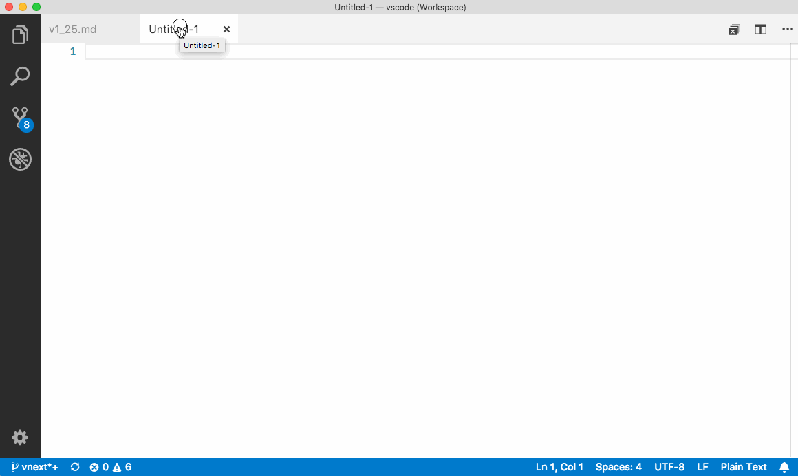
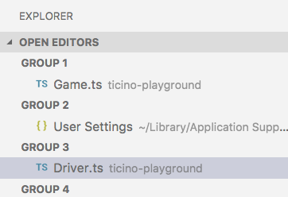
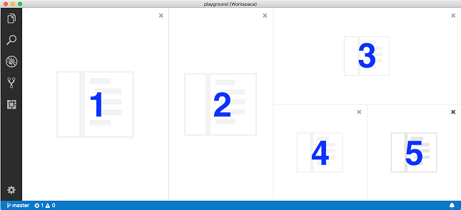
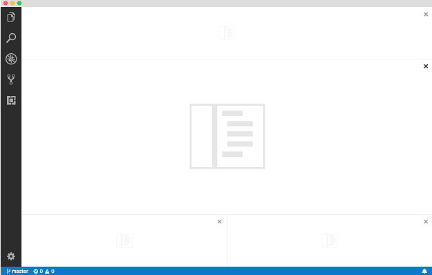

# June 2018 (version 1.25)

<!-- DOWNLOAD_LINKS_PLACEHOLDER -->

## Insiders Release

Welcome to the Insiders build. These are the preliminary notes for the June 1.25 release of Visual Studio Code. As we get closer to the release date, you'll see details below about new features and important fixes.

Until the June release notes are available, you can still track our progress:

* **[June Iteration Plan](https://github.com/Microsoft/vscode/issues/51483)** - See what's planned for the milestone.
* **[Commit Log](https://github.com/Microsoft/vscode/commits/master)** - GitHub commits to the vscode open source repository.
* **[Closed issues](https://github.com/Microsoft/vscode/milestone/69?closed=1)** - Resolved bugs and implemented feature requests in the June milestone.

We really appreciate people taking a look at our new features as soon as they are ready so check back here often and learn what's new to try out.

If you find issues or have suggestions, you can enter them in the VS Code repository on [GitHub](https://github.com/Microsoft/vscode/issues).

<!-- In-product release notes styles.  Do not modify without also modifying regex in gulpfile.common.js -->
<a id="scroll-to-top" role="button" aria-label="scroll to top" href="#"><span class="icon"></span></a>
<link rel="stylesheet" type="text/css" href="css/inproduct_releasenotes.css"/>

## Workbench

### Grid Editor Layout

Editors in the workbench can now be arranged freely both vertically and horizontally and there is no longer a limit of just showing 3 editors side by side at the same time:



To support flexible layouts, editor groups can now show up as empty. By default, closing the last editor of an editor group will also close the group itself, but you can change this with the new setting `workbench.editor.closeEmptyGroups: false`.



You can find a set of predefined editor layouts from the new "Editor Layout" menu under the "View" entry:



Editors that open to the side (e.g. by clicking the "Split Editor" action in the editor toolbar) will by default open to the right hand side of the active editor. If you prefer to open editors below the active one, configure the new setting `workbench.editor.openSideBySideDirection: down`.

There are a lot of [new commands](#new-commands) introduced to use the grid editor layout with keyboard alone, but if you prefer to use the mouse, using drag and drop is a fast way to split the editor into any direction:



Since editor groups are now unlimited and can be arranged in many ways, the "Open Editors" view is no longer talking about a "Left", "Center", or "Right" editor group. Instead, editor groups are now showing up with numbers according to their creation time. Thus, the last editor group created will always be at the end of the list. We found this to be a good model that minimizes the number of times the list would change by moving editor groups around in the layout:



Please refer to [Extension Authoring](#extension-authoring) for the impact on extensions or themes and to [New Commands](#new-commands) for a list of new commands that we now support as part of introducing this feature.

**Pro Tip**: If you press and hold the `Alt`-key while hovering over the action to split an editor, it will offer to split to the other direction. This is a fast way to split either to the right or to the bottom.


## Extension Authoring

### Grid Editor Layout: ViewColumn

There are only few adjustments in the API to support the new editor grid layout feature. Most notably, there is a new `ViewColumn.Beside` that can be used to open an editor to the side of the active one. With the grid editor layout there is no longer a limit in the number of opened editors, so using that option will always create a new editor to the side of the active one unless there is already some space to the side. Depending on the user setting `workbench.editor.openSideBySideDirection` this can either be to the right or below the editor.

The `ViewColumn` value for text editors and webviews still goes by the order of appearance in the editor area from left to right as shown below:



Even though the `ViewColumn` enumeration was extended all the way to `ViewColumn.Nine`, a `TextEditor` will always have a number assigned as view column as long as it is contained in the grid.

When an editor group is moved or an editor group is closed, the `onDidChangeTextEditorViewColumn` event is fired as before.

### Grid Editor Layout: New Commands

Even though the change to the API is minimal to support the new grid editor layout, extensions can still make use of the grid editor layout by leveraging new commands that were added (see below in the commands section for a complete overview).

The new `vscode.setEditorLayout` deserves a bit of explanation as it allows you to change the overall editor layout with a single command and arguments: The layout is described as object with an initial (optional) orientation (`0` = horizontal, `1` = vertical) and an array of editor `groups` within. Each editor group can have a `size` and another array of editor `groups` that will be layed out orthogonal to the orientation. If editor group sizes are provided, their sum must be `1` to be applied per row or column.

Example for a 2x2 grid:
```json
{ orientation: 0, groups: [{ groups: [{}, {}], size: 0.5 }, { groups: [{}, {}], size: 0.5 }] }
```

### Editors open in active ViewColumn by default

If no `ViewColumn` is provided when opening a text editor or webview , we now default to open in the currently active editor group, instead of opening it in `ViewColumn.One`. If you want to preserve the previous behaviour, just pass in `ViewColumn.One` when opening.

### New Theme colors

There are two new theme colors for the background color of empty editor groups - a feature that came in through the work of supporting a grid editor layout:

* `editorGroup.emptyBackground`: Background color of an empty editor group.
* `editorGroup.focusedEmptyBorder`: Border color of an empty editor group that is focused.


### Deprecated Theme colors

The theme color `editorGroup.background` is no longer supported with the introduction of the grid editor layout feature.

## New Commands

Key|Command|Command id
---|-------|----------
`kb(workbench.action.splitEditorOrthogonal)`|Split the editor to the orthogonal direction that is configured via `workbench.editor.openSideBySideDirection`|`workbench.action.splitEditorOrthogonal`
`kb(workbench.action.showEditorsInActiveGroup)`|Show the opened editors of the active editor group|`workbench.action.showEditorsInActiveGroup`
`kb(workbench.action.moveEditorToLastGroup)`|Move the active editor to the last editor group|`workbench.action.moveEditorToLastGroup`
`kb(workbench.action.moveActiveEditorGroupUp)`|Move the active editor group up|`workbench.action.moveActiveEditorGroupUp`
`kb(workbench.action.moveActiveEditorGroupDown)`|Move the active editor group down|`workbench.action.moveActiveEditorGroupDown`
`kb(workbench.action.focusLastEditorGroup)`|Focus the last editor group|`workbench.action.focusLastEditorGroup`
`kb(workbench.action.firstEditorInGroup)`|Focus the first editor group|`workbench.action.firstEditorInGroup`
`kb(workbench.action.closeGroup)`|Close the active editor group (will merge opened editors into the neighbour group)|`workbench.action.closeGroup`
`kb(workbench.action.closeAllEditorGroups)`|Close all editor groups|`workbench.action.closeAllEditorGroups`
`kb(workbench.action.closeEditorsAndGroup)`|Close the active editor group and its editors|`workbench.action.closeEditorsAndGroup`
`kb(workbench.action.splitEditorUp)`|Split the active editor up|`workbench.action.splitEditorUp`
`kb(workbench.action.splitEditorDown)`|Split the active editor down|`workbench.action.splitEditorDown`
`kb(workbench.action.splitEditorLeft)`|Split the active editor to the left|`workbench.action.splitEditorLeft`
`kb(workbench.action.splitEditorRight)`|Split the active editor to the right|`workbench.action.splitEditorRight`
`kb(workbench.action.joinAllGroups)`|Merge the editors of all editor groups into the active one|`workbench.action.joinAllGroups`
`kb(workbench.action.focusFourthEditorGroup)`|Focus the fourth editor group (will create a new editor group as needed)|`workbench.action.focusFourthEditorGroup`
`kb(workbench.action.focusFifthEditorGroup)`|Focus the fifth editor group (will create a new editor group as needed)|`workbench.action.focusFifthEditorGroup`
`kb(workbench.action.focusSixthEditorGroup)`|Focus the sixth editor group (will create a new editor group as needed)|`workbench.action.focusSixthEditorGroup`
`kb(workbench.action.focusSeventhEditorGroup)`|Focus the seventh editor group (will create a new editor group as needed)|`workbench.action.focusSeventhEditorGroup`
`kb(workbench.action.focusEighthEditorGroup)`|Focus the eighth editor group (will create a new editor group as needed)|`workbench.action.focusEighthEditorGroup`
`kb(workbench.action.moveEditorToLeftGroup)`|Move active editor into the left editor group|`workbench.action.moveEditorToLeftGroup`
`kb(workbench.action.moveEditorToRightGroup)`|Move active editor into the right editor group|`workbench.action.moveEditorToRightGroup`
`kb(workbench.action.moveEditorToAboveGroup)`|Move active editor into the above editor group|`workbench.action.moveEditorToAboveGroup`
`kb(workbench.action.moveEditorToBelowGroup)`|Move active editor into the below editor group|`workbench.action.moveEditorToBelowGroup`
`kb(workbench.action.focusLeftGroup)`|Focus the editor group to the left|`workbench.action.focusLeftGroup`
`kb(workbench.action.focusRightGroup)`|Focus the editor group to the right|`workbench.action.focusRightGroup`
`kb(workbench.action.focusAboveGroup)`|Focus the editor group to the top|`workbench.action.focusAboveGroup`
`kb(workbench.action.focusBelowGroup)`|Focus the editor group to the bottom|`workbench.action.focusBelowGroup`
`kb(workbench.action.newEditorGroupLeft)`|Create a new editor group to the left|`workbench.action.newEditorGroupLeft`
`kb(workbench.action.newEditorGroupRight)`|Create a new editor group to the right|`workbench.action.newEditorGroupRight`
`kb(workbench.action.newEditorGroupAbove)`|Create a new editor group to the top|`workbench.action.newEditorGroupAbove`
`kb(workbench.action.newEditorGroupBelow)`|Create a new editor group to the bottom|`workbench.action.newEditorGroupBelow`
`kb(workbench.action.editorLayoutSingle)`|Switch to editor layout: Single|`workbench.action.editorLayoutSingle`
`kb(workbench.action.editorLayoutTwoColumns)`|Switch to editor layout: Two Columns|`workbench.action.editorLayoutTwoColumns`
`kb(workbench.action.editorLayoutThreeColumns)`|Switch to editor layout: Three Columns|`workbench.action.editorLayoutThreeColumns`
`kb(workbench.action.editorLayoutTwoRows)`|Switch to editor layout: Two Rows|`workbench.action.editorLayoutTwoRows`
`kb(workbench.action.editorLayoutThreeRows)`|Switch to editor layout: Three Rows|`workbench.action.editorLayoutThreeRows`
`kb(workbench.action.editorLayoutTwoByTwoGrid)`|Switch to editor layout: Two by Two Grid|`workbench.action.editorLayoutTwoByTwoGrid`
`kb(workbench.action.editorLayoutTwoColumnsBottom)`|Switch to editor layout: Two Columns (Bottom)|`workbench.action.editorLayoutTwoColumnsBottom`
`kb(workbench.action.editorLayoutTwoColumnsRight)`|Switch to editor layout: Two Columns (Right)|`workbench.action.editorLayoutTwoColumnsRight`
`kb(workbench.action.editorLayoutCentered)`|Switch to editor layout: Centered|`workbench.action.editorLayoutCentered`

### New `layoutEditorGroups` command

The `layoutEditorGroups` command allows to set an editor group layout the way you like and assign it a keybinding. The layout is described as object with an initial (optional) orientation (`0` = horizontal, `1` = vertical) and an array of editor `groups` within. Each editor group can have a `size` and another array of editor `groups` that will be layed out orthogonal to the orientation. If editor group sizes are provided, their sum must be `1` to be applied per row or column. For example:

```json
{
	"key": "Ctrl+0",
	"command": "layoutEditorGroups",
	"args": {
        "orientation": 1,
		"groups": [{ "size": 0.2 }, { "size": 0.6 }, { "size": 0.2, "groups": [{}, {}] }]
	}
}
```

This will produce the following layout:



## Removed Commands

Key|Command|Command id
---|-------|----------
`kb(workbench.action.showEditorsInFirstGroup)`|Use `workbench.action.showEditorsInActiveGroup` instead|`workbench.action.showEditorsInFirstGroup`
`kb(workbench.action.showEditorsInSecondGroup)`|Use `workbench.action.showEditorsInActiveGroup` instead|`workbench.action.showEditorsInSecondGroup`
`kb(workbench.action.showEditorsInThirdGroup)`|Use `workbench.action.showEditorsInActiveGroup` instead|`workbench.action.showEditorsInThirdGroup`
`kb(workbench.action.moveEditorToSecondGroup)`|Use one of the `workbench.action.moveEditor.*` commands instead|`workbench.action.moveEditorToSecondGroup`
`kb(workbench.action.moveEditorToThirdGroup)`|Use one of the `workbench.action.moveEditor.*` commands instead|`workbench.action.moveEditorToThirdGroup`
`kb(workbench.action.openLastEditorInGroup)`|Use `workbench.action.lastEditorInGroup` instead|`workbench.action.openLastEditorInGroup`

## Notable Changes

* [49591](https://github.com/Microsoft/vscode/issues/49591): Have a "Close All" button as editor action in the toolbar