# July 2018 (version 1.26)

**Update 1.26.1**: The update addresses these [issues](https://github.com/Microsoft/vscode/milestone/76?closed=1).

<!-- DOWNLOAD_LINKS_PLACEHOLDER -->

Welcome to the July 2018 release of Visual Studio Code. There are a number of significant updates in this version that we hope you will like, some of the key highlights include:

* **[Breadcrumbs](#breadcrumbs)** - Breadcrumb navigation lets you jump to symbols and files in your workspace.
* **[Quick Fixes from Problems panel](#problems-panel-quick-fixes)** - Apply code fixes while reviewing warnings and errors.
* **[User setup on Windows](#user-setup-for-windows)** - Elevation no longer required during Windows setup.
* **[Terminal column selection](#column-selection)** - Alt+click to select blocks of text in the integrated terminal.
* **[Add all missing imports](#add-all-missing-imports-quick-fix)** - Single action to add all missing imports in a JavaScript/TypeScript file.
* **[JSX tag completion](#jsx-tag-completion)** - Work with JSX tags in JavaScript/TypeScript just like you do in HTML.
* **[Better JS/TS error reporting](#better-error-reporting)** - Concise, clear messages with relevant source code links.
* **[Improved extension search](#intellisense-for-extension-search)** - Filter Marketplace queries to find the extensions you want.
* **[Extension Pack management](#extension-packs-revisited)** - Manage Extension Packs as a single unit or by individual extension.
* **[Preview: Settings editor](#new-settings-editor)** - Rich settings description display, "Table of Contents" tracks scrolling.

>If you'd like to read these release notes online, go to [Updates](https://code.visualstudio.com/updates) on [code.visualstudio.com](https://code.visualstudio.com).<br>
>You can also check out this 1.26 release [highlights video](https://youtu.be/VwSw-r6fHYQ) from Cloud Developer Advocate [Brian Clark](https://twitter.com/_clarkio).

The release notes are arranged in the following sections related to VS Code focus areas. Here are some further updates:

* **[Workbench](#workbench)** - New View menu layout, copy relative path action, offline mode.
* **[Integrated Terminal](#integrated-terminal)** - Improved multi-line support, rendering improvements.
* **[Languages](#languages)** - Convert named imports to namespace imports, JSX folding.
* **[Debugging](#debugging)** - Improved stop session and smart step debugging.
* **[Preview Features](#preview-features)** - Themable custom tool and menu bar for Windows and Linux.
* **[Extension Authoring](#extension-authoring)** - QuickInput API, extensionPack declaration, webview titlebar icons.

**Insiders:** Want to see new features as soon as possible? You can download the nightly [Insiders](https://code.visualstudio.com/insiders) build and try the latest updates as soon as they are available. And for the latest Visual Studio Code news, updates, and content, follow us on Twitter [@code](https://twitter.com/code)!

## Workbench

### Breadcrumbs

The editor now has a navigation bar above its contents - we call it [Breadcrumbs](https://en.wikipedia.org/wiki/Breadcrumb_(navigation)). It shows the current location and allows you to quickly navigate between symbols and files. To start using breadcrumbs, enable it with the **View** > **Toggle Breadcrumbs** command or via the `breadcrumbs.enabled` setting.

When using editor [tabs](https://code.visualstudio.com/docs/getstarted/userinterface#_tabs) (default), breadcrumbs are displayed in a separate row below the editor title. If you are [not using](https://code.visualstudio.com/docs/getstarted/userinterface#_working-without-tabs) editor tabs, breadcrumbs show as an interactive file path next to the title.


Breadcrumbs always show the file path and, with the help of extensions, the symbol path up to the cursor position. The symbols shown are the same as in Outline view and Go to Symbol and so existing extensions will just work with breadcrumbs.

The appearance of breadcrumbs can be customized. If you have very long paths or are only interested in either file paths or symbols paths, you can use the `breadcrumbs.filePath` and `breadcrumbs.symbolPath` settings. Both support `on`, `off`, and `last` and they define if or what part of the path you see.

To interact with breadcrumbs, use the **Focus Breadcrumbs** command or press `kb(breadcrumbs.focusAndSelect)`. It will select that last element and open a dropdown that allows you to navigate to a sibling file or symbol. Use the `kb(breadcrumbs.focusPrevious)` and `kb(breadcrumbs.focusNext)` keyboard shortcuts to go to elements before or after the current element. When the dropdown appears, simply start typing - all matching elements will be highlighted and the best match will be selected for quick navigation.


You can also interact with breadcrumbs without the picker. Press `kb(breadcrumbs.focus)` to focus the last element, use `kb(breadcrumbs.focusPrevious)` and `kb(breadcrumbs.focusNext)` to navigate, and use `kb(breadcrumbs.revealFocused)` to reveal the element in the editor.

### Problems panel Quick Fixes

You can now apply Quick Fixes from the Problems panel. A light bulb indicating Quick Fixes is shown when you hover or select a problem entry. Quick Fixes can be applied by clicking on the light bulb or by opening the context menu for the problem entry.


**Note:** The light bulb indicator is shown only if the extension contributing Quick Fixes provides [Diagnostic](https://github.com/Microsoft/vscode/blob/release/1.26/src/vs/vscode.d.ts#L2029) information associated with the Quick Fix.

### User setup for Windows

Announced last release, the user setup package for Windows is now available on stable. Installing the user setup does not require Administrator privileges as the location will be under your user Local AppData (LOCALAPPDATA) folder. User setup also provides a smoother background update experience.

[Download User Setup](https://code.visualstudio.com/docs/?dv=win64user)

If you are a current user of the system-wide Windows setup, you will be prompted to install user setup, which we recommend using from now on. Don't worry, all your settings and extensions will be kept during the transition. During installation, you will also be prompted to uninstall the system-wide setup.

### Grid: Automated maximize of minimized editors

One feature we lost during the introduction of the grid editor layout last milestone was the ability to have editors automatically maximize when you focus them and they are in their minimized state. This feature is now working as before:


**Note:** You can always maximize the active editor via **View: Maximize Editor Group** (`workbench.action.minimizeOtherEditors`) or reset all editor sizes via **View: Reset Editor Group Sizes** (`workbench.action.evenEditorWidths`).

### View menu cleanup

The **View** menu was growing very large and we decided to move many of the entries into a separate **Appearance** sub-menu to clean it up.


### Copy relative path

VS Code always had an action to copy the absolute path of a file to the clipboard (`kb(copyFilePath)`). There is now a new action **Copy Relative Path** (`kb(copyRelativeFilePath)`) to copy the file path relative to the workspace folder root.

**Note:** You can get to this action from the context menu (for example, on a tab or a file in the File Explorer) by pressing and holding the `Shift` key (`Alt` key on macOS) before opening the menu.

### Custom view: File resource decorations

Custom views showing file resources will now have file decorations (Git, problems) shown. You can disable them using the settings `explorer.decorations.colors` and `explorer.decorations.badges` which disables them in File Explorer, Open Editors and Custom views.

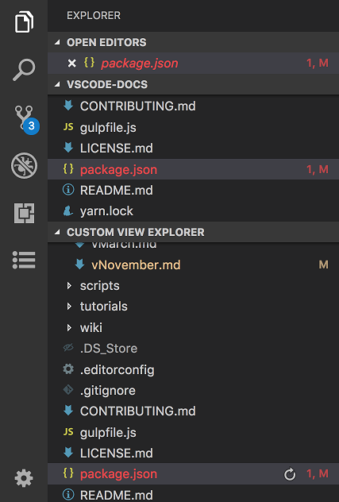

### Run npm scripts from package.json

You can now run an npm script in a `package.json` file from the hover as shown below or from the context menu.


### Opening folder URIs

You can now open an URI as a folder in VS Code, if there is an extension contributing a `FileSystemProvider` for that URI. We introduced a new command line argument `--folder-uri` to do this.

The following CLI command opens the VS Code GitHub repository as a folder, if you have [RemoteHub](https://marketplace.visualstudio.com/items?itemName=eamodio.remotehub) extension installed.

`code --folder-uri remotehub://github.com/Microsoft/vscode`


### Rapid render

On startup, the basic workbench layout is now restored much faster. The restoration order is Activity Bar, Side Bar, and Status Bar, followed by headers and icons, and then the Explorer and editor region are populated.


Rapid render is meant to improve perceived performance as the time you are looking at an empty canvas is reduced. We have more ideas how to improve rendering performance and we are interested in your feedback.

### Output panel

VS Code's main, window, and shared processes each have their own logging channel, where you can now view the telemetry events sent when the log level is set to "Trace". Data common to all telemetry events will not be visible here for the sake of brevity. The complete payload of each telemetry event is logged in a separate log file named `telemetry.log` which you can access via the **Developer: Open Log File...** command.

### Offline mode

Some users do not want any outgoing network requests from VS Code unless they specifically invoke features that require online access. To support this offline mode, we have added new settings to turn off features such as automatic extension update checking, querying settings for A/B experiments, and fetching of online data for auto-completions.

Below is the complete list of settings to control VS Code features that make network requests:

* `update.channel`
* `update.showReleaseNotes`
* `extensions.autoupdate`
* `extensions.autocheckUpdates`
* `extensions.showRecommendationsOnlyOnDemand`
* `workbench.settings.enableNaturalLanguageSearch`
* `workbench.enableExperiments`
* `telemetry.enableTelemetry`
* `telemetry.enableCrashReporter`
* `git.autofetch`
* `npm.fetchOnlinePackageInfo`

### Accessibility improvements

We have fixed a large number of accessibility issues - mostly around keyboard navigation, screen reader support, and color contrast. The full list can be found [here](https://github.com/microsoft/vscode/issues?q=is%3Aissue+label%3Aaccessibility+milestone%3A%22July+2018%22+is%3Aclosed).

## Integrated Terminal

### Column selection

Column selection is now supported within the Integrated Terminal via `Alt+click`.

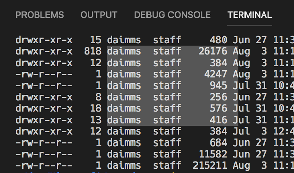

### Improved multi-line support

Double clicking to select words in the terminal now selects words that are split over lines.

### Frontend and backend are now synchronized

The data stream that comes into the Integrated Terminal is now synchronized with the backing pseudoterminal/shell process. This means that the data coming into the terminal can no longer flood the UI thread and cause unresponsiveness, SIGINT (Ctrl+C) should always be responsive, and the `time` command should return accurate results.

### Dynamic texture atlas

The Integrated Terminal now defaults to using a "dynamic texture atlas" for canvas rendering. This changes the caching strategy used by the terminal to store character glyphs. Instead of being a fixed set of glyphs on the default background, glyphs are now added to the texture atlas as they are required, regardless of the background being used. This should reduce the first terminal start up time and the rendering time of characters not using the default background, as well as improving overall rendering performance.

This came in as an upstream community contribution to [xterm.js](https://github.com/xtermjs/xterm.js/pull/1327).

## Languages

### TypeScript 3.0

VS Code now ships with TypeScript 3.0.1. This major update brings support for project references, better support for tuples, and other language and tooling features. You can read more about TypeScript 3.0 [here](https://blogs.msdn.microsoft.com/typescript/2018/07/30/announcing-typescript-3-0/).

### Better error reporting

The TypeScript team has done a lot of work to make JavaScript and TypeScript error messages smarter and clearer. Some error messages now include links to relevant locations in the source code.

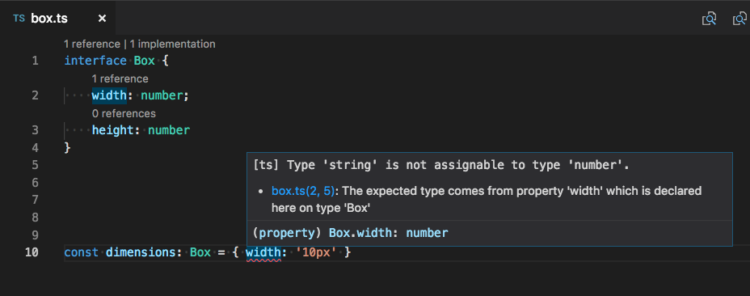

Messages for unions and other complex types should also be more concise and helpful. For example, a simple type error in JSX could sometimes produce a complex error message like this:

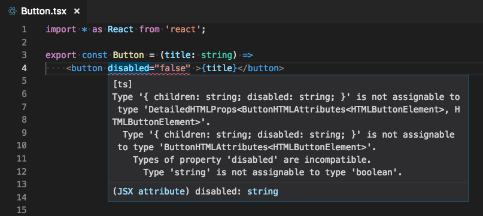

Thanks to TypeScript 3.0, the error is much more readable in VS Code 1.26:

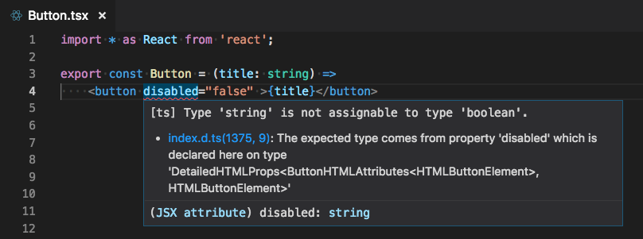

### JSX tag completion

JSX tags are now closed automatically when you type `>` in a JavaScript or TypeScript file:

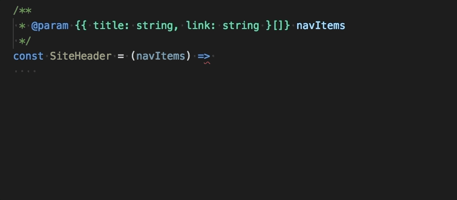

This behavior matches what VS Code already provided in HTML files. Auto closing of tags can be disabled by setting `"javascript.autoClosingTags": false` and `"typescript.autoClosingTags": false`.

### Add all missing imports Quick Fix

The **Add missing import** Quick Fix can now be applied to all missing imports in a JavaScript/TypeScript file:

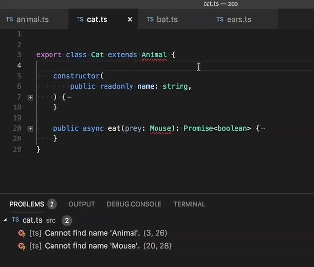

This Quick Fix will only add imports for symbols with a single potential definition. If there are multiple potential definitions of a symbol in the current project, for example having two different files export a symbol called `Button`, you must Quick Fix the individual error and select the specific import that you intended.

To use this Quick Fix in JavaScript files, [enable semantic checking](https://code.visualstudio.com/docs/languages/javascript#_type-checking).

### JSX folding

JSX tags are now foldable when using [syntax aware folding](https://code.visualstudio.com/docs/editor/codebasics#_folding).

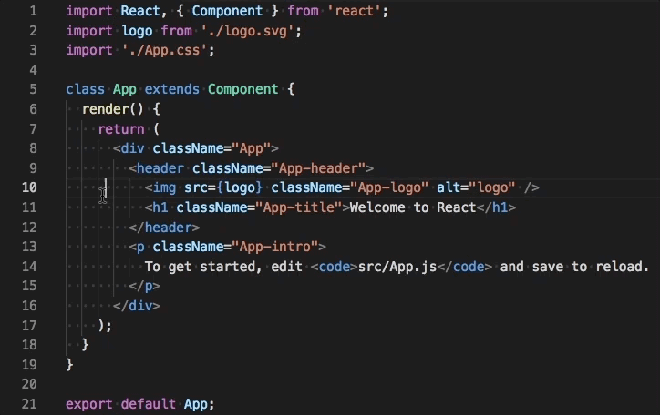

### Convert between named imports and namespace imports

Two new refactorings let you quickly convert between named imports and namespace imports in JavaScript and TypeScript:


### Clickable links in jsconfig.json and tsconfig.json project files

Quickly navigate `jsconfig.json` and `tsconfig.json` project references by `Ctrl` clicking on project reference paths (`Cmd+click` on macOS):


The [`extends`](https://www.typescriptlang.org/docs/handbook/tsconfig-json.html) path is now also clickable.

## Debugging

### Improved stop debug behavior

In previous releases, the **Debug: Stop** action (found on the Debug toolbar) would always kill a debuggee and its child processes immediately, without giving the debuggee a chance to clean up gracefully. Some users didn't like this behavior because they were forced to do manual cleanup after stopping a debug session.

In this release, we've improved the **Debug: Stop** action in the following way:

1. When pressing **Stop** for the first time, the debuggee is no longer killed immediately but it is requested to shutdown gracefully (and to clean up everything as necessary).

2. If there are no breakpoints (or problems) in that shutdown code, the debuggee and the debug session will terminate. The user will not not see any difference in behavior to previous versions of VS Code.

3. However, if the debugger hits a breakpoint in the shutdown code or if the debuggee does not terminate properly by itself, then the debug session will not end.

4. In this case, pressing the **Stop** button again will force terminate the debuggee. So if you see that a debug session doesn't end when you press the red **Stop** button, then press the button again to force a shutdown of the debuggee.

**Note**: This feature is only supported by debugger extensions that have opted into implementing it. Currently this is only the built-in Node.js debugger. We expect other debug extensions to support this feature soon.

### Changed smartStep behavior for Node/Chrome debugging

Previously, `"smartStep": true` would cause the Node.js debugger to not stop in source code without source maps. This can happen in two ways:

* Files that don't have source maps at all (source code that isn't transpiled or .js files shipped with node modules).
* Transpiled files that do have source maps, but there are individual lines that aren't mapped (extra lines that TypeScript inserts when down compiling some features like async/await).

With VS Code 1.26, `"smartStep": true` will only affect the second type, lines that are missing from a source map. Now you'll be able to step into .js files while still skipping TS async/await code.

We changed this because we realized that the old smartStep behavior was too aggressive. Skipping inserted code is usually correct, but skipping in the first scenario only makes sense for some projects and users. In addition, using the `skipFiles` option in your `launch.json` configuration file does a better job of covering the case for entire files, since it can target files more precisely and is faster.

So, if you are using `smartStep` and notice that the debugger is no longer auto-skipping through files without source maps, you can use `skipFiles` to get the previous behavior back. See [Skipping uninteresting code](https://code.visualstudio.com/docs/nodejs/nodejs-debugging#_skipping-uninteresting-code-node-chrome) for examples of how to configure `skipFiles` to skip source code in node_modules, internal node files, or any other files that you don't want to step through.

## Extensions

### IntelliSense for extension search

This release makes it easier to search for extensions by adding IntelliSense autocompletions to the extension search field. This will help you refine your extension searches to filter results based on things like category and install state; or sort results by name, rating, or install count. Type '@' or `kb(editor.action.triggerSuggest)` to trigger suggestions for supported query parameters.

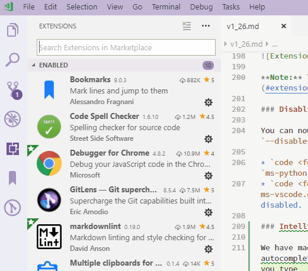

### Extension Pack management

Extension Pack management has become a lot smoother in this release. An Extension Pack is installed, uninstalled, enabled or disabled always as a single pack. You can also now uninstall or disable an extension belonging to an Extension Pack without requiring you to uninstall or disable the entire Extension Pack.

There is also a new **Extension Pack** tab when you open extension details showing which extensions are bundled in the Extension Pack.

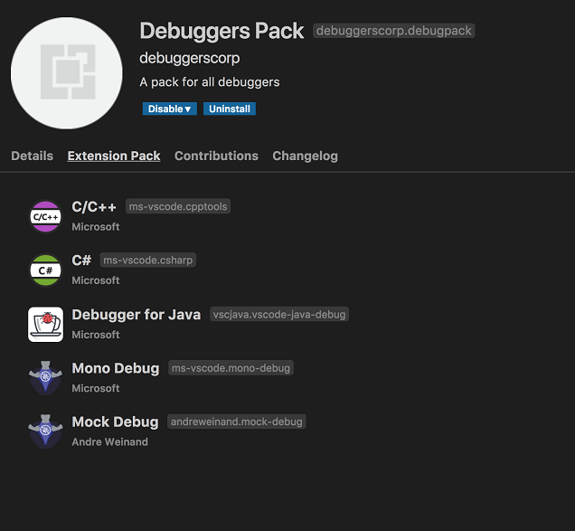

**Note:** This needs adoption by Extension Packs. See [Extension Packs revisited](#extension-packs-revisited) for more details.

### Disabling extensions from command line

You can now disable extensions from the command line using the new argument `--disable-extension`.

* `code <folder_path> --disable-extension ms-python.python` - Opens the folder with `ms-python.python` extension disabled.
* `code <folder_path> --disable-extension ms-python.python --disable-extension ms-vscode.csharp` - Opens the folder with `ms-python.python` and `ms-vscode.csharp` extensions disabled.

## Preview Features

Preview features are not ready for release but are functional enough to use. We welcome your early feedback while they are under development.

### New Settings editor

In this milestone, we continued work on a GUI for editing settings. It's still a preview, but if you'd like to try it out, you can open it with the **Preferences: Open Settings (Preview)** command. We would like to hear any feedback you have - you can leave it on [this GitHub issue](https://github.com/Microsoft/vscode/issues/50249).

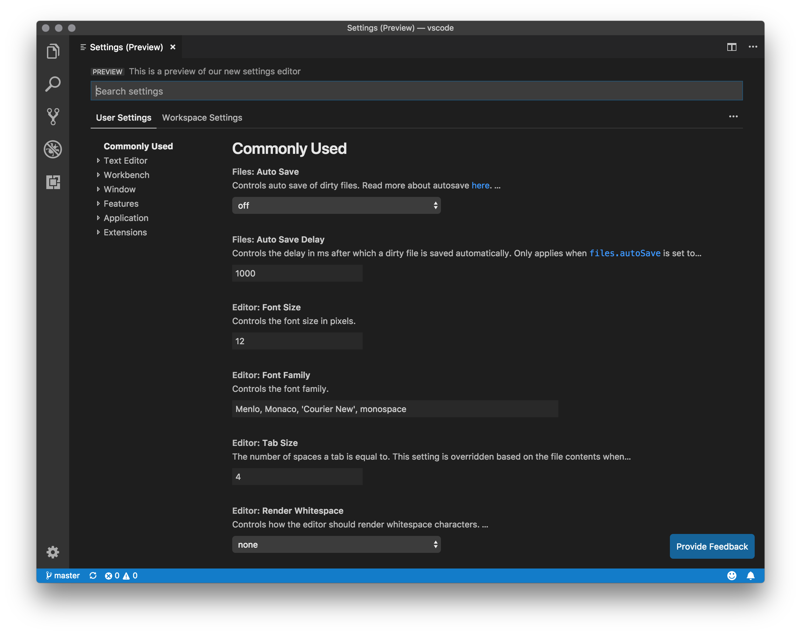

Some of the new changes compared to last month are:

* The header UX has been refreshed and cleaned up, and the actions to only show modified settings and to open the JSON editor have been moved under the `...` menu to the right.
* The table of contents on the left is now collapsed by default, and expands as you scroll to reveal the current section.
* Setting descriptions are now rendered as Markdown. Some settings have external links to relevant docs, and references to other settings are now clickable links that scroll to the setting. The `enumDescriptions` of enum-type settings are now shown after the setting description (and in the JSON editor as well):


* A new control for the `files.exclude` and `search.exclude` settings makes it easier to add or remove glob patterns, and to see which ones are applied for the current scope:

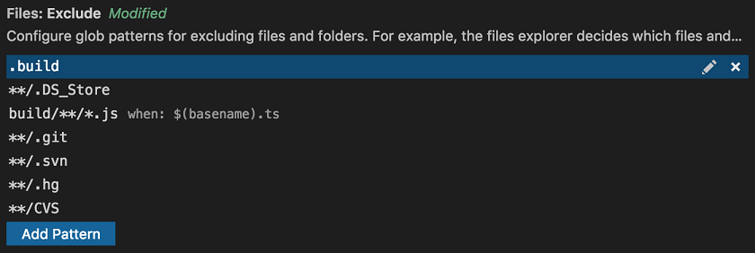

* The controls in the settings editor are now themeable. See the new theme colors under [New theme colors](#new-theme-colors).

### Custom title bar and menus for Windows/Linux

This milestone we improved the custom menus on Windows and Linux when the custom title bar is enabled. While still in preview, you can try it out by setting `window.titleBarStyle` to `custom` in your `settings.json`.

Some highlights include:

* The menus are now themable. See the new theme colors under [New theme colors](#new-theme-colors).

   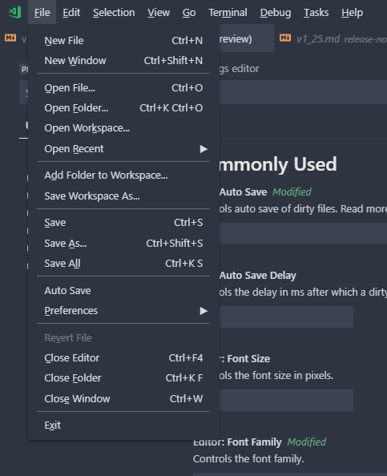

* Keyboard and mouse interaction with the menus is more coherent. Before, there were several focus indicators making the menus unclear. Now, the menus function in way that is much more familiar.
* Many accessibility issues have been resolved to improve the experience for those needing larger zoom levels or using screen readers.

We will continue to improve the new menus and title bar as well as address issues tagged with the [`workbench-title`](https://github.com/Microsoft/vscode/labels/workbench-title) or [`workbench-menu`](https://github.com/Microsoft/vscode/labels/workbench-menu) labels.

## Extension Authoring

### QuickInput API

The `QuickPick` and `InputBox` APIs are now stable. They allow for more flexible collection of user input than the existing `showQuickPick` and `showInputBox` APIs. There are samples of QuickInput API usage in a [sample extension](https://github.com/Microsoft/vscode-extension-samples/tree/master/quickinput-sample).

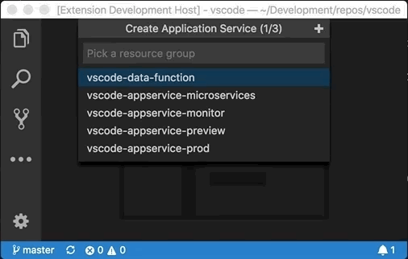

### Extension Packs revisited

Defining an Extension Pack now uses a new property called `extensionPack` instead of `extensionDependencies` in `package.json`. This is because `extensionDependencies` is mainly used to define functional dependencies among extensions that prevents uninstalling or disabling an extension dependency without uninstalling or disabling the dependent extension.

An Extension Pack should not have any functional dependencies with its bundled extensions and they should be manageable independent of the pack. Below is an example `extensionPack` entry which defines an Extension Pack that bundles several debugger extensions.

```json
"extensionPack": [
    "andreweinand.mock-debug",
    "ms-vscode.mono-debug",
    "ms-vscode.cpptools",
    "ms-vscode.csharp",
    "vscjava.vscode-java-debug"
]
```

This will make it much simpler and easier for users to manage an Extension Pack and its bundled extensions. See [Extension Pack management](#extension-pack-management).

### Better Workspace edit

The `WorkspaceEdit` and `applyEdit` APIs have been extended to allow extensions to create, rename, and delete files. Before, only textual edits were possible. The new APIs allow for better refactorings; for example, renaming a file when a class name is changed.

### New theme colors

There are new theme colors for the breadcrumbs:

* `breadcrumb.foreground`: Color of breadcrumb items.
* `breadcrumb.focusForeground`: Color of focused breadcrumb items.
* `breadcrumb.activeSelectionForeground`: Color of selected breadcrumb items.
* `breadcrumbPicker.background`: Background color of breadcrumb item picker.

The controls of the new Settings editor are now themeable:

* `settings.headerForeground`: The foreground color for a section header or active title.
* `settings.modifiedItemForeground`: The foreground color for the modified setting indicator.
* `settings.inactiveSelectedItemBorder`: The color of the selected setting row border, when the settings list does not have focus.
* `settings.dropdownBackground`: Dropdown background.
* `settings.dropdownForeground`: Dropdown foreground.
* `settings.dropdownBorder`: Dropdown border.
* `settings.checkboxBackground`: Checkbox background.
* `settings.checkboxForeground`: Checkbox foreground.
* `settings.checkboxBorder`: Checkbox border.
* `settings.textInputBackground`: Text input box background.
* `settings.textInputForeground`: Text input box foreground.
* `settings.textInputBorder`: Text input box border.
* `settings.numberInputBackground`: Number input box background.
* `settings.numberInputForeground`: Number input box foreground.
* `settings.numberInputBorder`: Number input box border.

The custom menus on Windows and Linux are now themeable:

* `menu.background`: Background of menus and context menus.
* `menu.foreground`: Foreground of menus and context menus.
* `menu.selectionBackground`: Background of selected item in menus and context menus.
* `menu.selectionForeground`: Foreground of selected item in menus and context menus.
* `menu.selectionBorder`: Border of selected item in menus and context menus.
* `menubar.selectionBackground`: Background of selected top-level menu in the menubar.
* `menubar.selectionForeground`: Foreground of selected top-level menu in the menubar.
* `menubar.selectionBorder`: Border of selected top-level menu in the menubar.

### Updated default theme colors

As part of our [accessibility improvements](#accessibility-improvements), we've updated a few default theme colors to ensure they meet the color contrast requirements. The full list of color contrast fixes can be found [here](https://github.com/microsoft/vscode/issues?utf8=%E2%9C%93&q=is%3Aissue+label%3Aaccessibility+milestone%3A%22July+2018%22+is%3Aclosed+%22contrast%22).

### DefinitionLink

Definition providers may now return a `DefinitionLink` object. Definition links provide additional metadata over normal [location](https://code.visualstudio.com/docs/extensionAPI/vscode-api#Location) definitions, including the range of the defining symbol:

```ts
import * as vscode from 'vscode';

export function activate(context: vscode.ExtensionContext) {
    vscode.languages.registerDefinitionProvider('markdown', new LineLinkDefinitionProvider());
}

export class LineLinkDefinitionProvider implements vscode.DefinitionProvider {
    async provideDefinition(
        document: vscode.TextDocument,
        position: vscode.Position,
        token: vscode.CancellationToken
    ): Promise<vscode.DefinitionLink[]> {
        const wordRange = document.getWordRangeAtPosition(position, /<\d+>/);
        if (wordRange.isEmpty) {
            return [];
        }

        const targetLine = +document.getText(wordRange).slice(1, -1);
        return [{
            // Definition location
            targetRange: new vscode.Range(targetLine - 1, 0, targetLine, 0),
            targetUri: document.uri,

            // Range of the defining symbol
            originSelectionRange: new vscode.Range(
                wordRange.start.translate({ characterDelta: 1 }),
                wordRange.end.translate({ characterDelta: -1 })),
        }];
    }
}
```

### Debug extensions

**New home for the Debug Adapter Protocol**

We've moved the **Debug Adapter Protocol** from its [old location](https://github.com/Microsoft/vscode-debugadapter-node) to a new web site [https://microsoft.github.io/debug-adapter-protocol](https://microsoft.github.io/debug-adapter-protocol) and a corresponding repository [https://github.com/Microsoft/debug-adapter-protocol](https://github.com/Microsoft/debug-adapter-protocol).

A companion blog, [New home for the Debug Adapter Protocol](https://code.visualstudio.com/blogs/2018/08/07/debug-adapter-protocol-website), provides background and additional details about the move.

Everyone who is using the DAP JSON-schema programmatically from the old location [https://raw.githubusercontent.com/Microsoft/vscode-debugadapter-node/master/debugProtocol.json](https://raw.githubusercontent.com/Microsoft/vscode-debugadapter-node/master/debugProtocol.json) should update their source code to the new location:

```bash
https://microsoft.github.io/debug-adapter-protocol/debugAdapterProtocol.json
```

For the next two releases (August & September), we will keep the schema at the old location up-to-date, but we are planning to remove it in October.

**New `terminate` request for Debug Adapter Protocol**

A new `terminate` request and a corresponding `supportsTerminateRequest` capability have been added to the **Debug Adapter Protocol** in order to support the graceful shutdown of debuggees [explained above](#improved-stop-debug-behavior). If a debug adapter returns `true` for the `supportsTerminateRequest` capability, VS Code will first send a `terminate` request to the debug adapter when it stops a debug session.
The implementation of the `terminate` request in the debug adapter should request the debuggee to terminate itself. On Unix-based operating systems, this could easily be achieved by sending the `SIGINT` signal to the debuggee.

### Webview icons

[Webviews](https://code.visualstudio.com/docs/extensions/webview) may now provide a custom icon that is shown in the tab bar and OPEN EDITORS view:

```ts
import * as vscode from 'vscode';
import * as path from 'path';

export function activate(context: vscode.ExtensionContext) {

    context.subscriptions.push(vscode.commands.registerCommand('catCoding.start', () => {
        const panel = vscode.window.createWebviewPanel('catCoding',
            "Coding Cat", vscode.ViewColumn.One, { });

        panel.iconPath = vscode.Uri.file(path.join(context.extensionPath, 'media', 'cat.png'));
    });
}
```


### Terminal access API

The terminal access APIs are now stable. They allow extensions to access `Terminal` objects, regardless of whether the extension created them or not.

```ts
export namespace window {
    export const terminals: ReadonlyArray<Terminal>;
    export const onDidOpenTerminal: Event<Terminal>;
}
```

### URI handler API

The URI handler API is now stable. It allows extensions to handle system-wide [URIs](https://en.wikipedia.org/wiki/Uniform_Resource_Identifier).

```ts
export interface UriHandler {
    handleUri(uri: Uri): ProviderResult<void>;
}

export namespace window {
    export function registerUriHandler(handler: UriHandler): Disposable;
}
```

It comes with a `onUri` activation event which activates an extension whenever a URI directed towards itself is opened by the operating system.

Refer to the Git extension's [GitProtocolHandler](https://github.com/Microsoft/vscode/blob/master/extensions/git/src/protocolHandler.ts) for a reference implementation.

### Node.js update

The version of Electron that VS Code runs on has been updated which brings with it an update to Node.js that VS Code ships with from 7.9 to 8.9. All extensions will now run on this newer version of Node.js.

There are some changes which could affect extensions:

* The `natives` node module no longer works (see [#47569](https://github.com/Microsoft/vscode/issues/47569)).
* The legacy debug protocol and the `--debug` flag is no longer supported (see [#55907](https://github.com/Microsoft/vscode/issues/55907)).
* If language servers written in Node.js using stdio as the transport encounter problems in VS Code 1.26, the fix for extension authors using the LSP [client](https://www.npmjs.com/package/vscode-languageclient) and [server](https://www.npmjs.com/package/vscode-languageserver) libraries is to switch the transport to `TransportKind.ipc` instead of `TransportKind.stdio` and republish their extension.

## Proposed Extension APIs

Every milestone comes with new proposed APIs and extension authors can try them out. As always we are keen on your feedback. This is what you have to do to try out a proposed API:

* You must use Insiders because proposed APIs change frequently.
* You must have this line in the `package.json` file of your extension: `"enableProposedAPI": true`.
* Copy the latest version of the [`vscode.proposed.d.ts`](https://github.com/Microsoft/vscode/blob/master/src/vs/vscode.proposed.d.ts) file into your project.

Note that you cannot publish an extension that uses a proposed API. We may likely make breaking changes in the next release and we never want to break existing extensions.

### TextSearchProvider, FileSearchProvider, FileIndexProvider

We've added a set of APIs that let extensions implement text search and file search in VS Code.

`TextSearchProvider` is invoked when a user uses the Search view or when an extension uses the new API `workspace.findTextInFiles`. It returns text matches incrementally through the `progress` callback.

There are two ways to implement file search covering the two common use-cases, through a `FileIndexProvider` or a `FileSearchProvider`. A `FileIndexProvider` is invoked once when the user opens Quick Open, and must return an array of every file in the workspace. VS Code then searches within this list and applies its own fuzzy-matching logic to return the correct set of results to the user. If your extension is capable of providing a list of every file in the workspace, then implementing a `FileIndexProvider` is the easier way to support file search.

If instead your extension needs to handle the user's search query and return its own list of filtered results, implement a `FileSearchProvider`. It's invoked on the user's every keypress in Quick Open, and must return a filtered and sorted set of file matches.

```ts
export interface TextSearchProvider {
    provideTextSearchResults(query: TextSearchQuery, options: TextSearchOptions, progress: Progress<TextSearchResult>, token: CancellationToken): Thenable<void>;
}

export interface FileIndexProvider {
    provideFileIndex(options: FileIndexOptions, token: CancellationToken): Thenable<Uri[]>;
}

export interface FileSearchProvider {
    provideFileSearchResults(query: FileSearchQuery, options: FileSearchOptions, token: CancellationToken): Thenable<Uri[]>;
}

export namespace workspace {
    export function registerTextSearchProvider(scheme: string, provider: TextSearchProvider): Disposable;
    export function registerFileIndexProvider(scheme: string, provider: FileIndexProvider): Disposable;
    export function registerFileSearchProvider(scheme: string, provider: FileSearchProvider): Disposable;
}
```

### findTextInFiles API

New proposed API has been added to allow extensions to search for text patterns within the workspace:

```ts
export namespace workspace {
    export function findTextInFiles(query: TextSearchQuery, options: FindTextInFilesOptions, callback: (result: TextSearchResult) => void, token?: CancellationToken): Thenable<void>;
}
```

This is the counterpart of `workspace.findFiles`, which searches for files in the workspace.

## Miscellaneous

### Electron update

In this release, we updated from Electron 1.7.12 to 2.0.5. This brings in a Chromium update from version 58 to 61 and Node.js from 7.9 to 8.9.

## New Documentation

### Logpoints blog post

You can read Kenneth's recent [blog post](https://code.visualstudio.com/blogs/2018/07/12/introducing-logpoints-and-auto-attach) to learn about Node.js debugging Logpoints and auto-attach. [Logpoints](https://code.visualstudio.com/docs/editor/debugging#_logpoints) let you quickly output logging information without changing source code or interrupting your debugging session.

### IntelliCode FAQ

If you are a Python developer, have a look at [IntelliCode](https://docs.microsoft.com/visualstudio/intellicode/FAQ), a new tool that enhances software development using artificial intelligence (AI). The [IntelliCode extension](https://go.microsoft.com/fwlink/?linkid=2006060) provides a set of AI-assisted capabilities for IntelliSense in Python, such as inferring the most relevant auto-completions based on the current source code context.


## Notable Changes

* [53532](https://github.com/Microsoft/vscode/issues/53532): Editor: load changes to file in the background if file already loaded
* [53586](https://github.com/Microsoft/vscode/issues/53586): Node debug: auto attach mode is not remembered
* [53022](https://github.com/Microsoft/vscode/issues/53022): "Read-only" label in the editor tabs for files that are read only
* [48275](https://github.com/Microsoft/vscode/issues/48275): `resourceIsFile` context key is no longer supported

## Thank You

Last but certainly not least, a big *__Thank You!__* to the following folks that helped to make VS Code even better:

Contributions to `vscode`:

* [@alexr00](https://github.com/alexr00): Fixes #48714: Added conversion from local case of the file to git case [PR #49397](https://github.com/Microsoft/vscode/pull/49397)
* [Arjun Attam (@arjun27)](https://github.com/arjun27): Adds webview select-all command [PR #54851](https://github.com/Microsoft/vscode/pull/54851)
* [Adit Bhatt (@avbhatt)](https://github.com/avbhatt): add support for ignored repositories list [PR #47890](https://github.com/Microsoft/vscode/pull/47890)
* [@coolreader18](https://github.com/coolreader18): Fix double dash in previewer if @param jsdoc tag has hyphen after param name [PR #53365](https://github.com/Microsoft/vscode/pull/53365)
* [Geoffrey (@g3offrey)](https://github.com/g3offrey): Allow to update require path with Node.js [PR #53964](https://github.com/Microsoft/vscode/pull/53964)
* [@HookyQR](https://github.com/HookyQR): Improve word part move and delete for capitalized snake case [PR #53470](https://github.com/Microsoft/vscode/pull/53470)
* [HUA Yang (@imhuay)](https://github.com/imhuay): fix #53590 [PR #54257](https://github.com/Microsoft/vscode/pull/54257)
* [Itamar (@itamark)](https://github.com/itamark)
  * Set diff editor border to match regular editor border.  [PR #53931](https://github.com/Microsoft/vscode/pull/53931)
  * Close param hints if you reach out of bounds of list instead of cycling [PR #53757](https://github.com/Microsoft/vscode/pull/53757)
* [Ivor Huang (@ivorhuang)](https://github.com/ivorhuang): Implement push success notification [PR #47790](https://github.com/Microsoft/vscode/pull/47790)
* [Josh Beard (@jlbeard84)](https://github.com/jlbeard84): Removed OS specific text on 'Open in Terminal' command. [PR #53636](https://github.com/Microsoft/vscode/pull/53636)
* [Jongkuen Hong (@Jongkeun)](https://github.com/Jongkeun): fixed spelling mistake from 'occuring' to 'occurring' [PR #54239](https://github.com/Microsoft/vscode/pull/54239)
* [Josh Goldberg (@JoshuaKGoldberg)](https://github.com/JoshuaKGoldberg): Trimmed file search strings in the search menu [PR #54625](https://github.com/Microsoft/vscode/pull/54625)
* [Leonardo Braga (@LeonardoBraga)](https://github.com/LeonardoBraga): Handle --enable-proposed-api w/o extension IDs as "enable all" [PR #52861](https://github.com/Microsoft/vscode/pull/52861)
* [Loic Nageleisen (@lloeki)](https://github.com/lloeki): Respect ownership on code command installation [PR #46962](https://github.com/Microsoft/vscode/pull/46962)
* [Nikolas (@nikolasburk)](https://github.com/nikolasburk): Add underscores and asterisks to surrounding pairs [PR #55054](https://github.com/Microsoft/vscode/pull/55054)
* [Nilesh Kevlani (@njkevlani)](https://github.com/njkevlani): Fixes #53372  [PR #53503](https://github.com/Microsoft/vscode/pull/53503)
* [Nick James (@omniomi)](https://github.com/omniomi): Update to powershell grammars [PR #52956](https://github.com/Microsoft/vscode/pull/52956)
* [Ori Ashual (@oriash93)](https://github.com/oriash93): Support for updating extensions from CLI [PR #45533](https://github.com/Microsoft/vscode/pull/45533)
* [Pradeep Murugesan (@pradeepmurugesan)](https://github.com/pradeepmurugesan)
  * Fixed the scrolling of the editor and cursor after the revert … [PR #47238](https://github.com/Microsoft/vscode/pull/47238)
  * Commit always using sign off flag setting [PR #47819](https://github.com/Microsoft/vscode/pull/47819)
* [Ahmed Tarek (@pushqrdx)](https://github.com/pushqrdx): Fixed SCM Badge Issue #42940 [PR #43256](https://github.com/Microsoft/vscode/pull/43256)
* [Dániel Tar (@qcz)](https://github.com/qcz): Improve the macOptionClickForcesSelection message [PR #54264](https://github.com/Microsoft/vscode/pull/54264)
* [Ryuichi Inagaki (@ryu1kn)](https://github.com/ryu1kn): Error on "Undo Last Commit" if executed on initial commit [PR #47578](https://github.com/Microsoft/vscode/pull/47578)
* [Sandy Armstrong (@sandyarmstrong)](https://github.com/sandyarmstrong): Treat Xamarin .workbook files as markdown [PR #51167](https://github.com/Microsoft/vscode/pull/51167)
* [Guillaume Marcoux (@V-ed)](https://github.com/V-ed): Remove confusing Start from wordPartLeft commands ID [PR #55492](https://github.com/Microsoft/vscode/pull/55492)
* [Walter M Barajas Jr (@wmb0117)](https://github.com/wmb0117): Add option to manually add repos [PR #48020](https://github.com/Microsoft/vscode/pull/48020)
* [Yogesh Mangaj (@yogeshmangaj)](https://github.com/yogeshmangaj): Add Focus search list command [PR #54196](https://github.com/Microsoft/vscode/pull/54196)
* [@zhuowei](https://github.com/zhuowei): [WIP] git: Detect conflict markets in BOTH_ADDED files when staging [PR #50252](https://github.com/Microsoft/vscode/pull/50252)

Contributions to `language-server-protocol`:

* [Luke Lau (@Bubba)](https://github.com/Bubba): Add hierarchicalDocumentSymbolSupport to Text Document Client Capabilities [PR #538](https://github.com/Microsoft/language-server-protocol/pull/538)
* [Qiming zhao (@chemzqm)](https://github.com/chemzqm): Add coc.nvim [PR #537](https://github.com/Microsoft/language-server-protocol/pull/537)
* [Colin Rofls (@cmyr)](https://github.com/cmyr): Fixup typos in specification.md [PR #499](https://github.com/Microsoft/language-server-protocol/pull/499)
* [@khng300](https://github.com/khng300): Add ccls as an implementation of LSP for C/C++/Objective-C [PR #525](https://github.com/Microsoft/language-server-protocol/pull/525)
* [Michael T Lombardi (@michaeltlombardi)](https://github.com/michaeltlombardi): Update Puppet Language Server Info [PR #509](https://github.com/Microsoft/language-server-protocol/pull/509)
* [Mikhail Arkhipov (@MikhailArkhipov)](https://github.com/MikhailArkhipov): Add preselect field to CompletionItem [PR #515](https://github.com/Microsoft/language-server-protocol/pull/515)
* [Andrey Kolomoets (@muffinmad)](https://github.com/muffinmad): Added eglot [PR #531](https://github.com/Microsoft/language-server-protocol/pull/531)
* [Olivier FAURE (@PoignardAzur)](https://github.com/PoignardAzur): Fix minor typo in specification [PR #529](https://github.com/Microsoft/language-server-protocol/pull/529)
* [Rafał Łasocha (@swistak35)](https://github.com/swistak35): Update servers.md - add new ruby language server [PR #535](https://github.com/Microsoft/language-server-protocol/pull/535)
* [Tyson Andre (@TysonAndre)](https://github.com/TysonAndre)
  * Fix typos in contributing.md and protocol-*-x.md [PR #536](https://github.com/Microsoft/language-server-protocol/pull/536)
  * Fix typo: litaral -> literal [PR #516](https://github.com/Microsoft/language-server-protocol/pull/516)

Contributions to `vscode-chrome-debug`:

* [Michael Crane (@mrcrane)](https://github.com/mrcrane): Race condition when killing Chrome on Windows on disconnect [PR #703](https://github.com/Microsoft/vscode-chrome-debug/pull/703)
* [Todd Chaffee (@tchaffee)](https://github.com/tchaffee): Clearer documentation about the webpack devtools option. [PR #694](https://github.com/Microsoft/vscode-chrome-debug/pull/694)

Contributions to `vscode-chrome-debug-core`:

* [@digeff](https://github.com/digeff)
  * Canonicalize win32 paths to lowercase [PR #342](https://github.com/Microsoft/vscode-chrome-debug-core/pull/342)
  * Canonicalize paths to lowercase in Windows [PR #341](https://github.com/Microsoft/vscode-chrome-debug-core/pull/341)
* [@Pokute](https://github.com/Pokute): Added support for URI encoded source maps + tests. [PR #344](https://github.com/Microsoft/vscode-chrome-debug-core/pull/344)
* [Raghav Katyal (@rakatyal)](https://github.com/rakatyal)
  * Now we log the browser and the protocol version when attempting to li… [PR #338](https://github.com/Microsoft/vscode-chrome-debug-core/pull/338)
  * Persist the client ID when we reset the breakpoints in source mapped … [PR #337](https://github.com/Microsoft/vscode-chrome-debug-core/pull/337)

Contributions to `vscode-vsce`:

* [Jimi (Dimitris) Charalampidis (@JimiC)](https://github.com/JimiC): Fix pattern matching in .vscodeignore [PR #271](https://github.com/Microsoft/vscode-vsce/pull/271)

Contributions to `vscode-recipes`:

* [Fabien Allanic (@fallanic)](https://github.com/fallanic)
  * added instructions for windows users [PR #108](https://github.com/Microsoft/vscode-recipes/pull/108)
  * jest debugging : fixed program path so it also works with jest-cli [PR #106](https://github.com/Microsoft/vscode-recipes/pull/106)
* [Jesus Abarca (@jabas06)](https://github.com/jabas06): Update to make debugging work with version 6 of Angular CLI [PR #117](https://github.com/Microsoft/vscode-recipes/pull/117)
* [@NileshParkhe83](https://github.com/NileshParkhe83): Jest issue - SecurityError: localStorage is not available for opaque origins [PR #120](https://github.com/Microsoft/vscode-recipes/pull/120)
* [@NiloCK](https://github.com/NiloCK): #96 Distinguish instructions for vue-cli 2.x / 3.x [PR #121](https://github.com/Microsoft/vscode-recipes/pull/121)

Contributions to `localization`:

There are over 800 members in the Transifex [VS Code project](https://aka.ms/vscodeloc) team with about 100 active contributors every month. We appreciate your contributions, either by providing new translations, voting on translations, or suggesting process improvements.

Here is a snapshot of contributors for this release. For details about the project including the contributor name list, visit the project site at [https://aka.ms/vscodeloc](https://aka.ms/vscodeloc).

* **Chinese (Simplified):** Joel Yang, Yusong, pluwen, Liu Dingming 刘丁明, hackereric, Simon Chan, 韦煊 王, gzponline, Ziming Wang.
* **Chinese (Traditional):** Duran Hsieh, Will 保哥, Poy Chang, Alan Tsai, Kevin Yang, Winnie Lin, MartinLau, Ben Tsai 蔡和恩, Alan Liu.
* **French:** Antoine Griffard, Ludovic P, William Thibodeau, Adrien Clerbois, Alain BUFERNE.
* **German:** Carsten Siemens, Carsten Kneip, Markus Hatvan, Väinämö Lumikero, Ettore Atalan, AlCalzone, Levin Rickert.
* **Italian:** Alessandro Alpi, Andrea Dottor, Emilie Rollandin, Riccardo Cappello, Aldo Donetti, Massimo.
* **Japanese:** Satoshi Kajiura, Yuichi Nukiyama, Shunya Tajima, yoshioms, Nakamura Yuta.
* **Korean:** Helloyunho.
* **Russian:** Michel Ace.
* **Spanish:** Alberto Poblacion, Julián Martínez, Alejandro Medina, José M. Aguilar, Carlos Mendible, Pedro Sanchez, Lio Fleishman.
* **Bosnian:** Bahrudin Hrnjica.
* **Bulgarian:** Любомир Василев.
* **Czech:** Ľuboš Uličný, Ľubomír Kováč, Frantisek Veris.
* **Dutch:** Gerald Versluis, RubenJacobse, Armand Duijn, Dirk Doesburg, Maarten van Stam, Dean Wyns.
* **English (United Kingdom):** Matthew John Cheetham, Swotboy2000.
* **Finnish:** Feetu Nyrhinen, Petri Niinimäki, Make.
* **Greek:** Ioannis Paraskevopoulos, Theodore Tsirpanis.
* **Hungarian:** Dóczi Dominik.
* **Indonesian:** Laurensius Dede Suhardiman, Wildan Mubarok, Riwut Libinuko, Bagus Ilman, Lundy Orlando.
* **Norwegian:** andreona, Daniel Bjørnbakk.
* **Polish:** Patryk Brejdak, Sebastian Baran, Igor Śpiączka, Lukasz Woznicki.
* **Portuguese (Brazil):** Lucas Miranda, Otacilio Saraiva Maia Neto, Roberto Fonseca, Marcelo Camargo, Marcelo Novaes, Victor Hugo Schmidt, Pedro Sereno, Rafael Oliveira, Danilo Dantas, Vitor Dutra Freire, Luan Moreno Medeiros Maciel, Fabio Correia.
* **Portuguese (Portugal):** Daniel Correia, Pavlo Zakharuk, António Santos, João Mata, Diogo Barros, Danilo Dantas.
* **Romanian:** Schiriac Robert, Cornel Cocioaba, Dan Ichim, Alexandru Spinu, ovisan, Bogdan Mateescu.
* **Tamil:** Jeyanthinath Muthuram, Jam Station.
* **Ukrainian:** Oleksandr, Fedir Gordiienko, Volodymyr Holovka.

<!-- In-product release notes styles.  Do not modify without also modifying regex in gulpfile.common.js -->
<a id="scroll-to-top" role="button" aria-label="scroll to top" href="#"><span class="icon"></span></a>
<link rel="stylesheet" type="text/css" href="css/inproduct_releasenotes.css"/>
