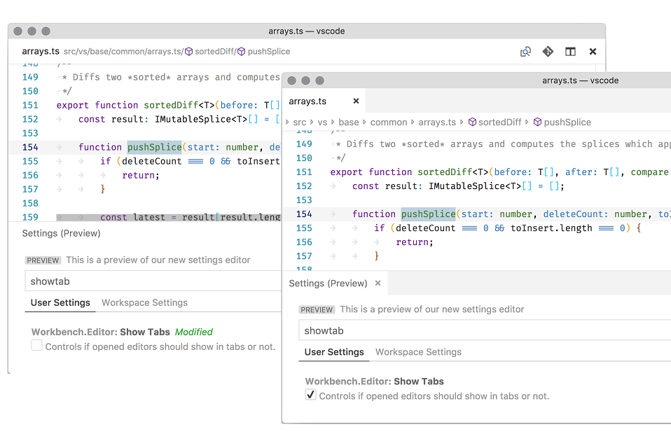
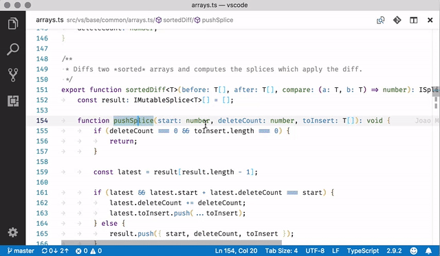
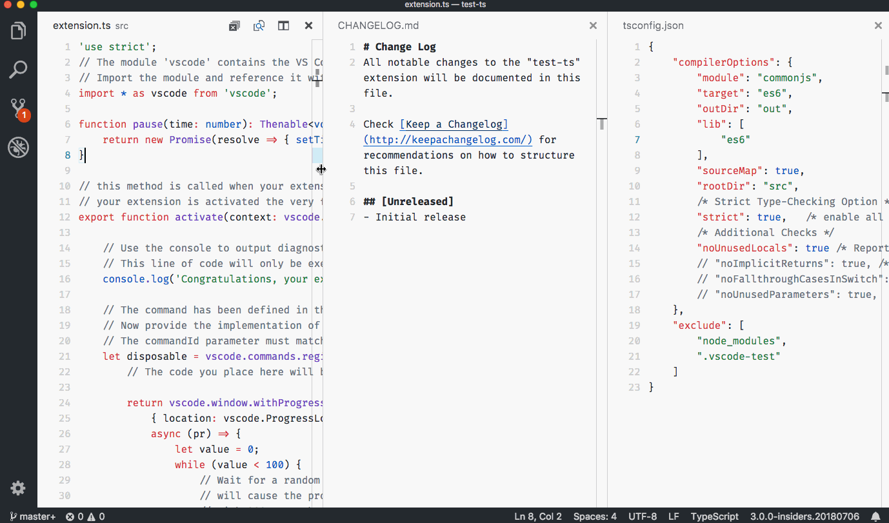
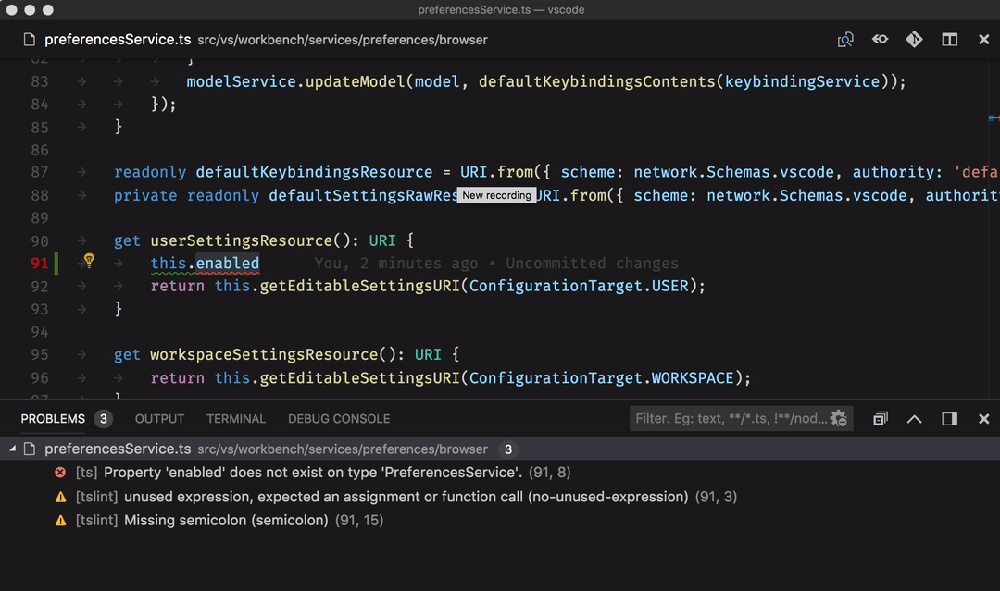
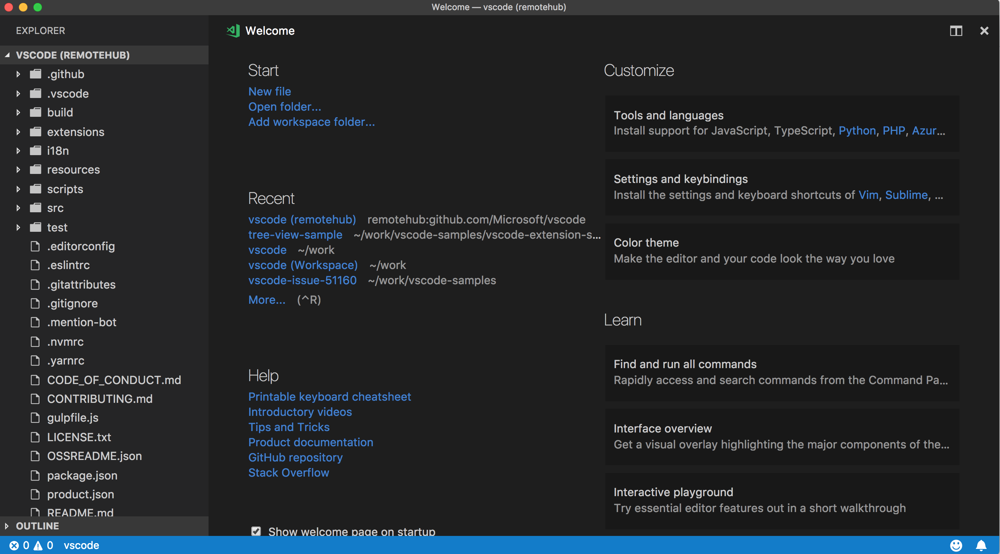

# July 2018 (version 1.26)

<!-- DOWNLOAD_LINKS_PLACEHOLDER -->

## Insiders Release

Welcome to the Insiders build. These are the preliminary notes for the July 1.26 release of Visual Studio Code. As we get closer to the release date, you'll see details below about new features and important fixes.

Until the July release notes are available, you can still track our progress:

* **[July Iteration Plan](https://github.com/Microsoft/vscode/issues/53850)** - See what's planned for the milestone.
* **[Commit Log](https://github.com/Microsoft/vscode/commits/master)** - GitHub commits to the vscode open source repository.
* **[Closed issues](https://github.com/Microsoft/vscode/milestone/72?closed=1)** - Resolved bugs and implemented feature requests in the July milestone.

We really appreciate people taking a look at our new features as soon as they are ready so check back here often and learn what's new to try out.

If you find issues or have suggestions, you can enter them in the VS Code repository on [GitHub](https://github.com/Microsoft/vscode/issues).

## Workbench

### Breadcrumbs 🥖 🍞

The editor now has a navigation bar above its contents - we call it **Breadcrumbs**. It shows the current location and allows you to quickly navigate between symbols and files. To start using breadcrumbs, enable it with the **View** > **Toggle Breadcrumbs** command or via the `breadcrumbs.enabled` setting.

When using editor [tabs](https://code.visualstudio.com/docs/getstarted/userinterface#_tabs) (default), breadcrumbs are displayed in a separate row below the editor title. If you are [not using](https://code.visualstudio.com/docs/getstarted/userinterface#_working-without-tabs) editor tabs, breadcrumbs show as an interactive file path next to the title.



Breadcrumbs always show the file path and, with the help of extensions, the symbol path up to the cursor position. The symbols shown are the same as in Outline view and Go to Symbol and so existing extensions will just work with breadcrumbs.

The appearance of breadcrumbs can be customized. If you have very long paths or are only interested in either file paths or symbols paths, you can use the `breadcrumbs.filePath` and `breadcrumbs.symbolPath` settings. Both support `on`, `off`, and `last` and they define if or what part of the path you see.

To interact with breadcrumbs, use the **Focus Breadcrumbs** command or press `kb(breadcrumbs.focusAndSelect)`. It will select that last element and open a dropdown that allows you to navigate to a sibling file or symbol. Use the `kb(breadcrumbs.focusPrevious)` and `kb(breadcrumbs.focusNext)` keyboard shortcuts to go to elements before or after the current element. When the dropdown appears, simply start typing - all matching elements will be highlighted and the best match will be selected so that it can be navigated to quickly.



You can also interact with breadcrumbs without the picker. Press `kb(breadcrumbs.focus)` to focus the last element, use `kb(breadcrumbs.focusPrevious)` and `kb(breadcrumbs.focusNext)` to navigate, and use `kb(breadcrumbs.revealFocused)` to reveal the element in the editor.

### Grid: Automated maximize of minimized editors

One feature we lost during the introduction of the grid editor layout last milestone was the ability to have editors automatically maximize when you focus them and they are in their minimized state. This feature is now working as before:



**Note:** You can always maximize the active editor via **View: Maximize Editor Group** (`workbench.action.minimizeOtherEditors`) or reset all editor sizes via **View: Reset Editor Group Sizes** (`workbench.action.evenEditorWidths`).

### View menu cleanup

The **View** menu was growing very large and we decided to move many of the entries into a separate **Appearance** sub-menu to clean it up.


### Copy Relative Path

VS Code always had an action to copy the absolute path of a file to the clipboard (`kb(copyFilePath)`). There is now a new action **Copy Relative Path** (`kb(copyRelativeFilePath)`) to copy the file path relative to the workspace folder root.

**Note:** You can get to this action from the context menu (for example, on a tab or a file in the File Explorer) by pressing and holding the `Shift` key (`Alt` key on macOS) before opening the menu.

### Problems view: Quick Fixes

You can now apply Quick Fixes from the Problems view. A light bulb indicating Quick Fixes is shown when you hover or select a problem entry. Quick Fixes can be applied by clicking on the light bulb or by opening the context menu for the problem entry.



**Note:** Light bulb indicator is shown only if the extension contributing Quick Fixes provides [Diagnostic](https://github.com/Microsoft/vscode/blob/1.26.0/src/vs/vscode.d.ts#L2029) information associated with the Quick Fix.

### Custom view: File resource decorations

Custom views showing file resources will now have file decorations (git, problems) shown. You can disable them using the settings `explorer.decorations.colors` and `explorer.decorations.badges` which disables them in File Explorer, Open Editors and Custom views.


### Run npm scripts from package.json

You can now run an npm script in a `package.json` file from the hover as shown below or from the context menu.


### Opening folder URIs

You can now open an URI as a folder in VS Code, if there is an extension contributing a `FileSystemProvider` for that URI. We introduced a new command line argument `--folder-uri` to do this.

The following CLI command opens the VS Code GitHub repository as a folder, if you have [RemoteHub](https://marketplace.visualstudio.com/items?itemName=eamodio.remotehub) extension installed.

`code --folder-uri remotehub://github.com/Microsoft/vscode`



### Rapid render

On startup, the basic workbench layout is now restored much faster. First, the Activity Bar, Side Bar, and Status Bar are restored, followed by headers and icons, and then the Explorer and editor region are populated.


Rapid render is meant to improve perceived performance as the time you are looking at an empty canvas is reduced. We have more ideas how to extend this and we are interested in your feedback.

## Extensions

### Extension Pack management

Extension Pack management has become a lot smoother in this release. An Extension Pack is installed, uninstalled, enabled or disabled always as a pack. You can also now uninstall or disable an extension belonging to an Extension Pack without requiring you to uninstall or disable the entire Extension Pack.

There is also a new **Extension Pack** tab when you open extension details.


**Note:** This needs adoption by Extension Packs. See [Extension Packs revisited](#extension-packs-revisited) for more details.

### Disabling extensions from command line

You can now disable extensions from the command line using the new argument `--disable-extension`.

* `code <folder_path> --disable-extension ms-python.python` - Opens the folder with `ms-python.python` extension disabled.
* `code <folder_path> --disable-extension ms-python.python --disable-extension ms-vscode.csharp` - Opens the folder with `ms-python.python` and `ms-vscode.csharp` extensions disabled.

## Extension Authoring

### Extension Packs revisited

Defining an Extension Pack now uses a new property called `extensionPack` instead of `extensionDependencies` in `package.json`. This is because `extensionDependencies` is mainly used to define functional dependencies among extensions that prevents uninstalling or disabling an extension dependency without uninstalling or disabling the dependent extension.

An Extension Pack should not have any functional dependencies with its bundled extensions and they should be manageable independent of the pack. Below is an example `extensionPack` entry which defines an Extension Pack which bundles several extensions.

```json
"extensionPack": [
    "andreweinand.mock-debug",
    "ms-vscode.mono-debug",
    "ms-vscode.cpptools",
    "ms-vscode.csharp",
    "vscjava.vscode-java-debug"
]
```

This will make managing extension pack and bundled extensions much simpler and better. See [Extension Pack Management](#extension-pack-management).

### Better Workspace Edit

The `WorkspaceEdit` and `applyEdit` APIs have been extended to allow extensions to create, rename, and delete files. Before, only textual edits were possible. The new APIs allow for better refactorings; for example, renaming a file when a class name is changed.

### New Theme colors

There are new theme colors for the breadcrumbs:

* `breadcrumb.breadcrumbsForeground`: Color of focused breadcrumb items.
* `breadcrumb.breadcrumbsFocusForeground`: Color of focused breadcrumb items.
* `breadcrumb.breadcrumbsActiveSelectionForeground`: Color of selected breadcrumb items.
* `breadcrumb.breadcrumbsPickerBackground`: Background color of breadcrumb item picker.

## Notable Changes

* [53532](https://github.com/Microsoft/vscode/issues/53532): Editor: load changes to file in the background if file already loaded

## Thank You

Last but certainly not least, a big *__Thank You!__* to the following folks that helped to make VS Code even better:

Contributions to `vscode`:

Contributions to `language-server-protocol`:

* [Olivier FAURE (@PoignardAzur)](https://github.com/PoignardAzur): Fix minor typo in specification [PR #529](https://github.com/Microsoft/language-server-protocol/pull/529)

<!-- In-product release notes styles.  Do not modify without also modifying regex in gulpfile.common.js -->
<a id="scroll-to-top" role="button" aria-label="scroll to top" href="#"><span class="icon"></span></a>
<link rel="stylesheet" type="text/css" href="css/inproduct_releasenotes.css"/>
