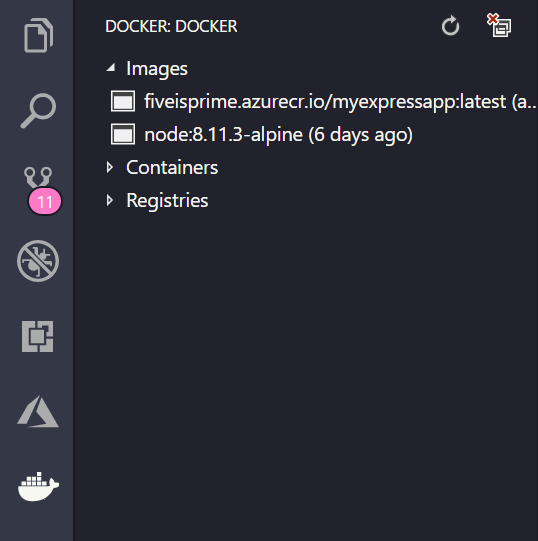
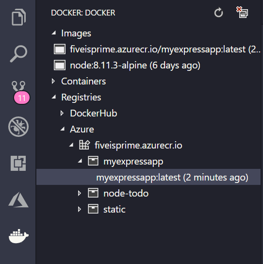

# Create and push your app image

With the necessary `Dockerfile` in place, you're ready to build the Docker image and push it to a registry.

## Build and test the Docker image

1. Make sure that Docker is running on your computer.

1. On the VS Code **Command Palette** (`kb(workbench.action.showCommands)`), select **Docker: Build Image**.

1. When prompted for the Docker file, choose the `Dockerfile` that you created in the previous section. (VS Code remembers your selection so you won't need to enter it again to rebuild.)

1. When prompted for a name to give the image, use a name that follows the conventional form of `<registry or username>/<image name>:<tag>`, where `<tag>` is typically `latest`. Here are some examples:

    ```
    # Examples for Azure Container Registry, prefixed with the registry name
    vsdocsregistry.azurecr.io/python-sample-vscode-django-tutorial:latest
    vsdocsregistry.azurecr.io/python-sample-vscode-flask-tutorial:latest
    vsdocsregistry.azurecr.io/myexpressapp:latest

    # Examples for Docker hub, prefixed with your username
    vsdocs-team/python-sample-vscode-django-tutorial:latest
    vsdocs-team/python-sample-vscode-flask-tutorial:latest
    vsdocs-team/myexpressapp:latest
    ```

1. Each step of Docker's build process appears in the VS Code Terminal panel, including any errors that occur running the steps in the `Dockerfile`.

    > **Tip**: every time you run the **Docker: Build image** command, the Docker extension opens another Terminal in VS Code in which to run the command. You can close each terminal once the build is complete. Alternately, you can reuse the same terminal to build the image by scrolling up in the command history using the up arrow.

1. When the build is complete, the image appears in the **Docker** explorer under **Images**:

    

1. Optional: run and test your container locally by using the following command, replacing `<image_name>` with your specific image, and changing the port numbers as needed. For web apps, you can then open browser to `localhost:8000` (or the appropriate port) to see the running app.

    ```bash
    docker run --rm -it -p 8000:8000 <image_name>
    ```

### Two useful features of the Docker extension

The Docker extension provides a simple UI to manage and even run your images rather than using the Docker CLI. Just expand the **Image** node in the Docker explorer, right click any image, and select any of the menu items:


In addition, on the top of the Docker explorer, next to the refresh button, is a button for **System Prune**:


This command cleans up any dangling and otherwise unused images on your local computer. It's a good idea to periodically use the command to reclaim space on your file system.

## Push the image to a registry

1. On the **Command Palette** (`kb(workbench.action.showCommands)`), select **Docker: Push**.

1. Choose the image you just built to push the image to the registry; upload progress appears in the Terminal.

1. Once completed, expand the **Registries** > **Azure** (or **DockerHub**) node in the **Docker** explorer, then expand the registry and image name to see the exact image. (You may need to refresh the **Docker** explorer.)



> **Tip:** The first time you push an image, you see that VS Code uploads all of the different layers that make up the image. Subsequent push operations, however, upload only those layers that have changed. Because it's typically only your app code that's changes, those uploads happen much more quickly, making for a tight edit-build-deploy-test loop. To see this, make a small change to your code, rebuild the image, and then push again to the registry. The whole process typically completes in a matter of seconds.

Next, you deploy the app image to Azure App Service.

----

<a class="tutorial-next-btn" href="/tutorials/docker-extension/deploy-container">I've created an image for my app</a> <a class="tutorial-feedback-btn" onclick="reportIssue('docker-extension', 'containerize-app')" href="javascript:void(0)">I ran into an issue</a>
