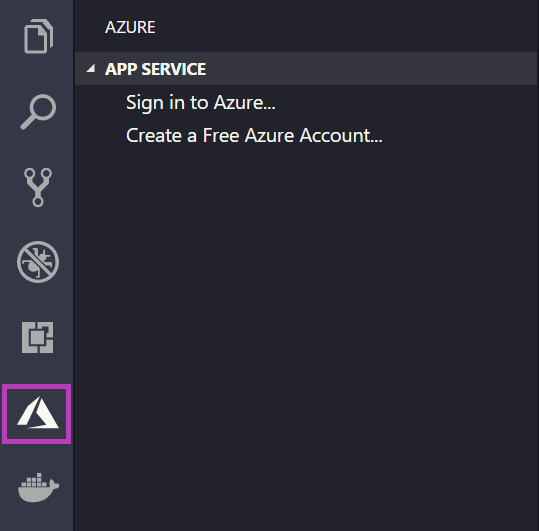

# Deploy to Azure using Docker

This tutorial walks you through containerizing an existing Node.js or Python application using [Docker](https://www.docker.com/), pushing the app image to a Docker registry, then deploying the image to [Azure Web App for Containers](https://azure.microsoft.com/services/app-service/containers/) directly from Visual Studio Code.

## A brief introduction to containers

Docker is a system that allows you to deploy and run apps using *containers* rather than setting up dedicated environments like virtual machines. A container is a lightweight runtime environment that shares the resources of the host operating system with other containers. Docker provide the layer that sits on top of the operating system to manages those resources on behalf of containers.

A container is specifically an instance of a Docker *image*, which is an executable package that contains everything needed to run your app: the app code, configuration files, the necessary runtimes, and all of app's dependencies. The same image can be used to create any number of containers, which makes containers a especially powerful way to scale out a cloud-based app.

Images are also typically built using base images that provide common elements like the Node.js and Python runtimes, which means the image you build for an app contains only what's unique to that app. As a result, an image file is typically quite small, making it far more inexpensive to generate, store, manage than virtual machine images.

You experience the basics of containers and images in this tutorial. For additional background, refer to the [Docker documentation](https://docs.docker.com/get-started/).

## Prerequisites

If you don't have an Azure account, [sign up now](https://azure.microsoft.com/free/?utm_source=campaign&utm_campaign=vscode-tutorial-docker-extension&mktingSource=vscode-tutorial-docker-extension) for a free 30-day account with $200 in Azure credits to try out any combination of services.

You need [Visual Studio Code](https://code.visualstudio.com/) installed along with the following:

    - [Docker Community Edition](https://www.docker.com/community-edition).
    - [Node.js and npm](https://nodejs.org/en/download), or Python and the Python extension as described on [Python Tutorial - Prerequisites](../../docs/python/python-tutorial.md).

## Install the Docker and Azure App Service extensions

The Docker extension helps you manage local Docker images, provides Docker commands, and simplifies deployment of app images to Azure.

> <a class="tutorial-install-extension-btn" href="vscode:extension/PeterJausovec.vscode-docker">Install the Docker extension</a>

The Azure App Service extension helps you create, manage, and deploy Linux Web Apps on Azure.

> <a class="tutorial-install-extension-btn" href="vscode:extension/ms-azuretools.vscode-azureappservice">Install the Azure App Service extension</a>

## Sign in

Once the extensions are installed, log into your Azure account by navigating to the **Azure: App Service** explorer, select **Sign in to Azure**, and follow the prompts.



## Prerequisite check

Before continuing, make sure you've installed and configured all the prerequisites.

To verify Docker, run the command below, which should show output such as `Docker version 18.06.1-ce, build e68fc7a`.

```bash
docker --version
```

In VS Code, you should see the email account of your Azure arround in the Status Bar and your subscription(s) in the **Azure: App Service** explorer.


----

<a class="tutorial-next-btn" href="/tutorials/docker-extension/create-registry">I've installed the extensions</a>
<a class="tutorial-feedback-btn" onclick="reportIssue('docker-extension', 'getting-started')" href="javascript:void(0)">I ran into an issue</a>
